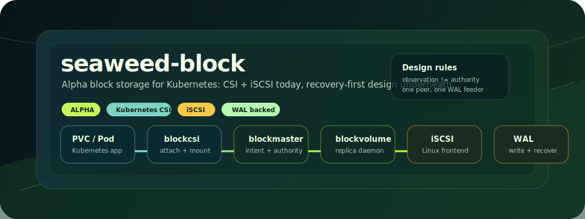

# seaweed-block (Alpha)

**Kubernetes CSI · iSCSI today · WAL-backed recovery · RF=2/RF=3 roadmap**

<p align="center">
  
</p>

`seaweed-block` is a small, opinionated block storage service for Kubernetes.

It's built for the middle path: teams who need replicated PersistentVolumes but
find Ceph/Rook too heavy for a 3-node edge cluster, and find Local PVs too
fragile for real workloads. The goal is a storage engine that's small enough to
read, with recovery semantics you can actually reason about.

> **⚠️ Alpha.** Today this passes a single-node smoke path: dynamic PVC create →
> CSI attach → iSCSI mount → pod write/read checksum → cleanup. It is **not**
> production-ready. Multi-node failover, durable packaging, and failover-under-
> mount are still ahead. If you need five-nines today, this isn't it yet.

---

## Why build this?

Storage in Kubernetes usually forces a choice between two extremes:

- **The giants:** Ceph/Rook are mature and powerful, but operationally heavy
  for small teams or lab environments.
- **The basics:** Local PVs are simple but don't handle replication or node
  failure gracefully.

`seaweed-block` exists because we wanted a storage engine where the recovery
logic isn't a black box — where you can trace how data moves between peers
without a PhD in distributed systems.

---

## The design (or: how we plan to not lose data)

Three principles drive the architecture.

### 1. WAL + extent (write-ahead-log first)

Writes don't disappear into a complex filesystem. They hit a WAL-style path
first, then drain into extent storage:

```text
write → WAL → flush/checkpoint → extent
```

This makes the local data lifecycle explicit and easy to debug when things go
sideways. The current alpha uses `walstore`; a smarter WAL backend is on the
roadmap behind an explicit test gate.

### 2. Dual-lane recovery

Recovery shouldn't choke the hot path. We separate base data transfers from
live WAL feeding so normal writes keep flowing while a peer catches up.

The rule that prevents the classic multi-sender bugs:

```text
one peer, one monotonic WAL feeding owner
```

Only one peer is the source of truth for a recovery stream at any given time.

### 3. Protocol and execution separation

Control-plane facts and data-plane execution stay strictly separated:

```text
observation        != authority
placement intent   != assignment
authority moved    != data continuity proven
frontend fact      != storage readiness
```

This is slower to design but much easier to audit. It's also what keeps iSCSI,
future NVMe-oF, recovery, and placement from quietly redefining each other's
contracts.

---

## How it compares

This isn't a feature comparison — it's the intended product position.

| System | Strength | Tradeoff |
| :--- | :--- | :--- |
| **Ceph/Rook** | mature, powerful, broad storage platform | operationally heavy for small clusters |
| **OpenEBS local engines** | Kubernetes-friendly, easy to start | behavior varies by chosen engine/topology |
| **seaweed-block** | **small, inspectable, recovery-contract-driven** | **early alpha, incomplete** |

The pitch, if it lands: simpler than a full distributed storage platform, more
structured than ad-hoc local disks, CSI-first, designed for RF=2/RF=3, iSCSI
first with NVMe-oF later, and recovery semantics that are documented and
testable.

---

## What actually works today

The current code can survive a single-node Kubernetes alpha smoke run:

- ✅ CSI dynamic PVC `CreateVolume`
- ✅ blockmaster lifecycle and automated placement
- ✅ launcher-generated `blockvolume` Deployment
- ✅ iSCSI frontend attach, mount, and pod write/read checksums
- ✅ CSI `DeleteVolume` cleanup path (alpha smoke removes the launcher-generated
  blockvolume Deployments today; an operator will replace this manual sweep)
- ✅ no dangling iSCSI sessions after cleanup
- ✅ TestOps registry and a minimal `cmd/sw-testops` CLI

Current alpha defaults:

- Kubernetes: single-node k3s lab
- frontend: iSCSI
- backend: `walstore`
- launcher-generated blockvolume state: `emptyDir`
- demo StorageClass replication: RF=1

### What's explicitly NOT claimed (yet)

These boundaries matter for an alpha — read them before evaluating:

- not production-ready
- not multi-node validated as a Kubernetes product
- not durable across blockvolume pod restart in the alpha manifest
- not yet a full operator (a manifest launcher does the work today)
- no failover-under-mounted-PVC claim
- no NVMe-oF CSI claim yet
- no performance or soak-test claim

### What's next on the to-do list

- move the alpha manifest off `emptyDir` to a durable node-local path
- ship a proper operator (replace the manual launcher)
- multi-node validation for RF=2/RF=3
- failover-under-load (pulling the rug while a pod is writing)
- one-command install path
- reduce noisy debug logs

---

## Quick Start

You need a Linux Kubernetes node where privileged CSI pods are allowed and
`iscsi_tcp` is loadable. k3s works well for this.

**Prerequisites**

- Docker
- `kubectl`
- a running Kubernetes cluster (e.g. k3s)
- `iscsi_tcp` loadable on the node
- `KUBECONFIG` pointing at your cluster

For a default k3s install:

```bash
export KUBECONFIG="${KUBECONFIG:-/etc/rancher/k3s/k3s.yaml}"
```

**Build images**

```bash
bash scripts/build-alpha-images.sh "$PWD"
```

**Import (k3s example — both images)**

```bash
docker save sw-block:local     | sudo k3s ctr images import -
docker save sw-block-csi:local | sudo k3s ctr images import -
```

If your cluster pulls from a registry instead of local k3s images:

```bash
export SW_BLOCK_IMAGE=registry.example.com/storage/sw-block:alpha
export SW_BLOCK_CSI_IMAGE=registry.example.com/storage/sw-block-csi:alpha

bash scripts/build-alpha-images.sh "$PWD"
docker push "$SW_BLOCK_IMAGE"
docker push "$SW_BLOCK_CSI_IMAGE"
```

The demo scripts render the manifests with those image names at runtime.

**Run the app demo**

```bash
bash scripts/run-k8s-demo.sh "$PWD"
```

Expected result:

```text
[app-demo] PASS: app pod wrote data, replacement app pod read it back through the same PVC, cleanup complete
```

This is the best first demo for Kubernetes users: one app pod writes
`/data/demo.bin`, a replacement app pod mounts the same PVC, and the replacement
pod verifies the checksum. See
[docs/quickstart-kubernetes.md](docs/quickstart-kubernetes.md).

**Short smoke path**

```bash
bash scripts/run-k8s-alpha.sh "$PWD"
```

Expected result:

```text
[alpha] PASS: dynamic PVC create/delete completed checksum write/read and cleanup
```

The app-demo walkthrough is also available at
[docs/kubernetes-app-demo.md](docs/kubernetes-app-demo.md).

For the manual `kubectl apply` flow, see
[deploy/k8s/alpha/README.md](deploy/k8s/alpha/README.md).

---

## Simple user manual

The current alpha flow:

1. Build `sw-block:local` and `sw-block-csi:local`.
2. Deploy blockmaster, CSI controller, and CSI node manifests.
3. Create a PVC using the `sw-block-dynamic` StorageClass.
4. Apply the launcher-generated blockvolume Deployment.
5. Run a pod that mounts the PVC.
6. Delete the pod and PVC.
7. Confirm the launcher-generated blockvolume workload and iSCSI sessions are
   gone.

`scripts/run-k8s-alpha.sh "$PWD"` runs that whole path. Still a lab workflow —
a real operator should eventually replace the manual launcher step.

---

## Roadmap

**Near-term**

- replace `emptyDir` with a durable node-local path
- one-command install path
- operator/controller for launcher-generated workloads
- easier remote K8s shell scenarios in TestOps
- reduce log noise

**Availability**

- RF=2/RF=3 Kubernetes path
- multi-node attach
- failover while a pod stays mounted
- returned-replica reintegration
- WAL retention and flow-control under pressure

**Protocol/backend**

- keep iSCSI as MVP default
- protocol-neutral CSI dispatch
- NVMe-oF behind the same frontend-target model
- smart WAL backend behind an explicit test gate

**More detail**

- [docs/architecture.md](docs/architecture.md)
- [docs/developer-architecture.md](docs/developer-architecture.md)
- [docs/runtime-state-machines.md](docs/runtime-state-machines.md)
- [docs/roadmap.md](docs/roadmap.md)

---

## Repository layout

```text
cmd/
  blockmaster/    control plane daemon
  blockvolume/    per-replica data/frontend daemon
  blockcsi/       CSI controller/node plugin
  sw-testops/     minimal TestOps scenario runner

core/
  authority/      assignment publication and observation model
  csi/            CSI implementation
  host/           composed master/volume hosts
  lifecycle/      desired volume, node inventory, placement intent
  launcher/       Kubernetes manifest renderer
  recovery/       recovery execution components
  replication/    peer replication pieces

deploy/k8s/alpha/  alpha Kubernetes manifests and manual guide
docs/              architecture and roadmap notes
internal/          non-public support libraries and TestOps registry
scripts/           build and smoke-test helpers
```

---

## Development tests

Development tests need Go installed.

Useful smoke tests:

```bash
go test ./cmd/sw-testops ./internal/testops ./cmd/blockcsi \
        ./core/launcher ./cmd/blockmaster ./core/host/master \
        ./core/lifecycle -count=1
```

Kubernetes alpha smoke:

```bash
bash scripts/run-k8s-alpha.sh "$PWD"
```

---

## Honesty note

Read this repo as an alpha block-storage system with a runnable Kubernetes
smoke path and a serious recovery/control-plane design under construction.

It is not finished storage software.
