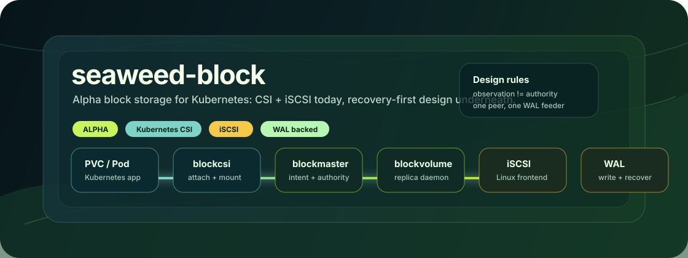

# Seaweed Block

<p align="center">
  
</p>

Seaweed Block is an experimental Kubernetes block storage service built around
normal Kubernetes PVCs, a CSI driver, and SeaweedFS block components.

The current alpha is focused on one user-visible loop:

```text
install on Kubernetes
-> create a PVC-backed block volume
-> mount it in an app pod
-> write/read data
-> inspect status and support evidence
-> clean up
```

Start with the Kubernetes tutorial:

- [First volume on Kubernetes](docs/quickstart-kubernetes.md)
- [Release notes](docs/releases/README.md)

## Status

Alpha / early beta shape. Not production-ready.

What has been validated in the current alpha:

- Day-1 install-to-first-volume path: activate stack, create PVC, writer pod
  verifies data, reader pod verifies persisted data, status report generated,
  cleanup clean.
- Helm alpha lifecycle smoke: chart hygiene, one upgrade/rollback path that
  preserves an existing PVC, three-PVC Day-1 smoke, support-bundle replay, and
  clean uninstall.
- dynamic PVC provisioning through CSI.
- product-owned generated `blockvolume` lifecycle.
- multiple PVCs / volumes visible in inventory.
- durable local volume restart/reattach coverage.
- RF=3 `sync-quorum` recovery through CSI/pod recreate.
- RF=3 Kubernetes node-loss recovery through CSI/pod recreate on a surviving
  node.
- RF=3 iSCSI ALUA + Linux dm-multipath transparent mounted failover on the
  proven alpha path.
- read-only operations evidence through `sw-block ops inventory`,
  `sw-block ops cluster --master-api ... -o json`, support bundles, and
  product-owned event timelines.

These are narrow alpha claims tied to documented gates and support artifacts.
Do not treat them as broad production HA or compatibility claims.

Known missing pieces:

- production-grade operator lifecycle,
- Helm is the supported alpha install path for supported labs; a narrow
  upgrade/rollback smoke is gated, but production-grade Helm lifecycle is not
  claimed,
- production hosted dashboard/UI; a local read-only dashboard/report exists,
- backup, snapshot, and restore workflow,
- returned-replica rebuild, reintegration, and failback,
- transparent node-loss failover without pod recreate,
- NVMe ANA parity for the transparent failover path,
- broad distro/kernel/initiator compatibility matrix,
- broad upgrade/rollback safety beyond the gated smoke path,
- performance, RTO, or SLO claims,
- security/RBAC/audit hardening for mutating admin actions.

## Why this exists

Kubernetes storage usually comes down to two options:

- a full storage stack such as Ceph/Rook
- Local PVs with weaker failure handling

`seaweed-block` explores a smaller block storage design for cases where a full
storage platform is too heavy but local storage is not enough. The current
goal is to validate the control path, data path, and recovery model before
expanding the system.

## Architecture

The alpha path:

- Kubernetes PVC
- CSI driver
- block master / controller
- block volume process
- iSCSI target
- WAL-backed local write path

The local write path:

```text
write → WAL → flush/checkpoint → extent
```

The WAL-first design makes writes easier to inspect and recover during
development.

Recovery is split into base transfer and live WAL feeding so normal writes
keep flowing while a peer catches up. Only one peer is the source of truth
for a recovery stream at any given time.

## Quick Start

Use [First volume on Kubernetes](docs/quickstart-kubernetes.md). For v0.3
alpha, start with Helm on a supported Kubernetes/k3s lab.

Fast path:

```bash
go build -o sw-block ./cmd/sw-block
export PATH="$PWD:$PATH"
sw-block ops generate-helm-values \
  --out values.day1.yaml \
  --image ghcr.io/seaweedfs/seaweed-block:sha-d4822bf02617 \
  --csi-image ghcr.io/seaweedfs/seaweed-block-csi:sha-d4822bf02617
helm install sw-block charts/seaweed-block \
  --namespace kube-system \
  --create-namespace \
  -f values.day1.yaml \
  --wait \
  --timeout 10m
SW_BLOCK_INSTALL_MODE=helm \
SW_BLOCK_HELM_RELEASE=sw-block \
SW_BLOCK_HELM_NAMESPACE=kube-system \
SW_BLOCK_HELM_VALUES_FILE=values.day1.yaml \
  bash scripts/run-basic-app-example.sh "$PWD"
```

`generate-helm-values` reads the current Kubernetes API through `kubectl`,
selects Ready schedulable nodes, and writes chart values. One selected node
uses loopback mode. Multiple selected nodes use external iSCSI/status addresses
and CHAP by default.

Expected summary fields:

```text
first_volume_status=ok
writer_verified=true
reader_verified=true
inventory_status=ok
status_report=status/report/index.html
cleanup_status=ok
```

Use the script path for development, local image testing, or fallback
diagnostics when Helm is not the target.

```bash
bash scripts/activate-k8s-alpha.sh "$PWD"
bash scripts/run-basic-app-example.sh "$PWD"
cat "$(ls -td /tmp/sw-block-basic-app-* | head -1)/first-volume-summary.txt"
```

The `"$PWD"` argument is the repository root. The helper scripts use it to
locate chart, manifest, and example files.

The activation script writes `/tmp/sw-block-activation-*/activation-summary.txt`
with the blockmaster, CSI controller, CSI node, StorageClass, protocol, ACK
profile, and next inspection commands.

For QA/PM user-path testing against published images, prefer immutable image
tags in Helm values or activation env:

```bash
ghcr.io/seaweedfs/seaweed-block:sha-<commit>
ghcr.io/seaweedfs/seaweed-block-csi:sha-<commit>
```

Current validated v0.3.1 Day-1 walkthrough image tag:
`sha-d4822bf02617`.

Mutable `:alpha` is a smoke/demo tag only; it can drift from the source tree.

## Operations

```bash
kubectl -n kube-system port-forward deploy/sw-blockmaster 9333:9333
sw-block ops cluster --master-api 127.0.0.1:9333 -o json \
  > /tmp/sw-block-cluster-evidence.json
sw-block ops report --master-api 127.0.0.1:9333 --out /tmp/sw-block-report
sw-block ops dashboard --master-api 127.0.0.1:9333 --listen 127.0.0.1:9334
```

If `sw-block` is not in `PATH`, run the same commands from this repository as
`go run ./cmd/sw-block ops ...`.

`sw-block ops report` writes static read-only artifacts. `sw-block ops
dashboard` serves the same evidence as a local read-only dashboard. Neither has
mutating admin actions.

For replica-level support evidence:

```bash
sw-block ops inventory \
  --namespace default \
  --master 127.0.0.1:9333 \
  --out /tmp/sw-block-inventory
```

## What Users Can Do Today

- Install the alpha stack on a supported Kubernetes/k3s lab.
- Create PVC-backed block volumes through Kubernetes.
- Run app pods that mount the PVC and verify file data.
- Inspect cluster, volume, replica, primary, frontend, and event evidence.
- Generate a local read-only HTML status report or dashboard from live master
  evidence or a saved support bundle.
- Collect inventory and product evidence bundles for support.
- Exercise documented recovery gates in TestOps/lab environments.

## What Users Should Not Expect Yet

- A production-grade operator.
- Production-grade Helm lifecycle management; Helm is the supported alpha
  install path and one upgrade/rollback smoke is gated, but broad upgrade
  safety is not claimed.
- A production hosted dashboard; the current dashboard is local and read-only.
- Backup, snapshot, or restore workflows.
- Mutating admin actions such as promote, repair, rebuild, failback, or cleanup.
- Broad upgrade/rollback safety beyond the gated smoke path.
- Performance, RTO, or SLO guarantees.
- Broad distro/kernel/initiator compatibility.
- Transparent Kubernetes node-loss failover without pod recreate.

## Repository layout

```text
cmd/        command entry points (blockmaster, blockvolume, blockcsi, sw-block)
core/       core storage logic (authority, csi, host, lifecycle, recovery, replication)
internal/   non-public packages and TestOps registry
deploy/     Kubernetes manifests
docs/       design and quickstart docs
examples/   Kubernetes examples
scripts/    build, install, and smoke-test helpers
```

## Development

Run the release-relevant scoped tests:

```bash
go test ./cmd/sw-block ./core/ops ./core/csi ./core/launcher ./core/host/master -count=1
```

`go test ./...` is the full repository sweep and may include unrelated
in-progress packages outside the current release gate.

Run the Kubernetes alpha smoke:

```bash
bash scripts/run-k8s-alpha.sh "$PWD"
```

More detail:

- [docs/releases/README.md](docs/releases/README.md)
- [docs/architecture.md](docs/architecture.md)
- [docs/developer-architecture.md](docs/developer-architecture.md)
- [docs/runtime-state-machines.md](docs/runtime-state-machines.md)
- [docs/roadmap.md](docs/roadmap.md)

## License

Apache-2.0
