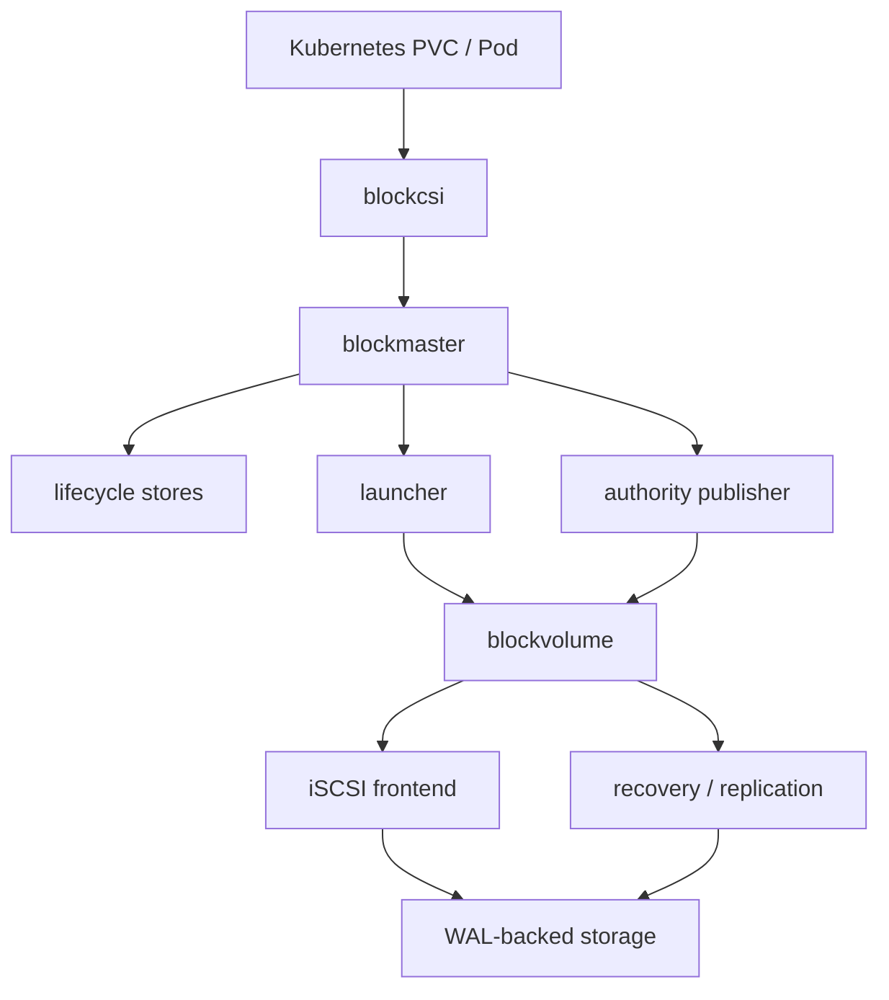
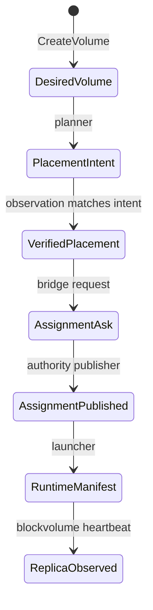
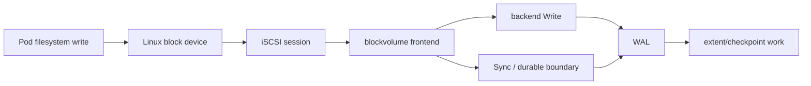
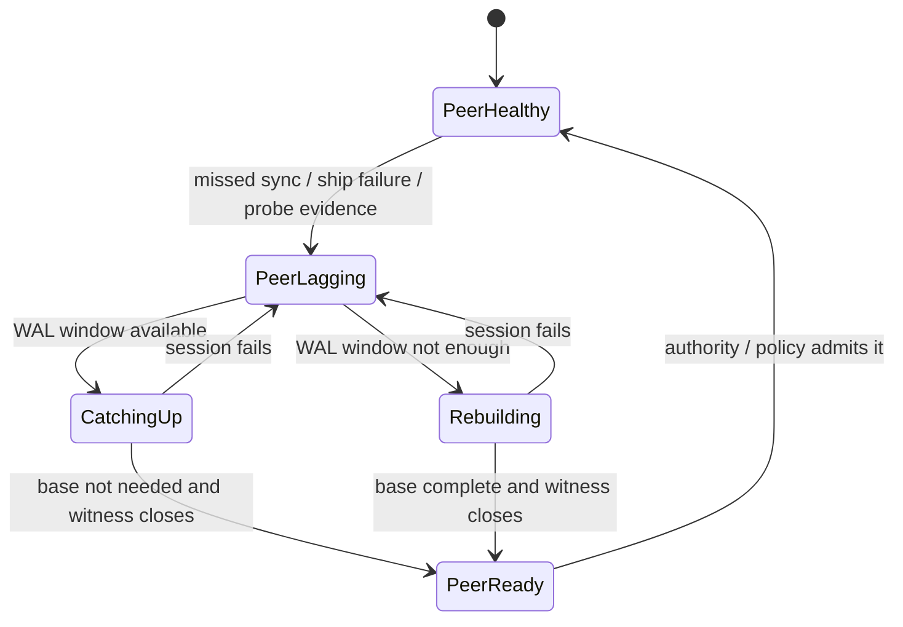
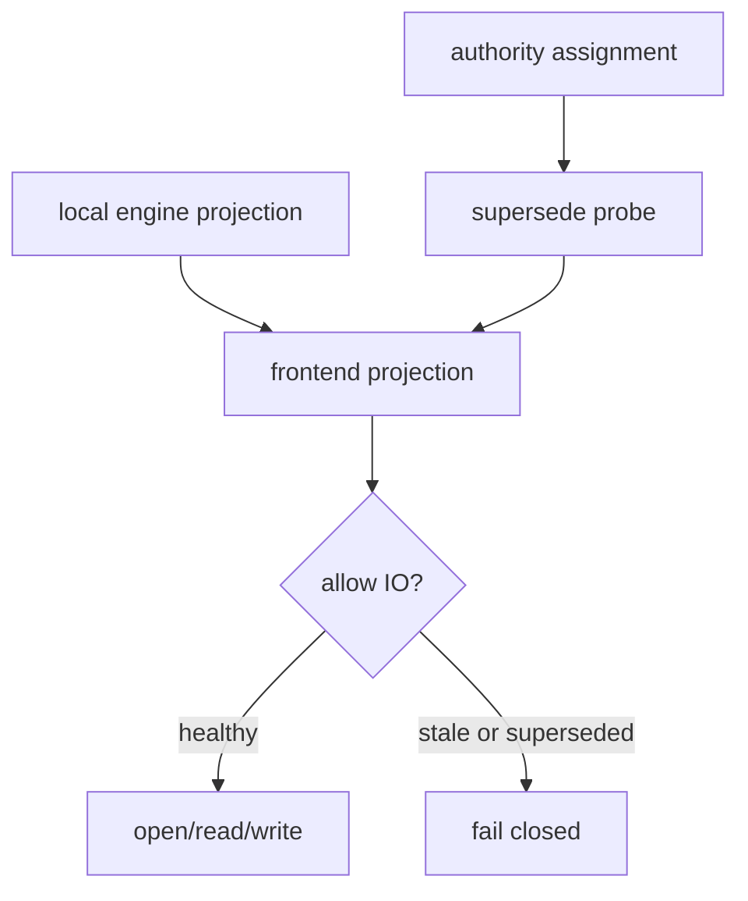
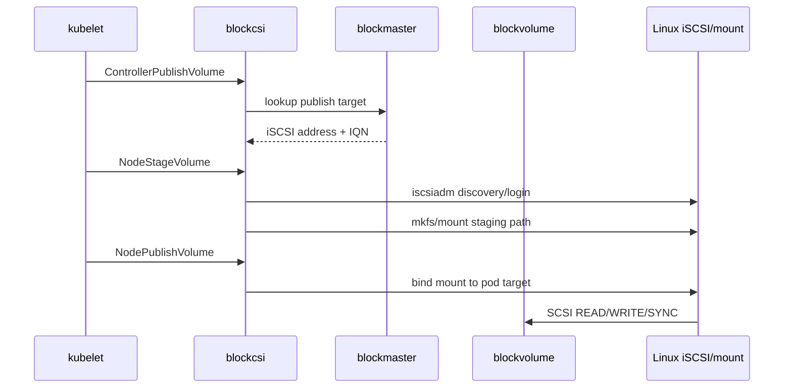

# Runtime State Machines

This is a lightweight map for engineers reading the runtime code for the first
time. It is descriptive, not a normative protocol specification.

The key idea: `seaweed-block` is not one giant state machine. It is a group of
smaller loops with explicit ownership boundaries.

## System Map



Reading order:

1. Kubernetes asks for a volume.
2. CSI calls `blockmaster`.
3. `blockmaster` records desired state and publishes authority through the
   authority module.
4. launcher materializes `blockvolume` replicas.
5. `blockvolume` exposes iSCSI and owns the data path.
6. recovery/replication feed lagging peers without redefining authority.

## Control Plane Loop



Main owners:

| State | Owner |
|---|---|
| Desired volume | `core/lifecycle` |
| Placement intent | `core/lifecycle` planner/reconciler |
| Verified placement | `core/host/master` + lifecycle observation store |
| Assignment | `core/authority` |
| Runtime manifest | `core/launcher` |
| Replica observation | `cmd/blockvolume` heartbeat to `cmd/blockmaster` |

Important boundary:

```text
verified placement != assignment
assignment != data continuity proof
```

## Data Plane Loop



The current alpha path is iSCSI-first. NVMe-oF should plug in later as another
frontend, not as a different storage truth model.

## Recovery / Replication Loop



Data-plane rule:

```text
one peer, one WAL-feeding decision owner
```

Recovery may send base data and WAL data through different internal mechanisms,
but the decision about what WAL to feed next must be single-owner and monotonic
per peer.

## Frontend Eligibility Loop



This is why `core/host/volume/projection_bridge.go` exists. A local engine can
still look healthy while another replica has become authoritative. The frontend
must fail closed in that case.

## CSI Node Flow



Current alpha tests verify this path with a checksum-writing pod.

## What Is Still Not Automated

- durable Kubernetes storage roots beyond alpha smoke paths
- multi-node scheduling and topology constraints
- failover while a pod remains mounted
- RF=3 production policy and quorum behavior
- operator-grade runtime reconciliation
- NVMe-oF frontend integration

