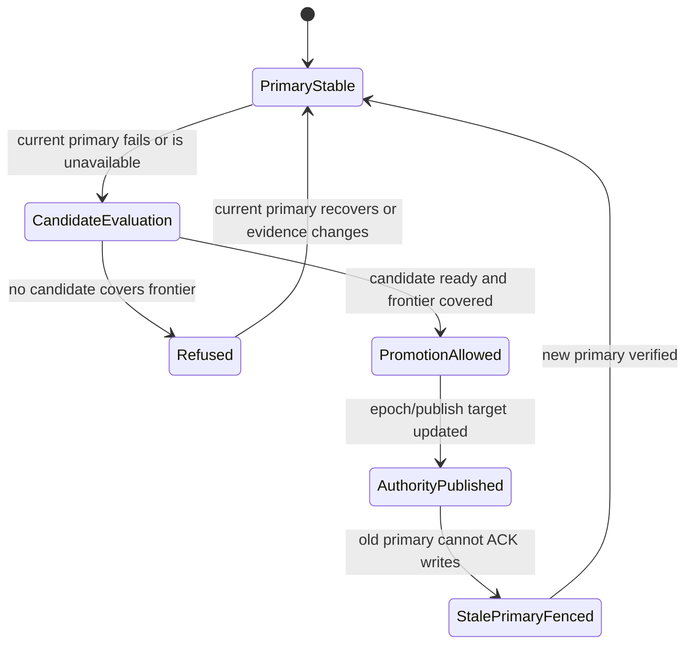

# Authority, Epoch, And Promotion

This page explains how Seaweed Block decides which replica is allowed to be
primary, why stale primaries must fail closed, and why promotion is more than
"pick another pod".

## Reader Orientation

In a block-storage system, authority answers:

```text
which replica is allowed to accept writes for this volume now?
```

You need this page before changing:

- blockmaster promotion logic,
- replica readiness/probe code,
- CSI publish-target selection,
- frontend stale-owner fencing,
- restart persistence of primary/epoch,
- returned-replica rebuild or failback.

## Domain Background

Distributed storage cannot allow two writable primaries for the same block
volume. Even a brief split can corrupt a filesystem because block clients assume
one coherent device.

Practical terms:

| Term | Meaning |
|---|---|
| primary | replica currently authorized to serve frontend writes |
| epoch | monotonic authority generation |
| endpoint version | frontend/publish target generation |
| stale primary | old primary that was valid in an earlier authority generation |
| promotion | changing authority to a new primary after evidence allows it |
| fencing | preventing old authority/session from accepting writes |
| durable frontier | write progress boundary a candidate must cover |

The industry pattern is the same whether the product is Ceph RBD, Longhorn,
Mayastor, or a custom block layer: authority must be explicit, monotonic, and
observable.

## Product Problem

Seaweed Block must support recovery and restart without letting old truth become
new truth:

```text
promotion to r2
-> restart control plane or kubelet
-> r1 must not resurrect as primary
-> r2/epoch/publish target remain authoritative
```

The hard part is that many signals are tempting but insufficient:

- pod Running,
- status endpoint reachable,
- heartbeat present,
- replica observed,
- local storage opened.

None of those alone prove authority.

## Methodology

Authority follows the method:

```text
facts: replica reachability, durable frontier, current assignment
constraints: one primary, monotonic epoch, candidate covers frontier
decision owner: blockmaster / authority path
execution: assignment publication and frontend projection
evidence: cluster evidence, Events, QA run summaries
```

CSI consumes authority. It does not choose a primary.

## State Machine



## Key Invariants

From the invariant ledger:

| Invariant | Meaning |
|---|---|
| `INV-AUTH-ONE-PRIMARY-001` | after promotion, there is at most one current primary |
| `INV-FENCE-STALE-PRIMARY-001` | stale primary cannot ACK post-failure writes |
| `INV-PROMOTE-FRONTIER-001` | candidate must cover required durable frontier |
| `INV-CSI-CONSUMES-AUTHORITY-001` | CSI consumes publish target; it does not mint authority |

## Implementation Map

| Responsibility | Code area |
|---|---|
| product loop and promotion decision | `core/host/master/product_loop.go` |
| promotion probing | `core/host/master/promotion_probe.go` |
| observation snapshot | `core/host/master/observation_snapshot.go` |
| frontend projection bridge | `core/host/volume/projection_bridge.go` |
| durable frontend readiness | `core/frontend/durable/` |
| CSI publish target consumption | `core/csi` |

## Phase History

| Phase | Contribution |
|---|---|
| 13-18 | restart, reattach, mounted failover, node-loss survival foundations |
| 27/31 | RF3 promotion restart persistence: primary/epoch/publish target survive restart |
| 34 | dirty-failure gate forced positive primary readiness before Ready projection |
| 37 | live node/CSI blockers no longer mask authority-adjacent failure states |
| 41-44 | operation layer can now explain lifecycle safety without minting authority |

## QA Evidence

| Gate | What it proves |
|---|---|
| RF3 promotion restart persistence | promoted authority survives k3s restart |
| stale primary I/O probes | old primary cannot successfully serve stale writes |
| multi-volume restart/failover gates | authority does not mix across volumes |
| SmartWAL corruption gate | reachable process is not enough for Ready |

## Non-Claims

- No automatic failback yet.
- Returned-replica rebuild is not productized yet.
- CSI does not decide promotion.
- Operation-layer status does not create authority.

## Future Work

Returned-replica rebuild should reuse this exact model:

```text
returned replica observed
-> fenced from frontend
-> rebuild/catch-up evidence current
-> candidate transitions through visible states
-> only then placement/ACK eligibility can change
```

