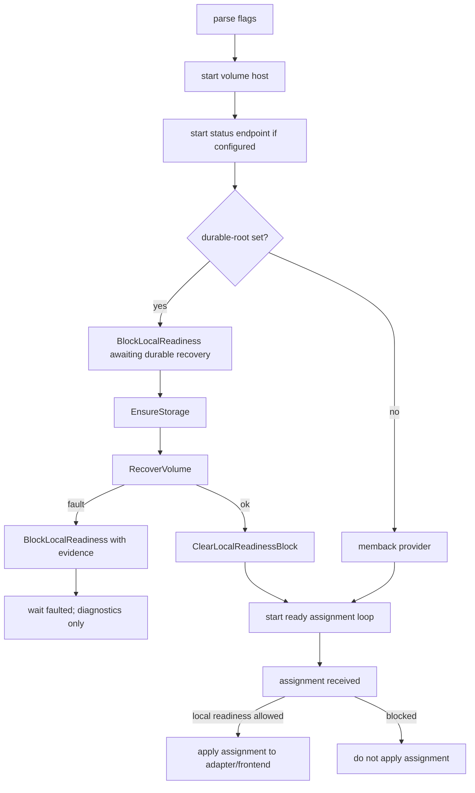
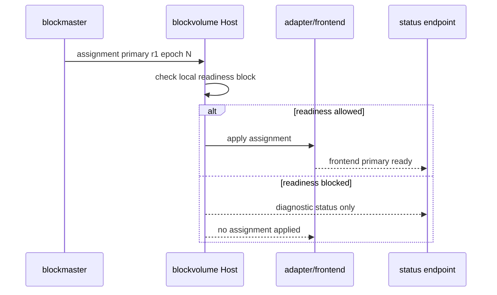

# blockvolume Process And Frontend Readiness

This page explains why the `blockvolume` process can be alive while the volume
is not Ready. It is a design note for developers changing daemon flags,
durable recovery, frontend providers, assignment handling, or status endpoints.

## Reader Orientation

You need this page before changing:

- `cmd/blockvolume/main.go`,
- `core/host/volume`,
- durable provider/recovery wiring,
- iSCSI/NVMe frontend startup,
- status endpoint behavior,
- readiness projection into blockmaster/operator-status.

The product question is:

```text
When is a running blockvolume process allowed to become a writable frontend for
the current authority?
```

The answer is not "when the pod is Running" and not "when the status endpoint
responds".

## Domain Background

A storage daemon has multiple independent states:

| State | Meaning |
|---|---|
| process alive | OS process is running |
| status endpoint live | diagnostics can be queried |
| durable storage opened | local store exists and can be inspected |
| recovery complete | local store passed recovery or clean open |
| assignment received | blockmaster sent authority facts |
| local readiness allowed | daemon may consume assignment into adapter/frontend |
| frontend ready | iSCSI/NVMe can serve data I/O for current authority |

Diagnostics should remain available even when readiness is blocked. That is why
a status endpoint can be live while the volume is not Ready.

## Product Contract

The contract is:

```text
blockvolume may be diagnosable while not ready.
Frontend write readiness requires durable recovery success plus current
assignment plus local readiness.
```

If durable recovery fails:

```text
status endpoint remains available
local readiness remains blocked
assignment is not applied to the adapter
PublishHealthy is not emitted
operator surfaces refuse Ready=True
```

## Startup / Readiness Flow



## Assignment Consumption



## Code Map

| Responsibility | Code |
|---|---|
| flag parsing and daemon wiring | `cmd/blockvolume/main.go` |
| local readiness block/clear | `core/host/volume/host.go` (`BlockLocalReadiness`, `ClearLocalReadinessBlock`) |
| assignment handling | `core/host/volume/subscribe.go`, `host.go` |
| status endpoint | `core/host/volume/status_server.go` |
| durable provider | `core/frontend/durable/provider.go` |
| durable recovery | `core/frontend/durable/recovery.go`, `core/storage/smartwal/` |
| frontend providers | `core/frontend/iscsi/`, `core/frontend/nvme/` |
| primary readiness projection | `core/host/master/observation_snapshot.go` |

## Important Flags

| Flag | Meaning |
|---|---|
| `--status-addr` | expose diagnostics/status endpoint |
| `--allow-external-status-bind` | explicit node-loss gate opt-in; default status is loopback safe |
| `--iscsi-listen` | enable iSCSI frontend |
| `--allow-external-iscsi-bind` | external iSCSI requires explicit opt-in and CHAP |
| `--nvme-listen` | enable NVMe/TCP frontend |
| `--durable-root` | enable persistent local storage |
| `--durable-impl` | choose `smartwal` or `walstore` |
| `--recovery-mode` | `legacy` or `dual-lane` recovery path |
| `--replication-ack` | `best-effort`, `sync-quorum`, or `sync-all` write ACK profile |

Many flags are optional because Helm/launcher supplies them. The required core
identity flags are `--master`, `--server-id`, `--volume-id`, `--replica-id`,
`--data-addr`, and `--ctrl-addr`.

## Evidence Contract

Useful diagnostics include:

```text
status endpoint reachable
durable recovery evidence=<string>
local_readiness_blocked=<true|false>
assignment_applied=<true|false>
publish_healthy_emitted=<true|false>
frontend_primary_ready=<true|false>
authority_role=<primary|supporting|unknown>
replication_role=<replica_ready|not_ready|recovering|...>
```

For dirty-failure gates:

```text
blockvolume: durable recovery faulted
local readiness blocked
NOT applying primary assignment
Ready=True count=0
```

## Failure Taxonomy

| Failure | Meaning |
|---|---|
| `durable_recovery_failed` | storage recovery returned typed failure |
| `wal_integrity_fault` | SmartWAL integrity check failed |
| `awaiting_durable_recovery` | durable provider has not cleared local readiness |
| `local_readiness_blocked` | assignment must not reach adapter/frontend |
| `primary_readiness_missing` | blockmaster cannot project primary Ready |
| `status_endpoint_unreachable` | diagnostics unavailable/stale |
| `frontend_bind_rejected` | unsafe bind policy or missing auth blocks frontend |

## Implementation Checklist

1. Keep status endpoint startup independent from frontend readiness when
   diagnostics are needed.
2. Block local readiness before durable recovery starts.
3. Clear local readiness only after recovery succeeds.
4. On typed recovery fault, keep diagnostics alive but never publish healthy.
5. Ensure assignment handling checks local readiness before adapter mutation.
6. Ensure blockmaster requires positive primary readiness, not heartbeat only.
7. Keep external status/iSCSI binds explicit and gated.
8. Update Helm/image compatibility whenever adding flags.
9. Add dirty-failure or status-surface gates for any readiness change.

## QA History

| Gate | Lesson |
|---|---|
| Phase 34 SmartWAL corruption | process/status endpoint reachable still produced false Ready until readiness blocks reached projection |
| Phase 34 strict pass | storage, process, and projection layers all refused false Ready |
| Phase 37 node evidence | pod/image readiness must not masquerade as volume readiness |
| Phase 40 release gate | chart flags must match shipped `blockvolume`/`blockmaster` binaries |

## Non-Claims

- A Running pod is not a Ready volume.
- A reachable status endpoint is not a writable frontend.
- A heartbeat is not authority readiness.
- This page does not define rebuild/failback policy.
