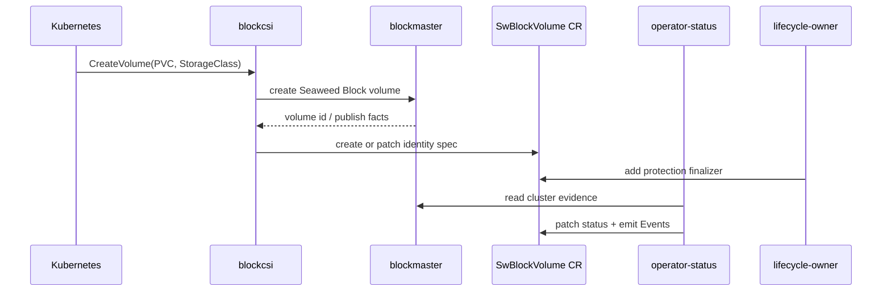

# CSI Lifecycle And SwBlockVolume Identity

This page explains the Kubernetes-facing path from PVC to Seaweed Block
operation-layer identity.

## Reader Orientation

CSI is the Kubernetes standard interface between an orchestrator and a storage
system. It is where Kubernetes lifecycle intent becomes storage-side actions.

You need this page before changing:

- `core/csi`,
- Helm CSI RBAC/flags,
- `SwBlockVolume` CR creation,
- PVC/PV delete behavior,
- node stage/publish behavior,
- any operation-layer code that assumes a `SwBlockVolume` identity exists.

## Domain Background

Kubernetes users request storage with a PersistentVolumeClaim. CSI receives
controller and node RPCs that turn that claim into a usable filesystem inside a
pod.

Practical CSI vocabulary:

| Term | Meaning |
|---|---|
| `CreateVolume` | controller-side creation/provisioning for a PVC |
| `DeleteVolume` | controller-side delete request for the storage volume |
| `ControllerPublishVolume` | attach/publish intent for a node |
| `NodeStageVolume` | node-side setup, e.g. login, format, mount to staging path |
| `NodePublishVolume` | bind or publish staged volume into the pod path |
| idempotency | repeated RPCs after retry must produce the same logical result |
| publish target | address/protocol target the node can connect to |

CSI does not know Seaweed Block authority by itself. It must consume the current
truth from blockmaster and the operation layer.

## Problem

Kubernetes users think in PVCs and pods. Seaweed Block internally needs a
volume identity, publish target, replica facts, delete-safety state, and
event/status surfaces. If those are not correlated, every tool can invent its
own answer about the same volume.

CSI is not just a mount API. It is a lifecycle compiler between Kubernetes
intent and block-storage safety:

```text
cluster intent + node state + volume state + readiness + mount state
-> safe create / publish / stage / mount / unstage / delete behavior
```

The hard bugs are usually lifecycle bugs, not byte-level bugs:

- a retry creates duplicate ownership,
- a node sees a volume it should not see,
- a backend becomes publishable before it is semantically ready,
- a detached volume still has stale mount/session state,
- a stale controller keeps acting after authority moved.

That is why CSI must consume current authority and readiness facts. It must not
mint authority.

The `SwBlockVolume` CR is the bridge:

```text
PVC / StorageClass
-> CSI CreateVolume
-> Seaweed Block volume
-> SwBlockVolume identity CR
-> operator-status writes status
-> lifecycle-owner protects deletion
```

## Ownership

| Owner | Writes | Must not write |
|---|---|---|
| CSI | `SwBlockVolume.metadata.name`, `.spec.pvcName`, `.spec.storageClass` | status, finalizers |
| operator-status | `SwBlockVolume.status`, Events | spec, finalizers |
| lifecycle-owner | Seaweed Block protection finalizer only | spec, status, labels, annotations, ownerReferences |

This split is the product boundary. It is why Phase 44 matters: a normal PVC can
now create the CR identity object before the status and lifecycle layers act.

## Lifecycle Compiler Questions

For every CSI action, ask:

```text
which volume exists?
which node may see it?
is the target ready?
who is allowed to mount it?
is this retry idempotent?
what stale state must be ignored or cleaned?
```

Those questions are coupled. Handling them as local special cases creates
hidden state machines.

## Sequence



## Main Code

| Behavior | Entry point |
|---|---|
| In-cluster Kubernetes client | `core/csi/kubernetes_metadata.go` |
| Ensure `SwBlockVolume` identity CR | `InClusterSwBlockVolumeRegistrar.EnsureVolumeObject` |
| Create/patch spec on conflict | `patchVolumeSpec` |
| CSI wiring | `core/csi/controller.go`, `cmd/blockcsi/main.go` |
| Helm flag | `blockcsi --swblockvolume-cr-namespace` |
| CSI RBAC | `charts/seaweed-block/templates/*csi*rbac*` |

## Important Detail

The CR name is derived from the operator status identity:

```text
SwBlockVolumeObjectName(ManagedVolumeOperatorStatus{
  VolumeID: ...,
  PVCName:  ...,
})
```

That keeps Kubernetes object naming aligned with the operation-layer read model.

## Failure Modes This Design Avoids

| Failure shape | Why the CR/status split helps |
|---|---|
| CSI creates storage but operation layer cannot find the volume | CSI creates the `SwBlockVolume` identity object at CreateVolume time |
| operator-status tries to infer identity from bundles or pod names | status writer reads explicit CR identity |
| lifecycle-owner protects the wrong object | finalizer is attached to the `SwBlockVolume` that CSI created |
| retry changes the identity object unexpectedly | create-or-patch identity spec is idempotent for the same PVC/volume |
| one component gets broad permissions | CSI/spec, operator-status/status, lifecycle-owner/finalizer are separated |

## Why This Took Multiple Phases

The early product path could prove a PVC worked. It could not yet prove that
the Kubernetes object model, status model, and lifecycle owner composed as one
user path. The missing link was automatic CR identity creation from the normal
CSI path.

Phase 44 closed that gap:

```text
PVC succeeds
-> CR exists without manual stub
-> finalizer is added
-> Ready status is written
-> delete request can be held/released
```

## QA Evidence

| Gate | What it proved |
|---|---|
| Phase 44 D2 | normal PVC creates exactly one `SwBlockVolume` CR; lifecycle-owner adds one protection finalizer; operator-status writes Ready status |
| Phase 44 D3/D4 | delete request drives delete-safety status and finalizer hold/release |
| Phase 44 D5/D6 | multi-volume delete state stays isolated |

## Non-Claims

- CSI does not own `SwBlockVolume.status`.
- CSI does not add or remove finalizers.
- CSI does not run cleanup.
- `SwBlockVolume` is not a replacement for PVC/PV lifecycle ownership.
