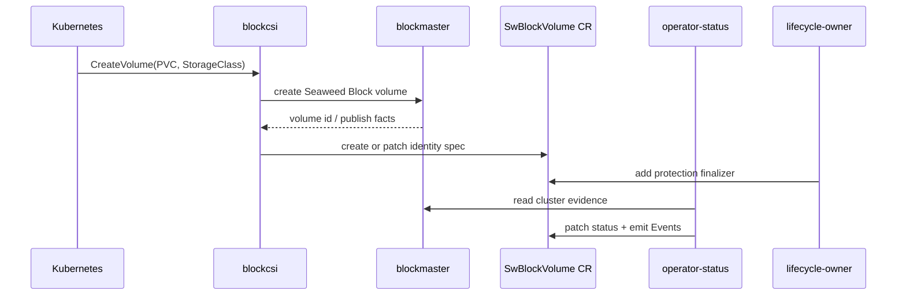

# CSI Lifecycle And SwBlockVolume Identity

This page explains the Kubernetes-facing path from PVC to Seaweed Block
operation-layer identity.

## Problem

Kubernetes users think in PVCs and pods. Seaweed Block internally needs a
volume identity, publish target, replica facts, delete-safety state, and
event/status surfaces. If those are not correlated, every tool can invent its
own answer about the same volume.

The `SwBlockVolume` CR is the bridge:

```text
PVC / StorageClass
-> CSI CreateVolume
-> Seaweed Block volume
-> SwBlockVolume identity CR
-> operator-status writes status
-> lifecycle-owner protects deletion
```

## Ownership

| Owner | Writes | Must not write |
|---|---|---|
| CSI | `SwBlockVolume.metadata.name`, `.spec.pvcName`, `.spec.storageClass` | status, finalizers |
| operator-status | `SwBlockVolume.status`, Events | spec, finalizers |
| lifecycle-owner | Seaweed Block protection finalizer only | spec, status, labels, annotations, ownerReferences |

This split is the product boundary. It is why Phase 44 matters: a normal PVC can
now create the CR identity object before the status and lifecycle layers act.

## Sequence



## Main Code

| Behavior | Entry point |
|---|---|
| In-cluster Kubernetes client | `core/csi/kubernetes_metadata.go` |
| Ensure `SwBlockVolume` identity CR | `InClusterSwBlockVolumeRegistrar.EnsureVolumeObject` |
| Create/patch spec on conflict | `patchVolumeSpec` |
| CSI wiring | `core/csi/controller.go`, `cmd/blockcsi/main.go` |
| Helm flag | `blockcsi --swblockvolume-cr-namespace` |
| CSI RBAC | `charts/seaweed-block/templates/*csi*rbac*` |

## Important Detail

The CR name is derived from the operator status identity:

```text
SwBlockVolumeObjectName(ManagedVolumeOperatorStatus{
  VolumeID: ...,
  PVCName:  ...,
})
```

That keeps Kubernetes object naming aligned with the operation-layer read model.

## QA Evidence

| Gate | What it proved |
|---|---|
| Phase 44 D2 | normal PVC creates exactly one `SwBlockVolume` CR; lifecycle-owner adds one protection finalizer; operator-status writes Ready status |
| Phase 44 D3/D4 | delete request drives delete-safety status and finalizer hold/release |
| Phase 44 D5/D6 | multi-volume delete state stays isolated |

## Non-Claims

- CSI does not own `SwBlockVolume.status`.
- CSI does not add or remove finalizers.
- CSI does not run cleanup.
- `SwBlockVolume` is not a replacement for PVC/PV lifecycle ownership.

