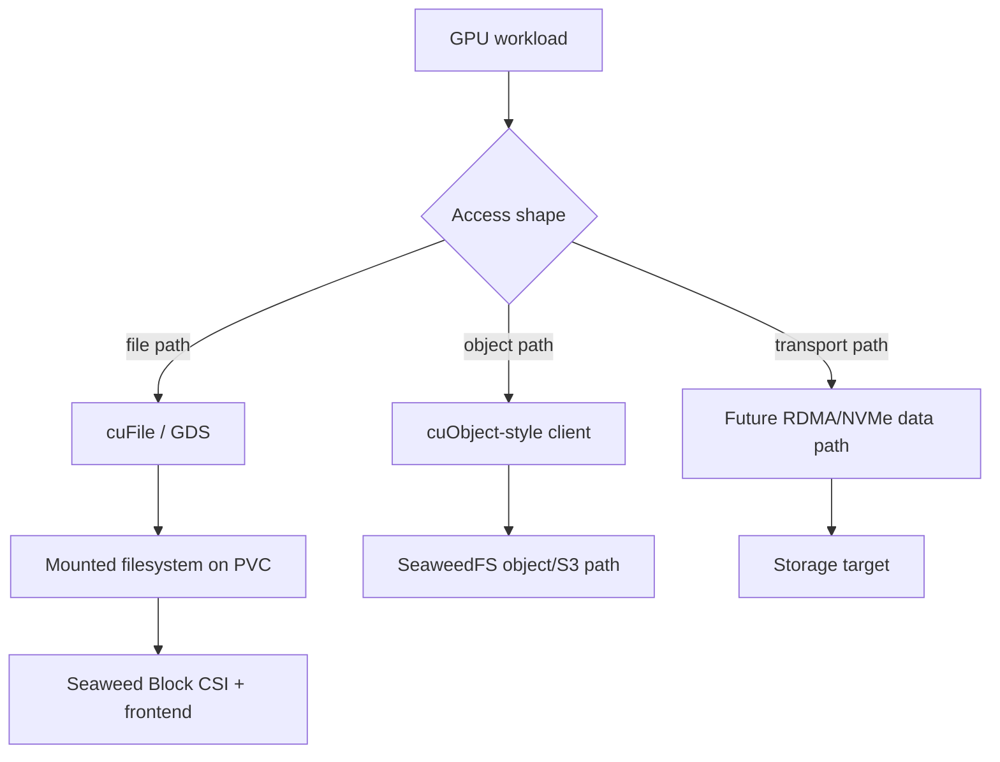
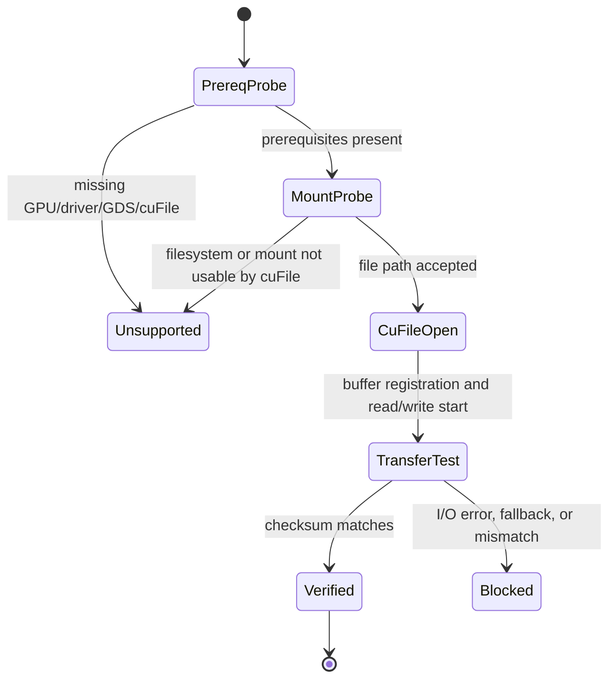

# GPUDirect, cuFile, And cuObject Future Design

This page is a future design note for GPU-oriented data paths. It is not a
current Seaweed Block capability.

## Reader Orientation

You need this page before proposing:

- GPUDirect Storage support,
- cuFile-based reads/writes from a Seaweed Block PVC,
- GPU-to-object-store data paths,
- cuObject-like object access,
- RDMA/NVMe protocol changes for GPU workloads.

The product question is:

```text
Can Seaweed storage serve GPU workloads without unnecessary CPU bounce buffers,
while preserving the same evidence, fencing, and lifecycle model as the block
product?
```

## External Background

NVIDIA GPUDirect Storage (GDS) is the family of technology that lets supported
storage paths move data between storage and GPU memory with reduced CPU
copying. cuFile is the user-space API commonly associated with GDS file I/O.

Useful external references:

- [NVIDIA GPUDirect Storage documentation](https://docs.nvidia.com/gpudirect-storage/)
- [NVIDIA cuFile API reference](https://docs.nvidia.com/gpudirect-storage/api-reference-guide/index.html)

Important practical point:

```text
cuFile is a file API path.
Seaweed Block is currently a Kubernetes block/PVC path.
SeaweedFS object is a different object/API path.
```

So GPUDirect work must not be treated as one flag on the existing block
frontend. It is a product train with separate prerequisites and gates.

## Vocabulary

| Term | Meaning in this design |
|---|---|
| GPU memory | CUDA device memory used by training/inference jobs |
| GPUDirect Storage | storage-to-GPU path that avoids normal CPU bounce behavior where supported |
| cuFile | NVIDIA API for file I/O involving GPU memory |
| cuObject | future object-storage style API concept for GPU-oriented object reads/writes |
| cuObject path | not current code; design placeholder for SeaweedFS object/S3 integration |
| block path | Seaweed Block PVC mounted as filesystem |
| object path | SeaweedFS object/S3-style object access |

## Product Tracks

### Track A: cuFile Over A Seaweed Block PVC

Shape:

```text
Kubernetes pod
-> mounted Seaweed Block PVC
-> filesystem path
-> cuFile reads/writes
-> GPU memory
```

This is the most natural bridge from Seaweed Block to GPU workloads, but it is
not automatically supported just because a PVC mounts. GDS compatibility depends
on OS, driver, kernel, filesystem, mount options, device path, and NVIDIA
software stack.

The first question is compatibility:

```text
Can a supported GDS/cuFile stack use the mounted Seaweed Block volume path?
```

Only after compatibility is proven should we optimize the backend.

### Track B: cuObject / GPU Object Path

Shape:

```text
GPU workload
-> cuObject-like client/API
-> SeaweedFS object/S3 path
-> object storage data
```

This is not the same product as Seaweed Block. It belongs closer to SeaweedFS
object/KV/VFS design. It may share:

- authentication,
- object metadata,
- RDMA/network transport ideas,
- support-bundle methodology,
- TestOps evidence realism.

But it should not borrow block-volume authority/finalizer semantics without a
separate object lifecycle model.

### Track C: Protocol-Level GPU/RDMA Data Path

Shape:

```text
GPU memory
-> RDMA/NVMe/RoCE capable transport
-> storage target
```

This is the deepest path and should come after Track A compatibility and Track
B object API shape are understood. It touches transport, memory registration,
security, flow control, and failure semantics.

## Product Contract For A First Gate

A minimal first claim should be narrow:

```text
On one supported Linux GPU node, a pod can use cuFile against a mounted
Seaweed Block PVC and verify byte-correct data transfer with documented
environment prerequisites.
```

It should not claim:

- broad GDS support,
- multi-node failover with GPU memory,
- GPU-direct over iSCSI unless proven,
- object API support,
- performance/SLO,
- production compatibility across distros/drivers.

## Architecture Boundary



The three branches have different APIs and should have different claims.

## Required Facts Before Implementation

Track A needs:

```text
gpu_present=true
nvidia_driver_version=<version>
cuda_version=<version>
gds_installed=true
nvidia_fs_loaded=true
cufile_available=true
filesystem_type=<ext4|xfs|...>
mount_options=<...>
volume_protocol=<iscsi|nvme>
direct_io_supported=<true|false>
byte_check_passed=<true|false>
```

Track B needs:

```text
object_api=<s3|native|future>
gpu_client_api=<cuObject placeholder>
auth_model=<...>
object_consistency_model=<...>
range_read_semantics=<...>
write_commit_semantics=<...>
```

Track C needs:

```text
rdma_device=<...>
memory_registration=<...>
queue_pair_or_nvme_queue=<...>
fencing_model=<...>
backpressure_model=<...>
data_integrity_check=<...>
```

## State Machine For Track A



## Evidence Contract

A first cuFile gate should emit:

```text
gpu_direct_gate_status=<ok|blocked|unsupported>
gpu_model=<name>
nvidia_driver_version=<version>
cuda_version=<version>
gds_version=<version>
nvidia_fs_loaded=<true|false>
cufile_open=<ok|failed>
cufile_read=<ok|failed>
cufile_write=<ok|failed>
checksum_cpu_path=<hash>
checksum_gpu_path=<hash>
fallback_detected=<true|false|unknown>
volume_protocol=<iscsi|nvme>
filesystem=<ext4|xfs|...>
mount_path=<path>
```

If fallback cannot be detected reliably, the claim must say only
"cuFile API compatibility", not "zero-copy" or "GPUDirect accelerated".

## Code / Project Map

| Area | Likely owner |
|---|---|
| K8s PVC mount path | Seaweed Block CSI |
| cuFile smoke utility | new test utility, likely outside core storage first |
| GPU environment probe | TestOps runner action or helper script |
| object path / cuObject | SeaweedFS object/VFS design, not `core/csi` |
| RDMA/NVMe transport | future protocol/transport work |
| status/report integration | `core/ops` once evidence format stabilizes |

## Failure Taxonomy

| Reason | Meaning |
|---|---|
| `gpu_not_present` | no usable GPU in test node |
| `nvidia_driver_missing` | driver stack absent |
| `gds_not_installed` | GPUDirect Storage/cuFile unavailable |
| `nvidia_fs_not_loaded` | kernel module/runtime missing |
| `filesystem_unsupported` | mounted volume path not compatible |
| `direct_path_fallback` | cuFile may be falling back through CPU path |
| `checksum_mismatch` | data correctness failed |
| `protocol_path_unsupported` | iSCSI/NVMe path not supported for this gate |
| `object_semantics_undefined` | cuObject track lacks consistency/commit model |

## Implementation Checklist

1. Start with a read-only environment probe; do not change storage code first.
2. Write a standalone cuFile smoke utility that can run inside a pod.
3. Mount a normal Seaweed Block PVC and run CPU checksum baseline.
4. Run cuFile read/write checksum against the same file.
5. Record whether the path is API-compatible versus truly accelerated.
6. Add TestOps gate with explicit unsupported/blocked reasons.
7. Only after compatibility is proven, decide whether iSCSI, NVMe, or a new
   transport needs optimization.
8. Keep cuObject/object-path design separate from PVC/block semantics.
9. Add support-bundle evidence before any user-facing claim.

## Non-Claims

- No current Seaweed Block release supports GPUDirect/cuFile.
- cuFile API success would not automatically prove zero-copy acceleration.
- cuObject is a future object-path design placeholder, not current code.
- GPU/RDMA transport work must not bypass authority, fencing, recovery, or
  evidence requirements.
