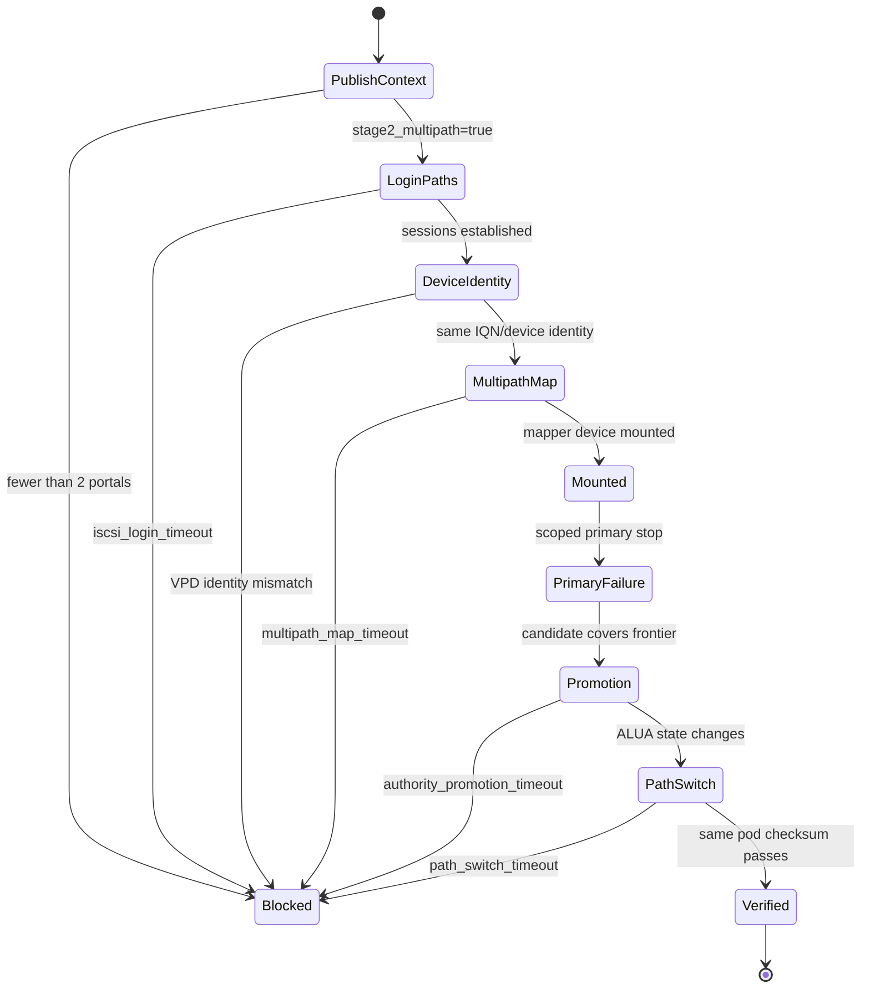
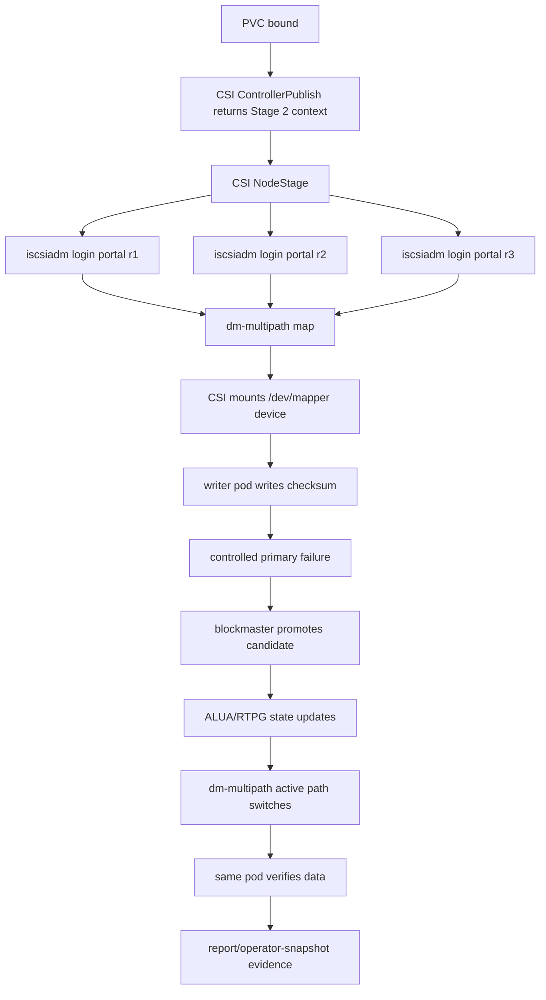

# iSCSI ALUA And Linux dm-multipath

This page is an implementation-grade design note for the iSCSI ALUA
transparent mounted-failover path. It is not a feature summary.

## Reader Orientation

This page is for developers changing:

- the iSCSI frontend,
- CSI publish / node-stage behavior,
- Stage 2 multipath Helm values,
- Linux host-path evidence collection,
- mounted failover TestOps scenarios,
- ManagedVolume projection for transparent recovery.

The product question is:

```text
Can a Kubernetes pod keep the same mounted PVC usable through a controlled
primary failure, without pod recreate, using standard Linux iSCSI ALUA and
dm-multipath behavior?
```

This is stronger than CSI reattach. In the reattach path, Kubernetes can delete
or recreate the pod and CSI can stage a fresh target. In the transparent path,
the same mounted filesystem must keep working while Linux switches paths below
the mount.

## Domain Background

### iSCSI Basics

iSCSI exposes a SCSI block device over TCP.

| Term | Practical meaning |
|---|---|
| initiator | Linux host that logs in with `iscsiadm` |
| target | Seaweed Block iSCSI frontend |
| IQN | target name, for example `iqn.2026-05.io.seaweedfs:<volume>` |
| portal | target network address, for example `192.168.1.184:3260` |
| session | active initiator-to-target login |
| LUN | logical unit exposed through the target |
| VPD 0x83 | SCSI device identity page used by udev/multipath to decide whether paths are the same logical device |

For multipath to work, multiple portals must expose the same logical device
identity. If each portal looks like a different disk, Linux cannot safely merge
them.

### ALUA

ALUA means Asymmetric Logical Unit Access. It is a SCSI mechanism that lets a
target report per-path access state. Linux can query those states with REPORT
TARGET PORT GROUPS, commonly via `sg_rtpg`.

Useful ALUA states:

| State | Meaning in Seaweed Block terms |
|---|---|
| active optimized | current primary frontend; preferred path for normal I/O |
| active non-optimized | usable but not preferred path, if policy permits |
| standby | visible path for probing, not normal data I/O |
| unavailable | path must fail fast |
| transitioning | authority/readiness is changing; do not silently accept data I/O |

Important boundary:

```text
ALUA does not elect a primary.
ALUA reflects authority that blockmaster already decided.
```

### Linux dm-multipath

`dm-multipath` combines multiple Linux block paths that have the same device
identity into one `/dev/mapper/<name>` device. Filesystems should be mounted on
the mapper device, not on a raw `/dev/sdX` path.

The host path looks like:

```text
iscsiadm login portal A
iscsiadm login portal B
udev creates /dev/disk/by-path/... devices
multipathd groups paths by WWID / VPD identity
/dev/mapper/<map> appears
CSI formats and mounts /dev/mapper/<map>
```

When one path fails or becomes non-optimal, dm-multipath can switch active
path without the pod being recreated.

### Host Prerequisites

Stage 2 depends on the node OS, not just Kubernetes objects:

```text
iscsiadm
multipath
sg_inq
sg_rtpg
kernel modules: iscsi_tcp, dm_multipath, scsi_dh_alua
/run/udev available to the CSI node pod
multipathd usable on the node
```

Missing prerequisites must become explicit blockers such as
`iscsi_prereq_missing` or `multipath_prereq_missing`, not timeouts.

## Product Contract

Stage 2's narrow claim is:

```text
protocol=iscsi
replication=RF3
ack_profile=sync-quorum
claim_profile=stage2-iscsi-alua-multipath
host_multipath=dm-multipath
recovery=mounted workload verifies data without pod recreate
```

Given:

```text
the pod wrote data through a mounted PVC
the volume has multiple iSCSI portals for the same IQN/device identity
Linux mounted a dm-multipath device
the current primary is stopped in a scoped way
blockmaster promotes a candidate that covers the required frontier
```

Then:

```text
Linux switches the active path through dm-multipath
the old primary cannot ACK stale I/O
the same pod UID verifies data after failure
support evidence names authority, ALUA state, multipath state, and data check
```

If the pod is recreated, the path is Stage 1 CSI reattach, not Stage 2
transparent failover.

## Non-Negotiable Boundaries

| Boundary | Rule |
|---|---|
| Authority | blockmaster chooses/promotes primary; CSI, iSCSI, and multipath consume authority |
| Durability | a promoted candidate must cover the required sync-quorum frontier |
| Protocol | ALUA state reflects frontend/authority facts and must not make unsafe replicas writable |
| Host | Linux must see one multipath device with multiple paths, not unrelated raw disks |
| Mounted I/O | same mounted workload path and same pod must verify data after failure |
| Fencing | old primary path must not return successful stale data I/O |
| Observability | every attach, login, map, RTPG, promotion, path-switch, and I/O wait has a timeout and blocker reason |

## Ownership Model

| Owner | Decides | Executes | Must not do |
|---|---|---|---|
| blockmaster | primary, epoch, publish authority | authority publication | infer Linux host success |
| iSCSI frontend | SCSI command response from local authority/readiness facts | target protocol behavior | elect authority |
| CSI controller | publish target context | returns iSCSI portal/IQN context | claim mounted failover |
| CSI node | Linux login, device discovery, format/mount | `iscsiadm`, multipath map use, mount | mount raw path when Stage 2 requires multipath |
| operator/status/report | explain readiness/recovery | status, Events, bundle projection | mutate host state |
| TestOps | prove the user claim | failover and evidence collection | accept helper self-certification only |

## CSI Publish Shape

The default CSI path remains single-target. Stage 2 is explicit opt-in.

Control-plane publish context must carry:

```text
protocol=iscsi
target=<primary portal for compatibility>
iqn=<same IQN across paths>
stage2_multipath=true
iscsiAddrs=<portal-a>,<portal-b>,<portal-c>
```

Rules:

- Stage 2 requires at least two portals.
- All portals must represent the same volume identity.
- Loopback portals cannot satisfy cross-node attach.
- If refreshed master evidence never exposes multiple portals, NodeStage must
  fail closed instead of silently mounting a single raw path.
- The default single-target path must not change behavior unless
  `--stage2-multipath` is enabled.

Relevant code:

| Behavior | Entry point |
|---|---|
| CSI flag | `cmd/blockcsi/main.go` (`--stage2-multipath`, `--reject-loopback-publish-targets`) |
| Publish target DTO | `core/csi/backend.go` (`PublishTarget`, `publishContext`) |
| Multipath lookup | `core/csi/master_backend.go` (`NewControlStatusLookupWithMultipath`) |
| NodeStage iSCSI path | `core/csi/node.go` (`stageISCSI`) |
| multipath publish wait | `waitForISCSIMultipathPublishContext` |
| portal parsing | `iscsiPortalsFromContext`, `iscsiMultipathFromContext` |
| Linux device lookup | `ISCSIUtil.GetMultipathDeviceByIQN` |
| Helm opt-in | `charts/seaweed-block/values.yaml`, CSI templates |

## Linux Host Path

The correct Stage 2 node-stage path is:

```text
read publish context
validate stage2_multipath=true
validate >=2 portals
configure CHAP if present
login every iSCSI portal
wait for raw devices
wait for one dm-multipath map for the IQN / device identity
format/mount the mapper device
record staged identity
```

The incorrect path is:

```text
login first portal
mount first /dev/disk/by-path device
claim multipath because more portals existed somewhere
```

That path hides failures and would turn a Stage 2 claim into a Stage 1 or
single-path claim.

## State Machine



## End-To-End Protocol Flow



## ALUA Command Policy

The iSCSI frontend must allow path-probing commands on visible paths while
failing unsafe data I/O closed.

| Command class | Active optimized | Standby / unavailable / transitioning |
|---|---|---|
| INQUIRY / VPD / REPORT LUNS | allowed | allowed when path is visible |
| READ CAPACITY / MODE SENSE / RTPG | allowed | allowed for path discovery |
| READ / WRITE / SYNCHRONIZE CACHE | allowed only when local authority/readiness permits | not GOOD; return stable NOT READY / check condition |

This is why frontend readiness cannot be just "process running". A reachable
iSCSI target with blocked local readiness must not project a writable path.

Relevant code:

| Behavior | Entry point |
|---|---|
| iSCSI target/session | `core/frontend/iscsi/target.go`, `session.go` |
| SCSI command handling | `core/frontend/iscsi/scsi.go` and tests |
| VPD identity tests | `core/frontend/iscsi/t2_v2port_scsi_inquiry_test.go` |
| stale/not-ready errors | `core/frontend/iscsi/errors.go`, `scsi_test.go` |

## Evidence Contract

A valid transparent failover bundle needs stable evidence, not just logs.

Required artifacts:

```text
multipath-prereq.txt
iscsi-discovery.txt
sg-inq.txt
sg-vpd83.txt
sg-rtpg.before.txt
multipath-before.txt
writer.log
pre-failure-inventory/
primary-failure.txt
authority-after.txt
sg-rtpg.after.txt
multipath-after.txt
workload-after-failover.log
post-failure-inventory/
support-bundle/
bounded-waits.txt
cleanup-audit.txt
```

Required stable lines:

```text
protocol=iscsi
multipath_enabled=true
host_device=<dm-* or /dev/mapper/...>
path_count_before>=2
path_count_after>=1
active_path_before=<portal/replica>
active_path_after=<portal/replica>
before_primary_replica=<rN>
failed_replica=<same rN>
promoted_replica=<rM>
post_failure_primary_count=1
old_primary_stale_io_success_count=0
data_check_after_failover=mounted_workload_checksum_passed
pod_recreate_used=false
bounded_waits=pass
blocked_reason=none
```

ManagedVolume projection must agree:

```text
status=recovered
reason=transparent_host_path_recovered
host_path.multipath_ready=true
host_path.stale_fenced=true
```

If `pod_recreate_used=true`, the page must be classified as CSI reattach, not
Stage 2 transparent recovery.

## Failure Taxonomy

Use stable blocker reasons instead of hanging waits:

| Failure class | Meaning | Cold-reader evidence |
|---|---|---|
| `iscsi_prereq_missing` | node lacks iSCSI tools/module | node prereq evidence |
| `multipath_prereq_missing` | node lacks multipath tools/module/udev | node prereq evidence |
| `attach_timeout` | Kubernetes attach/publish did not close | PVC/pod/CSI logs |
| `iscsi_login_timeout` | one or more portals did not login | `iscsiadm` sessions/discovery |
| `multipath_map_timeout` | raw paths did not group into one mapper device | `multipath -ll`, udev state |
| `alua_state_unavailable` | RTPG/ALUA not visible or path state unsafe | `sg_rtpg` |
| `authority_promotion_timeout` | blockmaster did not publish a single promoted primary | inventory/authority evidence |
| `path_switch_timeout` | dm-multipath did not switch active path | before/after multipath evidence |
| `stale_primary_fence_timeout` | old primary still accepts stale I/O | stale I/O probe |
| `post_failure_io_timeout` | same mounted pod cannot verify data | writer/workload log |
| `cleanup_timeout` | sessions/maps/node DB records remain | cleanup audit |
| `publish_target_loopback_cross_node` | loopback frontend used from another node | loopback negative bundle |
| `host_path_not_multipathed` | recovery observed without a valid multipath host path | ManagedVolume projection |

Every failure class should include:

```text
resource=<pvc|pod|iqn|portal|multipath-device|replica>
timeout=<duration>
last_observed_state=<stable string>
next_action=<read-only or scripted operator hint>
```

## Implementation Checklist

Use this checklist when changing the feature.

### Control / Publish

1. Preserve default single-target CSI behavior.
2. Require explicit `--stage2-multipath` opt-in.
3. Return `stage2_multipath=true` and comma-separated `iscsiAddrs` only when
   multiple eligible iSCSI frontends for the same volume identity exist.
4. Reject or block loopback publish targets for cross-node paths when that
   safety flag is enabled.
5. Keep authority fields from blockmaster; do not let CSI choose primary.

### NodeStage

1. Parse `stage2_multipath` from publish context before volume context.
2. Require at least two portals.
3. Login all portals and fail closed on bounded login failure.
4. Resolve the multipath mapper device by IQN/device identity.
5. Format and mount the mapper device, not a raw portal-specific device.
6. Record staged identity so idempotent retries do not mount another volume.
7. Cleanup logins when mount or device lookup fails.

### Frontend / ALUA

1. Standard INQUIRY advertises TPGS only when RTPG and VPD identity are valid.
2. VPD 0x83 exposes stable volume identity plus path-distinguishing descriptors.
3. RTPG covers active optimized, standby, unavailable, and transitioning states.
4. Standby/unavailable/transitioning data I/O cannot return GOOD.
5. Returned replica heartbeat must not make a path active.
6. Local readiness failure must block writable projection even if the status
   endpoint or iSCSI process is reachable.

### Evidence / QA

1. Capture host-path evidence while the writer pod still holds the mount.
2. Capture before and after RTPG and multipath state.
3. Prove same pod UID; do not accept reader pod recreate as Stage 2 evidence.
4. Probe stale primary I/O after promotion.
5. Verify cleanup: iSCSI sessions, iSCSI node DB, multipath maps, dmsetup,
   Kubernetes objects, and product processes.
6. Cross-check helper summary lines against independent host/Kubernetes facts.

## TestOps Gates

| Scenario | Purpose |
|---|---|
| `stage2-iscsi-alua-multipath-baseline-chain.yaml` | opt-in wiring, multi-portal same IQN, host multipath prerequisites, RTPG and map evidence |
| `stage2-iscsi-alua-multipath-failover-chain.yaml` | mounted writer held through primary failure and post-failure verification |
| `iscsi-p6-alua-failover-chain.yaml` | protocol-level ALUA/MPIO mounted failover evidence |
| `helm-multi-volume-rf3-mounted-failover-chain.yaml` | multi-volume transparent failover/isolation |
| `same-node-alpha-attach-chain.yaml` | loopback same-node accepted path |
| `same-node-alpha-attach-negative-chain.yaml` | cross-node loopback blocked as unsupported |

The runner must not pass a Stage 2 gate by grepping only lines it wrote itself.
It needs independent evidence: pod UID, host sessions, multipath map, RTPG
state, stale-I/O probe, and cleanup verifier.

## Phase History

| Phase / source | Contribution |
|---|---|
| iSCSI P6 | ALUA/MPIO contract, command policy, real Linux initiator evidence |
| Stage 2 spec | transparent mounted failover product contract and required bundle lines |
| Phase 17 | mounted failover path and host evidence model |
| Phase 27/31/32 | RF3 restart/failover and status-surface agreement |
| Phase 34 | showed reachable process is not sufficient for Ready; positive readiness required |
| Phase 37 D4/D5 | host prereq blockers and loopback cross-node blocker became visible |
| Phase 44 | integrated CR/status/delete lifecycle; does not change Stage 2 protocol semantics |

## Current Status

The project has gated evidence for the iSCSI ALUA/dm-multipath path and related
failure surfaces. The release claim must remain narrow:

```text
iSCSI ALUA/dm-multipath transparent mounted failover is a gated alpha path,
not a broad production HA or distro compatibility claim.
```

## Non-Claims

- No unconditional data-loss-free claim.
- No broad RTO/RPO/SLO.
- No Windows MPIO support claim.
- No NVMe ANA parity in this page.
- No node-loss transparent failover claim.
- No automatic repair/rebuild/failback execution.
- No guarantee that arbitrary Linux multipath configurations are compatible.

## Source Material

- `internal/docs/ref/stage2-transparent-multipath-host-failover-spec.md`
- `internal/docs/ref/iscsi-p6-alua-mpio-design.md`
- `docs/operations-v1.md`
- `core/csi/node.go`
- `core/csi/master_backend.go`
- `core/frontend/iscsi/`
- `core/ops/managed_volume_model.go`
- `testops/scenarios/stage2-iscsi-alua-multipath-baseline-chain.yaml`
- `testops/scenarios/stage2-iscsi-alua-multipath-failover-chain.yaml`
