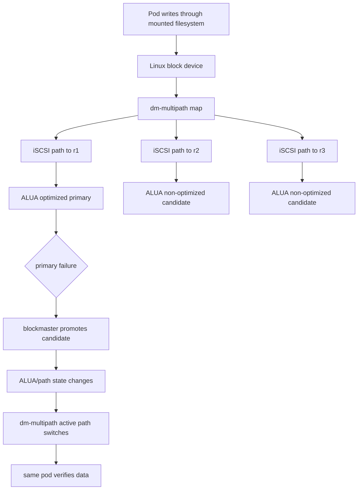

# iSCSI ALUA And Linux dm-multipath

This page explains the mounted transparent failover path based on iSCSI ALUA
and Linux dm-multipath.

## Reader Orientation

The normal Kubernetes CSI reattach path may require pod recreate. Stage 2
transparent failover asks a harder question:

```text
can the same mounted pod keep reading through a controlled primary failure?
```

The current proven protocol path is:

```text
iSCSI target portals + ALUA path states + Linux dm-multipath
```

## Domain Background

iSCSI exposes block devices over TCP. The host is the initiator; Seaweed Block
acts as the target.

ALUA means Asymmetric Logical Unit Access. It lets a target report path access
states such as optimized or non-optimized. Linux dm-multipath can combine
multiple paths to the same logical device and switch active path when one path
fails or becomes non-optimal.

Practical vocabulary:

| Term | Meaning |
|---|---|
| initiator | host side, e.g. Linux node running `iscsiadm` |
| target | Seaweed Block frontend accepting iSCSI |
| IQN | iSCSI target identity |
| portal | target address such as `ip:3260` |
| ALUA | path access-state reporting |
| RTPG | SCSI report target port groups command |
| dm-multipath | Linux device-mapper path aggregation |
| stale path | old primary path that must not accept writes after authority moves |

## Product Problem

Transparent mounted failover is stronger than CSI reattach:

```text
same pod UID
same mounted filesystem path
primary fails
host path switches
reader verifies data
no pod recreate
```

The hard part is proving that this was really multipath failover, not a hidden
pod restart or direct blockvolume read.

## Methodology

Required facts:

```text
same IQN across paths
multiple sessions/portals
dm-multipath map exists
ALUA state visible
authority moves to a valid candidate
old primary cannot ACK stale I/O
same pod verifies data after failure
```

Constraints:

- master chooses authority; ALUA does not elect primary,
- candidate must cover the durable frontier,
- host must see one multipath device, not unrelated `/dev/sdX` devices,
- every wait has a bounded timeout and blocker reason.

## State / Path Diagram



## Implementation Map

| Responsibility | Code / evidence area |
|---|---|
| CSI stage multipath opt-in | `core/csi` Stage 2 multipath path |
| iSCSI frontend | frontend iSCSI code and target state |
| authority evidence | `core/host/master` cluster evidence |
| host path evidence | `sg_rtpg`, `multipath`, `iscsiadm` artifacts |
| report model | `core/ops` host-path projection |
| scenarios | `stage2-iscsi-alua-multipath-*`, mounted failover scenarios |

## Evidence Required

A valid transparent failover claim needs lines like:

```text
protocol=iscsi
multipath_enabled=true
path_count_before>=2
path_count_after>=1
before_primary_replica=<rN>
promoted_replica=<rM>
post_failure_primary_count=1
old_primary_stale_io_success_count=0
data_check_after_failover=mounted_workload_checksum_passed
pod_recreate_used=false
```

## Phase History

| Phase | Contribution |
|---|---|
| iSCSI P6/P8 | OS initiator, ALUA, MPIO compatibility evidence |
| Stage 2 / Phase 17 | transparent host failover contract |
| Multi-volume phases | per-volume ALUA/multipath isolation |
| Phase 37 D4/D5 | host prereq and loopback/cross-node blockers surfaced |

## Failure Classes

Transparent failover must fail closed with named blockers:

- `attach_timeout`,
- `iscsi_login_timeout`,
- `multipath_map_timeout`,
- `alua_state_unavailable`,
- `authority_promotion_timeout`,
- `path_switch_timeout`,
- `stale_primary_fence_timeout`,
- `post_failure_io_timeout`,
- `cleanup_timeout`.

## Non-Claims

- This is not a generic production HA claim.
- NVMe ANA parity is separate.
- Pod-recreate CSI reattach is a different, weaker path.
- ALUA path state does not create authority; it reflects authority.

