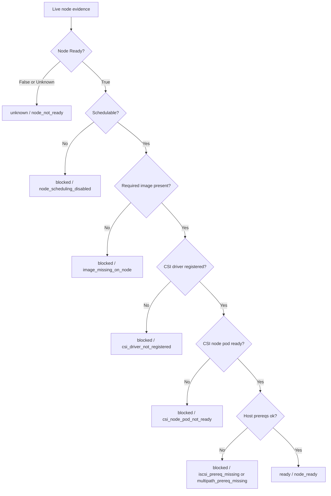
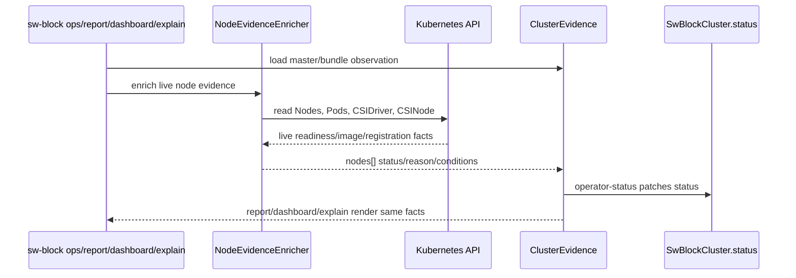

# Live Node And CSI Evidence

This page explains how Seaweed Block decides whether a Kubernetes node can
actually participate in block-volume operations. It exists because earlier
surfaces repeatedly showed nodes as ready when live Kubernetes evidence said
otherwise.

## Reader Orientation

You need this page before changing:

- node readiness projection,
- CSI node DaemonSet behavior,
- image-pull and install-preflight checks,
- report/dashboard/explain live enrichment,
- host-prereq and loopback blockers,
- release gates that claim a PVC can attach on a node.

The product question is:

```text
Can the user see node-level blockers from live Kubernetes/host evidence before
they become confusing PVC attach failures or false volume Ready signals?
```

## Domain Background

Kubernetes node readiness is not one fact.

| Fact | Source | Meaning |
|---|---|---|
| Node Ready | `Node.status.conditions` | kubelet/node health |
| SchedulingDisabled | node spec/cordon state | new pods should not schedule |
| CSI node pod Ready | Seaweed Block CSI DaemonSet pod | node plugin is running |
| CSI driver registration | `CSIDriver` / `CSINode` | kubelet knows the CSI driver |
| image pull state | CSI pod container waiting reason | selected image exists/reachable on that node |
| host prereqs | scripts or host evidence | iSCSI/multipath tools and modules exist |
| frontend reachability | publish target and node topology | target can be used from app node |

A node can be Kubernetes Ready but still blocked for Seaweed Block because the
CSI image is missing, the CSI node pod is not ready, the driver is not
registered, or a loopback frontend is being used cross-node.

## Product Contract

The narrow claim is:

```text
CRD status, report, dashboard, and explain must agree on node readiness and
node blockers from live evidence, not replay-only fixtures or helper summaries.
```

Negative-first rules:

- Node NotReady wins over CSI symptoms.
- Image missing on node wins over secondary symptoms such as CSI driver not
  registered.
- Cordon is a blocked scheduling condition, not a storage corruption signal.
- Missing evidence must not become healthy.
- A live node blocker must not be visible only in CRD status while report or
  dashboard still shows green.

## Ownership Model

| Layer | Owns |
|---|---|
| Kubernetes API | Node, Pod, DaemonSet, CSIDriver, CSINode facts |
| node evidence enricher | reads live K8s facts and updates observation model |
| operator-status | writes `SwBlockCluster.status.nodes[]` |
| report/dashboard/explain | consume the same enriched observation path |
| lifecycle-owner | does not decide node readiness |
| TestOps | creates live blockers and checks cross-surface agreement |

## Precedence State Machine



This precedence exists because symptom-first classification is misleading. A
NotReady node naturally causes CSI pod and driver symptoms; the root cause must
surface as `node_not_ready`.

## Live Enrichment Path



The important implementation detail is that live enrichment must be shared by
all live consumers. A fix in operator-status alone is not enough if `ops report`
or dashboard still loads un-enriched facts.

## Code Map

| Responsibility | Code / evidence |
|---|---|
| live enrichment call site | `cmd/sw-block/main.go` (`enrichLiveObservationCluster`) |
| namespace selection for CSI pods | `liveNodeEvidenceNamespace` |
| K8s node/CSI read model | `core/ops/kubernetes_node_evidence.go` |
| node classification | `core/ops/operator_status_controller.go`, `classifyNodeReadiness` |
| observation replay/host prereq | `core/ops/observation_bundle.go` |
| reason vocabulary | `core/ops/observation.go` |
| CRD schema | `charts/seaweed-block/crds/` |
| Phase 37 gates | `internal/docs/qa-assignments/phase37-*` |

## Evidence Contract

Node evidence must include stable fields:

```text
node=<name>
status=<ready|blocked|unknown>
reason=<node_ready|node_not_ready|node_scheduling_disabled|image_missing_on_node|...>
ready=<true|false>
schedulable=<true|false>
missing_images=<image list or empty>
conditions[]=Ready/Blocked/EvidenceStale with reason
```

For image failures:

```text
container_waiting_reason=ImagePullBackOff|ErrImagePull|ErrImageNeverPull
missing_images=["sw-block-csi:<tag>"]
```

For host prereqs:

```text
iscsi_prereq=<ok|missing>
multipath_prereq=<ok|missing>
```

For loopback cross-node:

```text
reason=publish_target_loopback_cross_node
app_node=<node-a>
blockvolume_node=<node-b>
frontend=127.0.0.1:3260
```

## Failure Taxonomy

| Reason | Meaning |
|---|---|
| `node_not_ready` | Kubernetes node readiness is false/unknown |
| `node_scheduling_disabled` | node is cordoned/unschedulable |
| `image_missing_on_node` | selected Seaweed Block image cannot run on that node |
| `csi_driver_not_registered` | Kubernetes does not see the CSI driver on the node |
| `csi_node_pod_not_ready` | CSI DaemonSet pod is not ready |
| `iscsi_prereq_missing` | node lacks required iSCSI host prerequisite |
| `multipath_prereq_missing` | node lacks required multipath host prerequisite |
| `publish_target_loopback_cross_node` | loopback frontend cannot be used from another node |

## Implementation Checklist

1. Read live Node, Pod, CSIDriver, and CSINode facts with read-only RBAC.
2. Resolve the CSI control-plane namespace, not the user's default namespace,
   when reading CSI node pods.
3. Classify root cause before symptoms: NotReady before CSI pod/driver reasons;
   image missing before registration fallout.
4. Map facts to existing CRD-valid condition types (`Ready`, `Blocked`,
   `EvidenceStale`) instead of inventing invalid condition enum values.
5. Enrich every live consumer: operator-status, report, dashboard, explain.
6. Keep from-bundle replay deterministic; do not require live K8s for cold
   bundles.
7. Add schema/API validation for the written status payload.
8. Test both `ImagePullBackOff` and `ErrImageNeverPull`.
9. Keep RBAC read-only: no node/pod/daemonset/storage mutation.

## QA History

| Gate | What it found or proved |
|---|---|
| Phase 36 D2 | positive node readiness projected, but negative live node facts were replay-only |
| Phase 36 D5 | live image import issue showed false node-ready masking |
| Phase 37 D2 initial | non-healthy node conditions violated CRD enum and were rejected |
| Phase 37 D2 rerun | node NotReady root cause precedence fixed |
| Phase 37 D3 | image-missing reason fixed across CRD/report/dashboard/default namespace |
| Phase 37 D4/D5 | host prereq and loopback cross-node blockers surfaced |

## Non-Claims

- Node readiness does not prove storage data safety.
- A ready node does not imply a volume is Ready.
- The node evidence enricher does not repair images, uncordon nodes, or install
  host packages.
- Loopback same-node support is not cross-node support.
