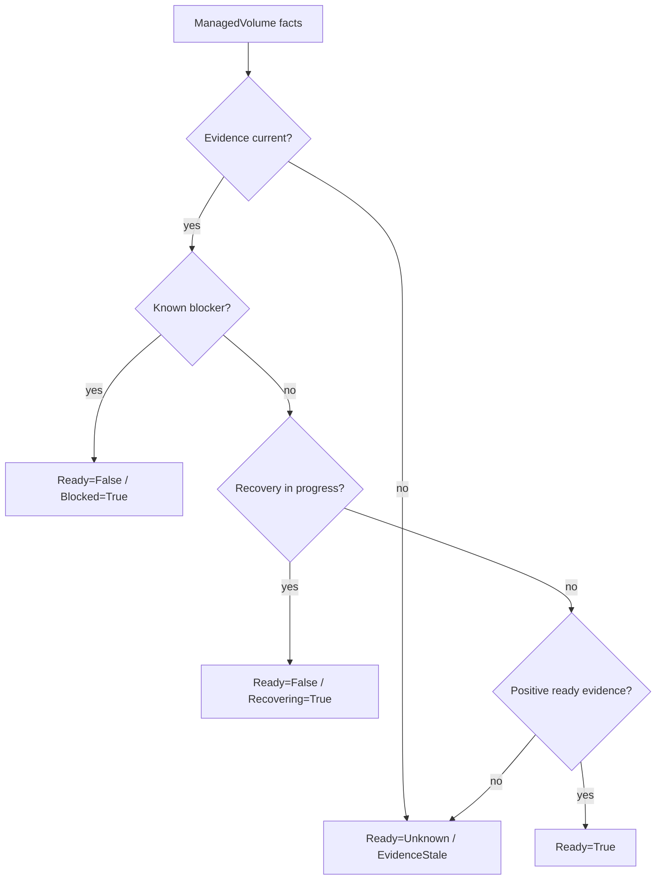

# ManagedVolume Readiness

`ManagedVolume` is the read-side product model for one PVC-backed Seaweed Block
volume. It correlates facts from Kubernetes, CSI, authority, replicas, frontend,
host path, cleanup, and support evidence.

It does not own Kubernetes lifecycle or authority.

## Why It Exists

Without a shared read model, CLI, dashboard, QA scripts, and CRD status can
derive different answers from the same underlying state. The core invariant is:

```text
User-facing PVC/volume explanations must be derived from ManagedVolume facts,
not independently recomposed by CLI, dashboard, TestOps, CSI logs, or shell grep.
```

## Readiness Priority



The important rule is not "green unless proven bad". It is:

```text
Ready=True requires positive current evidence.
```

## Common Reason Codes

| Situation | Projection |
|---|---|
| first volume verified | `Ready=True`, reason `first_volume_verified` |
| CSI image pull failed | `Ready=False`, `Blocked=True`, reason `csi_node_image_pull_failed` |
| status endpoint unreachable | `Ready=Unknown`, `EvidenceStale=True` |
| node NotReady | node `unknown/node_not_ready` |
| image missing on node | node `blocked/image_missing_on_node` |
| cleanup residue | `CleanupRequired=True`, delete-safety rejected |
| WAL integrity fault | not Ready; reason should remain diagnosable |

## Surfaces

The same projection feeds:

- `sw-block ops report`,
- dashboard `/operator-snapshot.json`,
- `sw-block ops explain`,
- `SwBlockCluster.status`,
- `SwBlockVolume.status`,
- Kubernetes Events.

## Main Code

| Behavior | Entry point |
|---|---|
| ManagedVolume model/projection | `core/ops/managed_volume_*` |
| observation bundle replay | `core/ops/observation_bundle.go` |
| report/dashboard rendering | `cmd/sw-block/main.go`, `core/ops` report helpers |
| CRD status mapping | `core/ops/operator_status_controller.go` |

## QA Evidence

| Gate | What it proved |
|---|---|
| Phase 32 | healthy/blocked/restart/multi-volume/stale surfaces agree |
| Phase 34 | dirty SmartWAL evidence cannot become false Ready |
| Phase 35-36 | CRD status, Events, cleanup, support refs, node evidence align |
| Phase 37 | live node/CSI blockers no longer mask false node readiness |

## Non-Claims

- `ManagedVolume` does not choose a primary.
- `ManagedVolume` does not execute promotion, rebuild, failback, or cleanup.
- `ManagedVolume` is a read model and action contract, not a storage authority.

