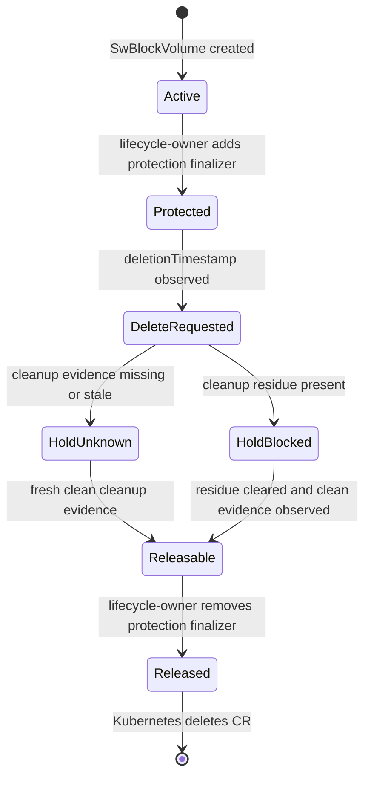
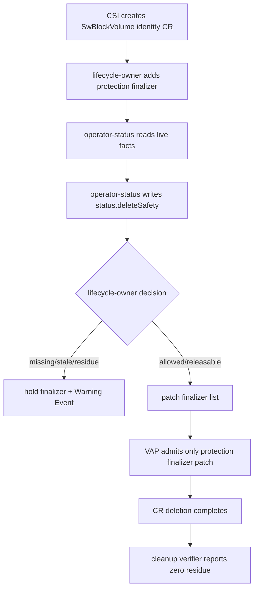

# Operation Layer v0.5

This page explains the first bounded mutating control-plane path in Seaweed
Block. It is written for developers who know Go and Kubernetes basics but may
not know storage operator design.

## Reader Orientation

Before v0.5, Seaweed Block could observe and explain a volume, but it did not
own a Kubernetes lifecycle mutation. v0.5 adds exactly one bounded mutation:

```text
add or remove block.seaweedfs.com/swblockvolume-protection
from SwBlockVolume.metadata.finalizers
```

Everything else remains out of scope:

```text
no automatic cleanup
no PVC/PV/workload deletion
no rebuild/failback/backup execution
no broad production operator claim
```

The goal is not "make an operator". The goal is to prove the first safe
operation loop:

```text
facts -> judgment -> status/action -> admitted mutation -> evidence
```

## Domain Background

### Kubernetes CRD Status

Kubernetes custom resources usually have two important areas:

| Area | Meaning |
|---|---|
| `.spec` | desired identity or user intent |
| `.status` | observed state written by a controller |

A status-only controller should patch only the `/status` subresource. That keeps
observation separate from lifecycle mutation.

### Kubernetes Finalizers

A finalizer is a string in `metadata.finalizers`. When a user deletes an object,
Kubernetes sets `deletionTimestamp` but does not remove the object until all
finalizers are gone.

For Seaweed Block, the finalizer is:

```text
block.seaweedfs.com/swblockvolume-protection
```

The finalizer protects the `SwBlockVolume` lifecycle object from disappearing
while delete-safety evidence is missing, stale, or unsafe.

### The CRD Finalizer Trap

Built-in Kubernetes resources sometimes have special subresources. Generic CRDs
do not expose a useful `/finalizers` endpoint for normal finalizer mutation. In
practice, changing a CRD finalizer means patching the main object:

```text
PATCH swblockvolumes/<name>
{"metadata":{"finalizers":[...]}}
```

That is dangerous because the same main-object patch permission can also change
other fields unless something else blocks it.

The trap:

```text
CRD finalizers require main-object patch
main-object patch can change spec and metadata
RBAC cannot express "only this one finalizer string"
therefore code review is not a safety boundary
```

This is why v0.5 needed real admission-policy proof.

## Product Problem

Seaweed Block needed to deliver a lifecycle behavior that feels product-owned:

```text
user creates PVC
-> Seaweed Block creates SwBlockVolume CR
-> CR is protected by a Seaweed Block finalizer
-> user requests delete
-> unsafe evidence holds deletion
-> clean evidence releases deletion
```

But the product must not silently become a broad storage operator. The hard part
is preserving this boundary under retries, stale evidence, schema validation,
RBAC, and Kubernetes admission behavior.

The easy but unsafe answer would be:

```text
give operator-status patch swblockvolumes
let it add/remove finalizers and maybe cleanup things later
```

That would destroy the v0.4 claim that `operator-status` is status/events-only.

The v0.5 answer is role separation:

| Role | Writes | Why |
|---|---|---|
| CSI | `SwBlockVolume` identity/spec | Create the CR from the normal PVC path |
| operator-status | `.status` and Events | Publish judgment and evidence |
| lifecycle-owner | protection finalizer only | Own object lifecycle metadata |

## Methodology

The method follows the older problem-shape rule:

```text
observe facts
-> apply constraints
-> decide in one place
-> execute narrowly
-> close with terminal evidence
```

For v0.5:

| Step | Owner | Evidence |
|---|---|---|
| observe live volume and cleanup facts | operator-status | cluster evidence, `cleanup-summary.txt` |
| classify delete safety | operator-status | `SwBlockVolume.status.deleteSafety` |
| decide finalizer hold/release | lifecycle-owner | status decision and deletionTimestamp |
| execute mutation | lifecycle-owner | main-object patch |
| confine mutation | Kubernetes admission | ValidatingAdmissionPolicy |
| close loop | CRD status, Events, QA cleanup verifier | finalizer held/released, zero residue |

## State Machine



## End-To-End Loop



## Delete-Safety Decision Table

| Evidence | Decision | State | Finalizer behavior |
|---|---|---|---|
| no cleanup evidence | `unknown` | `requested` | hold |
| stale cleanup evidence | `unknown` | `requested` | hold |
| iSCSI/multipath/dmsetup/process/hostPath/K8s residue | `rejected` | `blocked` | hold |
| fresh clean cleanup evidence | `allowed` | `releasable` | release |

The cleanup evidence is external. The lifecycle-owner does not execute cleanup.

## Why This Is Not Automatic Cleanup

Automatic cleanup would mutate host or Kubernetes state:

- iSCSI session or node DB records,
- multipath maps,
- dmsetup devices,
- hostPath data,
- generated Kubernetes resources,
- PVC/PV/workload objects.

Those are separate executor domains. v0.5 deliberately stops at lifecycle
metadata:

```text
Can this CR be released?
```

It does not answer:

```text
Can the operator repair or clean the cluster?
```

## Implementation Map

| Responsibility | Code / config |
|---|---|
| CSI creates identity CR | `core/csi/kubernetes_metadata.go`, `core/csi/controller.go`, `cmd/blockcsi/main.go` |
| status projection | `core/ops/operator_status_controller.go` |
| Kubernetes status writer | `core/ops/kubernetes_status_writer.go` |
| cleanup evidence parsing | `core/ops/cleanup_evidence.go` |
| delete-safety projection | `core/ops/observation_bundle.go` |
| lifecycle-owner reconcile | `core/ops/lifecycle_owner_controller.go` |
| action vocabulary | `core/ops/action_model.go` |
| CRDs/RBAC/VAP | `charts/seaweed-block/crds/`, `charts/seaweed-block/templates/` |
| CLI entry points | `cmd/sw-block/main.go` |

## Phase History

| Phase | What changed |
|---|---|
| 35 | introduced Kubernetes-native CRD status and Events; caught schema/casing issues |
| 36 | added productized operations actionability: node, support, cleanup visibility |
| 37 | hardened live node/CSI evidence so false node-ready no longer masked blockers |
| 38 | made action contracts executable and fail-closed |
| 39 | attempted finalizer path, discovered CRD finalizer/RBAC trap, pivoted to status-only delete-safety |
| 40 | hardened status API conformance and release-image checks |
| 41 | separated observer, lifecycle-owner, executor roles |
| 42 | proved lifecycle-owner admission boundary on real Kubernetes VAP |
| 43 | proved finalizer add/release as isolated gates |
| 44 | proved integrated PVC -> protected CR -> hold/release -> zero-residue path |

## Failures That Shaped The Design

| Failure | Design lesson |
|---|---|
| status writer payload passed mocks but failed live CRD schema | mock tests are insufficient for CRD writer paths |
| node condition enum rejected non-healthy node facts | schema vocabulary and product vocabulary must be shared |
| finalizer `/finalizers` patch returned 404 | CRD finalizers use main-object patch |
| main-object patch returned 403 under status-only RBAC | finalizer ownership needs a separate role |
| granting main patch is too broad | admission policy must confine the shape |
| CEL optional-field access denied valid patches | admission must be tested against a real API server |

These failures explain why the operation layer took many phases. The hard part
was not adding code. The hard part was proving the control boundary.

## QA Evidence

| Gate | What it proves |
|---|---|
| Phase 42 D1-D4 | lifecycle-owner can only add/remove the approved finalizer shape on a real VAP-capable API server |
| Phase 42 D5-D6 | delete-safety decisions are per-volume and dry-run/status-only before mutation |
| Phase 43 D1-D2 | lifecycle-owner adds the protection finalizer idempotently |
| Phase 43 D3-D4 | lifecycle-owner holds missing/blocked/stale and releases clean evidence only |
| Phase 44 D2 | normal PVC path creates protected `SwBlockVolume` CR without manual stubs |
| Phase 44 D3-D4 | integrated delete hold/release works with live status projection |
| Phase 44 D5-D6 | multi-volume delete isolation and report/dashboard/explain agreement |

## Non-Claims

- Not production-ready.
- No automatic cleanup execution.
- No PVC/PV/workload deletion.
- No host repair, iSCSI repair, or multipath repair.
- No rebuild, failback, backup, restore, or upgrade execution.
- No broad operator automation.

## Future Work

The next lifecycle features should reuse this pattern:

```text
fact owner
-> judgment owner
-> action owner
-> admission/RBAC boundary
-> user-visible evidence
-> QA gate
```

Returned-replica rebuild, failback, and cleanup execution should not bypass this
structure.
