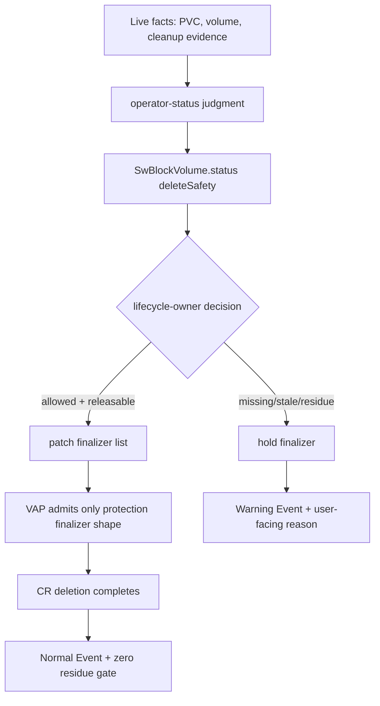

# Operation Layer v0.5

The v0.5 operation layer is the first bounded mutating lifecycle path. It is
not a broad operator. It exists to prove one controlled loop:

```text
facts -> judgment -> status/action -> admission-confined mutation -> evidence
```

## Why It Exists

Before this layer, Seaweed Block could observe many states but could not safely
own a Kubernetes lifecycle mutation. Phase 39 showed why: patching finalizers on
a CRD requires main-object patch permission, which is too broad unless an
admission boundary confines the write.

v0.5 resolves that by separating three components:

| Component | Role |
|---|---|
| CSI | create/update `SwBlockVolume` identity CR |
| operator-status | publish `.status` and Events only |
| lifecycle-owner | add/release only the Seaweed Block protection finalizer |

## End-To-End Loop



## Delete-Safety Contract

| Evidence | Decision | State | Finalizer |
|---|---|---|---|
| missing cleanup evidence | unknown | requested | held |
| stale cleanup evidence | unknown | requested | held |
| residue present | rejected | blocked | held |
| clean fresh evidence | allowed | releasable | released |

The cleanup evidence is external. The lifecycle-owner does not execute cleanup.

## Main Code

| Behavior | Entry point |
|---|---|
| operator-status reconcile | `core/ops/operator_status_controller.go` |
| Kubernetes status writer | `core/ops/kubernetes_status_writer.go` |
| cleanup evidence parsing | `core/ops/cleanup_evidence.go` |
| delete-safety projection | `core/ops/observation_bundle.go` |
| lifecycle-owner reconcile | `core/ops/lifecycle_owner_controller.go` |
| action model | `core/ops/action_model.go` |

## Admission Boundary

The lifecycle-owner needs main-object patch because CRD finalizers are mutated
through the main object. Kubernetes RBAC alone cannot express "finalizers only"
for this CRD. The boundary is therefore:

```text
RBAC permits lifecycle-owner main patch on SwBlockVolume
AND
ValidatingAdmissionPolicy denies any patch that changes spec, status, labels,
annotations, ownerReferences, foreign finalizers, or mixed fields
```

## QA Evidence

| Phase | Evidence |
|---|---|
| 41 | lifecycle-owner foundation and dry-run decision model |
| 42 | real Kubernetes ValidatingAdmissionPolicy boundary |
| 43 | finalizer add/release as isolated gates |
| 44 | integrated PVC -> protected CR -> hold/release -> zero-residue path |

## Non-Claims

- No automatic cleanup execution.
- No PVC/PV/workload deletion by operator-status or lifecycle-owner.
- No rebuild, failback, backup, or upgrade execution.
- No production operator claim.

