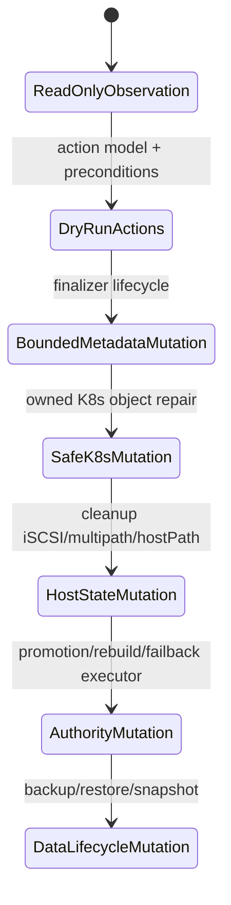
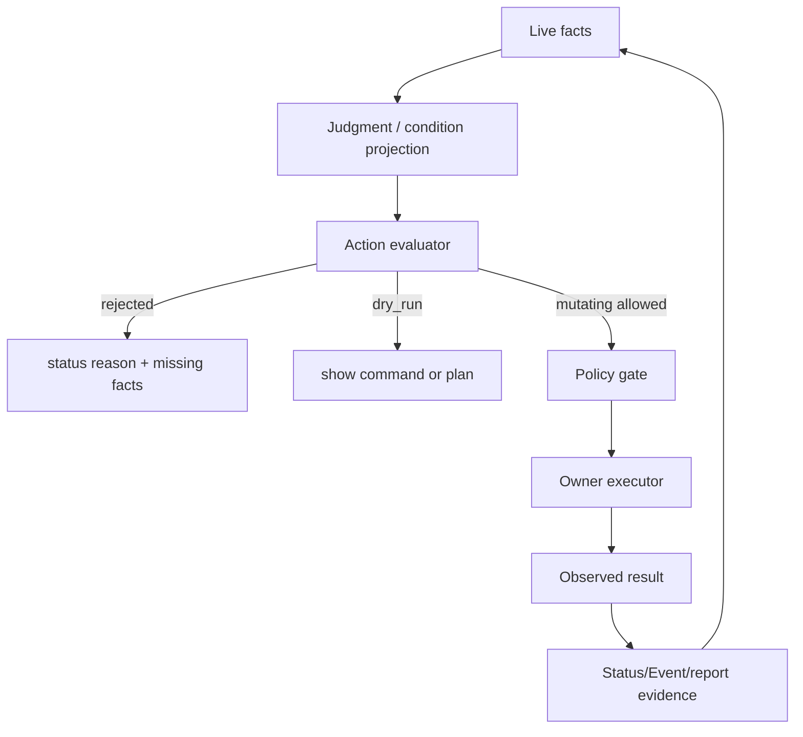

# From Read-Only Status To Read-Write Control Plane

This page explains how Seaweed Block should evolve from the current
status/action/finalizer foundation into broader read-write operator behavior.
It is deliberately written as a future design boundary, not as a current
release claim.

## Reader Orientation

You need this page before adding any controller that mutates:

- Kubernetes workload/storage objects,
- host iSCSI or multipath state,
- Seaweed Block authority,
- rebuild/failback state,
- backup/restore state,
- upgrade/rollback state.

The product question is:

```text
How do we add useful operator mutation without losing the safety model that
made the read-only/status layers trustworthy?
```

## Current Starting Point

The current operation layer is intentionally narrow:

```text
CSI creates SwBlockVolume identity/spec
operator-status writes .status and Events
lifecycle-owner mutates only the protection finalizer
support/report/dashboard/explain are read-only
cleanup evidence is observed, not executed
```

This is already one real write path:

```text
SwBlockVolume.metadata.finalizers add/remove
```

But it is not broad read-write operation. It is one admitted lifecycle metadata
mutation.

## Why Not Jump Directly To A Full Operator

Storage operators fail dangerously when they combine observation, judgment, and
mutation in one unbounded loop.

Common failure shapes:

- stale evidence triggers cleanup,
- node symptom masks root cause,
- a status bug becomes a storage mutation,
- a repair action runs without fencing,
- cleanup deletes host state still in use,
- rebuild/failback starts from the wrong frontier,
- a dashboard button bypasses product invariants.

The engineering rule is:

```text
No mutating action without live facts, preconditions, owner executor,
admission/RBAC boundary, user-visible status, and QA evidence.
```

## Maturity Ladder



The ladder is ordered by blast radius. A later stage should not start until the
previous stage has live gates and rollback/cleanup evidence.

## Action Classes

| Class | Example | Earliest safe owner |
|---|---|---|
| `observe` | collect bundle, render report | ops CLI / dashboard |
| `dry_run` | show import image or reinstall command | operator-status |
| `metadata_mutating` | add/release Seaweed Block finalizer | lifecycle-owner |
| `safe_k8s` | recreate an owned CSI DaemonSet, update owned Condition | future operator executor |
| `host_cleanup` | remove stale iSCSI node DB record or multipath map | future node agent, not cluster status writer |
| `authority_mutating` | request promotion, rebuild, failback | master/recovery executor |
| `data_lifecycle` | snapshot, backup, restore | future data lifecycle controller |

## Required Contract For Any Mutating Action

Every action needs this shape:

```text
action_type
mode=<dry_run|scripted|mutating>
side_effect_class
owner_executor
policy_gate
required_facts[]
preconditions[]
invariant_refs[]
evidence_required[]
mutation_allowed
result_status
terminal_evidence_ref
```

If an action lacks an owner executor or terminal evidence, it can be suggested
as `dry_run` or `scripted` but must not execute automatically.

## Read-Write Control Loop



The loop closes only when observed result evidence lands. "Command submitted"
is not a terminal state.

## Candidate Mutating Stages

### Stage 1: Safe Kubernetes Repair

Scope:

- restart or recreate Seaweed Block-owned pods/DaemonSets,
- apply missing owned CR objects,
- repair install drift for owned labels/annotations,
- never mutate PVC/PV/user workloads.

Required gates:

```text
owned_object_only=true
spec_patch_shape_admitted=true
foreign_object_denied=true
status_before_after_agree=true
rollback_or_reconcile_safe=true
```

### Stage 2: Host Cleanup Executor

Scope:

- remove stale Seaweed Block iSCSI node DB records,
- logout stale sessions,
- remove stale multipath/dmsetup maps,
- clean scoped hostPath residue.

This should be a node-scoped executor or privileged job with explicit evidence,
not an operator-status side effect.

Required gates:

```text
target_matches_seaweed_block_identity=true
device_not_mounted=true
no_active_session_for_live_volume=true
cleanup_plan_rendered=true
cleanup_execution_logged=true
post_cleanup_verifier_zero=true
```

### Stage 3: Returned-Replica Rebuild / Reintegration

Scope:

- observe returned replica,
- keep it frontend-fenced,
- choose catch-up or rebuild from frontier facts,
- run recovery,
- admit it back to ACK/placement only after terminal evidence.

Required gates:

```text
returned_replica_fenced=true
frontier_classified=true
rebuild_or_catchup_decision_visible=true
terminal_barrier_observed=true
ack_eligibility_after_recovery=true
multi_volume_isolation=true
```

### Stage 4: Failback

Failback is more dangerous than promotion because it can move authority away
from a working promoted primary. It should require:

- explicit policy,
- no dirty/stale evidence,
- current candidate covers frontier,
- old and new paths fenced correctly,
- user-visible event timeline.

### Stage 5: Backup / Snapshot / Restore

This is a data lifecycle feature, not an ops cleanup feature. It needs its own
consistency model, retention model, restore identity rules, and failure gates.

## Code Map

| Area | Current code |
|---|---|
| action model | `core/ops/action_model.go` |
| operator-status projection | `core/ops/operator_status_controller.go` |
| lifecycle owner | `core/ops/lifecycle_owner_controller.go` |
| delete-safety | `core/ops/delete_safety_contract.go` |
| admission/RBAC | `charts/seaweed-block/templates/` |
| cleanup evidence | `core/ops/cleanup_evidence.go`, `scripts/verify-helm-cleanup.sh` |
| authority/recovery | `core/host/master/`, `core/recovery/`, `core/transport/` |

## Failure Taxonomy

| Failure | Meaning |
|---|---|
| `missing_required_facts` | action cannot decide safely |
| `policy_disabled` | product intentionally rejects the action class |
| `executor_unavailable` | no owner exists to perform the action |
| `admission_boundary_missing` | mutation cannot be confined |
| `terminal_evidence_missing` | command ran but result cannot be proven |
| `foreign_object_risk` | target is not owned by Seaweed Block |
| `fencing_precondition_missing` | storage mutation could expose stale writer |

## Implementation Checklist

1. Define the action class and side effect.
2. Name the owner executor.
3. Define required live facts and stale-evidence behavior.
4. Add status fields and Events before enabling mutation.
5. Add admission/RBAC confinement for the exact patch shape.
6. Write a rejected-action test first.
7. Write a dry-run/action-plan test.
8. Write a real mutation gate with terminal evidence.
9. Verify multi-volume isolation.
10. Verify cleanup/residue after failure and success.

## Non-Claims

- Current v0.5 does not execute cleanup.
- Current lifecycle-owner does not mutate PVC/PV/workloads.
- Rebuild/failback/backup are not current operator actions.
- A dashboard action hint is not permission to execute mutation.
