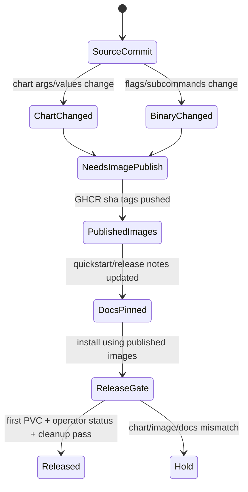

# Release Engineering And Image/Chart Skew

This page explains the release-engineering failure class where code, chart,
docs, and published images drift apart. It is written for developers preparing
release candidates or changing Helm flags and container entrypoints.

## Reader Orientation

You need this page before changing:

- Helm chart arguments,
- binary flags,
- default image tags,
- release notes,
- quickstart image pins,
- GHCR publishing scripts,
- TestOps release gates.

The product question is:

```text
Can a new user install the documented chart with the documented published
images and create the first PVC without local overrides?
```

## Domain Background

Kubernetes release artifacts are coupled:

```text
chart templates
values.yaml defaults
container images
binary flags
docs/quickstart
release notes
TestOps scenarios
```

If a chart passes a new flag but the published image contains an older binary,
Kubernetes does exactly what it should: the pod crashes. Local from-source tests
can still pass, which makes this failure easy to miss.

## Product Contract

For every release candidate:

```text
documented Helm install + published immutable images
-> pods start
-> first PVC writer/reader passes
-> operator/status claims pass on the shipped binary
-> cleanup leaves zero residue
```

The release cannot rely on:

- local `sw-block:local` images,
- a developer's k3s image cache,
- old `:alpha` tags,
- docs that say `sha-<commit>` without naming the validated tag.

## Skew State Machine



## Known Failure Pattern

Phase 40 exposed the concrete pattern:

```text
chart passes --launcher-durable-impl
published image predates that flag
blockmaster exits: flag provided but not defined
helm install --wait times out
first-volume path fails
```

The fix was to gate the new chart flag behind a compatibility value and then
validate the release image separately.

## Artifact Ownership

| Artifact | Must agree with |
|---|---|
| `charts/seaweed-block/templates/*.yaml` | binary flags and compatibility values |
| `charts/seaweed-block/values.yaml` | safe defaults for currently published images |
| `cmd/*/main.go` flags | chart args and generated values |
| `docs/quickstart-kubernetes.md` | latest validated immutable tags |
| `docs/releases/*.md` | QA evidence and exact image tags/digests |
| TestOps release gate | published images, not local override |

## Code / File Map

| Responsibility | File area |
|---|---|
| image defaults and generated values | `cmd/sw-block/main.go`, `charts/seaweed-block/values.yaml` |
| blockmaster args | `charts/seaweed-block/templates/blockmaster.yaml` |
| CSI args | `charts/seaweed-block/templates/csi-*.yaml` |
| release docs | `docs/releases/`, `docs/quickstart-kubernetes.md` |
| release gates | `internal/docs/qa-assignments/phase40-*`, TestOps scenarios |

## Evidence Contract

A release candidate needs:

```text
source_commit=<sha>
block_image=ghcr.io/seaweedfs/seaweed-block:sha-<sha>
csi_image=ghcr.io/seaweedfs/seaweed-block-csi:sha-<sha>
block_image_digest=<digest>
csi_image_digest=<digest>
helm_template_default_compatible=true
first_volume_with_published_image=PASS
operator_status_with_release_image=PASS
cleanup_status=ok
```

If the release uses backward-compatible chart changes, record both:

```text
old_published_image_backward_compat=PASS
fresh_release_image_status_gate=PASS
```

## Release Checklist

1. Build both block and CSI images from the release commit.
2. Push immutable `sha-<commit>` tags and record digests.
3. Verify chart defaults do not pass flags unsupported by the pinned image.
4. Verify quickstart and release notes name the exact tags.
5. Import/pull the images on every test node; do not rely on one-node cache.
6. Run first-volume scenario with published images and no local override.
7. Run operator-status CRD/Event/RBAC gate against the release image.
8. Run negative status and cleanup gates.
9. Confirm `sw-block --version` / image labels expose useful provenance when
   available.
10. Leave lab cleanup verifier at zero residue.

## Failure Taxonomy

| Reason | Meaning |
|---|---|
| `chart_image_flag_skew` | chart passes a flag missing from image binary |
| `docs_pin_missing` | release docs do not name a validated image tag |
| `node_image_cache_skew` | one k3s node has a stale local image |
| `multi_image_commit_skew` | block and CSI images come from different commits |
| `published_image_missing_feature` | release image lacks a new subcommand/path |
| `local_override_only_pass` | gate passed only with `sw-block:local` |

## Non-Claims

- A from-source local build does not prove release readiness.
- A published image smoke does not prove all HA features.
- `:alpha` is not an immutable release boundary.
- Helm lint does not prove runtime compatibility with image flags.
