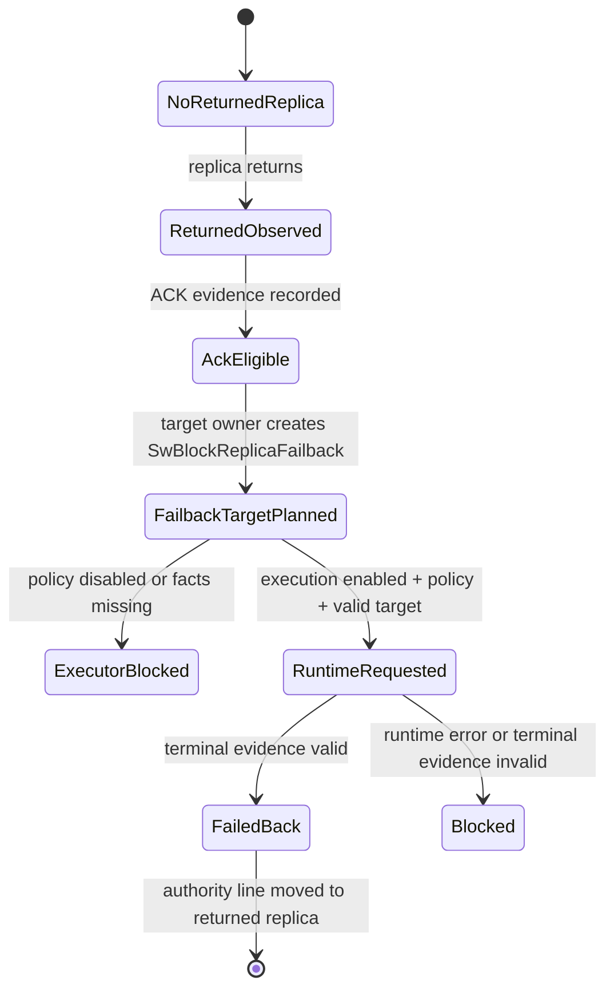

# Returned Replica Failback Runtime

This page explains the returned-replica failback path. It is an
implementation-grade design map for developers. It is not a release note and
does not claim automatic Kubernetes failback.

## Reader Orientation

A returned replica is a replica that was previously unavailable or stale, then
returns after the volume continued on another primary. Failback asks:

```text
Can authority move the primary role back to this returned replica?
```

That is separate from ACK eligibility, rebuild/catch-up, and frontend
publication. Failback changes authority, so it must be owned by the authority
layer and must not be inferred from "pod is Running".

## Domain Background

| Concept | Meaning |
|---|---|
| promotion | move primary role away from failed/unavailable primary |
| reintegration | allow a recovered replica to participate again |
| failback | move primary role back to the recovered replica |
| fencing | prove an unsafe writer cannot keep writing |
| durable frontier | evidence the target covers the required write boundary |
| authority epoch | monotonic generation for current primary ownership |
| publish target | frontend endpoint clients should attach to |

The dangerous bug class is:

```text
returned replica looks present
-> product assumes it is safe
-> primary authority moves
-> old or stale data path becomes current
```

Seaweed Block gates failback through explicit typed evidence.

## Product Contract

The failback path is explicit:

```text
ManagedVolume action
-> executor preflight
-> SwBlockReplicaFailback target CR
-> failback executor
-> FailbackService RPC
-> master-owned Publisher.apply(IntentReassign)
-> terminal evidence in target status
```

Required pre-runtime evidence:

| Evidence | Why it matters |
|---|---|
| `ack_eligible_true` | returned replica was explicitly admitted to ACK policy |
| `frontend_fenced_before_failback` | target is not serving unsafe frontend I/O before authority move |
| `durable_frontier_covered` | target covered the required write frontier |
| `failback_authority_owner` | authority change is owned by blockmaster/Publisher |
| `expectedCurrentReplicaID` | prevents stale requests from moving authority from the wrong source |
| `expectedCurrentEpoch` | prevents replaying an old failback request |
| `targetDataAddr` / `targetCtrlAddr` | authority line can publish the target endpoint |
| `noCrossVolumeIdentityChange` | target belongs to the intended volume |

Required terminal evidence:

```text
failbackStarted=true
authorityEpochAdvanced=true
singlePrimaryAfterFailback=true
publishTargetSwappedAfterFailback=true
noStorageMutation=true
noCrossVolumeIdentityChange=true
```

`noStorageMutation=true` means this path moves authority only. It does not claim
rebuild/catch-up traffic or data repair.

## State Machine



Hold reasons:

| Hold | Reason |
|---|---|
| policy disabled | executor may observe but not mutate |
| missing facts | target lacks required evidence |
| runtime missing | no HTTP endpoint or explicit gRPC runtime |
| stale expected-current | current primary/epoch changed before runtime applied |
| invalid terminal evidence | runtime did not prove all postconditions |

## Ownership Model

| Owner | Responsibility | Must not do |
|---|---|---|
| operator-status | publish facts/actions/status | execute failback |
| failback target owner | create `SwBlockReplicaFailback` target CR | mutate authority |
| failback executor | evaluate target and call runtime only under explicit policy | pick targets automatically |
| blockmaster FailbackService | delegate to master-owned authority runtime | run when disabled |
| authority Publisher | mint the reassignment epoch | publish frontend policy outside authority |

## Kubernetes / CRD Shape

Target object:

```text
SwBlockReplicaFailback
```

Important `.spec` fields:

```text
volumeName
volumeID
pvcName
replicaID
targetDataAddr
targetCtrlAddr
expectedCurrentReplicaID
expectedCurrentEpoch
ackEligible
frontendFencedBeforeFailback
durableFrontierCovered
noCrossVolumeIdentityChange
failbackDecision
failbackMutationAllowed
runtimeEndpoint
```

`runtimeEndpoint` is required only for HTTP fallback. With explicit gRPC
runtime, the target does not need a target-local HTTP endpoint.

Important `.status` fields:

```text
state=blocked|failed_back
reasonCode=failback_policy_disabled|failback_runtime_target_missing|...
failbackStarted
authorityEpochAdvanced
singlePrimaryAfterFailback
publishTargetSwappedAfterFailback
noCrossVolumeIdentityChange
nonClaims
```

## CLI / Chart Shape

Default executor:

```text
sw-block ops failback-executor
```

Execution requires all of:

```text
--enable-execution
--execution-policy
--failback-runtime-grpc-addr <blockmaster:9333>
```

Chart opt-in:

```yaml
blockmaster:
  failbackRuntimeRPC: true

failbackTargetOwner:
  create: true
  dryRun: false

failbackExecutor:
  create: true
  dryRun: false
  execution:
    enabled: true
    policy: true
    failbackRuntimeGrpcAddr: blockmaster.kube-system.svc:9333
```

The chart rejects execution with `dryRun: true`, missing execution policy, or
ambiguous HTTP/gRPC runtime addresses.

## Code Entry Points

| Area | Files |
|---|---|
| action/preflight contract | `core/ops/returned_replica_executor_preflight.go`, `core/ops/returned_replica_executor_contract.go` |
| failback target owner | `core/ops/failback_target_owner_controller.go` |
| failback executor controller | `core/ops/failback_executor_controller.go` |
| current authority status projection | `core/ops/managed_volume_model.go`, `core/ops/managed_volume_operator_contract.go`, `core/ops/operator_status_controller.go` |
| HTTP runtime | `core/ops/failback_runtime_http.go` |
| gRPC runtime | `core/ops/failback_runtime_grpc.go` |
| authority runtime adapter | `core/ops/failback_authority_runtime_adapter.go` |
| authority seam | `core/authority/failback_runtime.go` |
| blockmaster runtime factory | `core/host/master/host.go` |
| blockmaster gRPC service | `core/host/master/services.go`, `core/rpc/proto/control.proto` |
| CLI | `cmd/sw-block/main.go`, `cmd/blockmaster/main.go` |
| chart wiring | `charts/seaweed-block/templates/blockmaster.yaml`, `charts/seaweed-block/templates/failback-target-owner.yaml`, `charts/seaweed-block/templates/failback-executor.yaml` |

## Phase History

| Phase | Contribution |
|---|---|
| 74 | names `authority.failback_returned_replica` action and terminal evidence |
| 75 | creates `SwBlockReplicaFailback` handoff target |
| 76 | adds failback executor status-only boundary |
| 77 | defines failback runtime request/response contract |
| 78 | adds authority-owned `Publisher.apply(IntentReassign)` runtime seam |
| 79 | wires executor call-site to authority runtime adapter |
| 80 | exposes master-owned failback runtime factory |
| 81 | adds disabled-by-default blockmaster `FailbackService` RPC |
| 82 | adds executor gRPC runtime client |
| 83 | packages RPC/executor flags in Helm, default-off |
| 84 | proves executor -> real blockmaster service -> Publisher locally |
| 85 | proves execution flags alone do not call runtime without a valid target |
| 86 | decouples gRPC runtime from target-local HTTP `runtimeEndpoint` |
| 87 | aligns README/wiki/roadmap with source-gated failback claims |
| 88 | packages target owner + executor + blockmaster RPC as one explicit Helm suite |
| 89 | projects current authority facts into `SwBlockVolume.status`, operator-snapshot, and summary text for later expected-current failback activation |
| 90 | makes target-owner creation require current authority facts and stamp `expectedCurrentReplicaID` / `expectedCurrentEpoch` onto disabled targets |
| 91 | adds explicit target activation policy plus runtime endpoint wiring; default remains disabled and no runtime call is made by the target owner |
| 92 | proves local target-owner -> executor handoff, including expected-current facts in the runtime request and terminal `failed_back` evidence |
| 93 | proves multi-volume handoff isolation for expected-current authority and target data/control addresses |
| 94 | proves full opt-in Helm suite render plus executor -> real blockmaster gRPC FailbackService smoke |
| 95 | installs the opt-in suite in k3s, creates a live first-volume authority line, injects returned-replica failback evidence, and waits for deployed target-owner/executor to write terminal `failed_back` status through live blockmaster gRPC |

## Failure Classes

| Failure | Expected behavior |
|---|---|
| no target | zero runtime calls |
| policy disabled | reject before runtime |
| invalid target facts | write blocked status, zero runtime calls |
| runtime unavailable | blocked status, no terminal success claim |
| stale expected-current | blockmaster rejects the request |
| invalid terminal evidence | executor writes blocked status |
| chart incoherent values | Helm render fails |

## Implementation Checklist

Before enabling broader failback behavior:

1. Prove the target exists and is volume-scoped.
2. Prove ACK eligibility and frontier coverage came from live evidence.
3. Prove the target was frontend-fenced before failback.
4. Read expected-current replica and epoch from `SwBlockVolume.status`
   (`primaryReplicaID`, `authorityEpoch`) before activating a failback target.
5. Stamp expected-current replica and epoch onto the `SwBlockReplicaFailback`
   target before any executor/runtime call.
6. Require explicit target activation policy and runtime endpoint before
   stamping `failbackDecision=enabled`.
7. Pass expected-current replica and epoch to blockmaster.
8. Prove target-owner -> executor handoff locally before the live deployed
   runtime smoke.
9. Prove multi-volume handoff isolation before the live deployed runtime smoke.
10. Prove the deployed suite renders blockmaster RPC, target-owner activation,
    and executor gRPC runtime together.
11. Run through blockmaster-owned `FailbackService`, not a sidecar authority copy.
12. Require terminal evidence before writing `failed_back`.
13. Prove the full opt-in suite can run in Kubernetes with fresh images, Helm,
    real service DNS, CRDs, RBAC, and cleanup.
14. Keep frontend publication as a separate gated action.
15. Keep rebuild/catch-up traffic as a separate gated action.
16. Run multi-volume isolation gates.
17. Document exactly what is automatic and what is opt-in.

## Current Boundary

After Phase 95, the intended product statement is:

```text
The failback authority control path is deployable and opt-in. The executor can
drive blockmaster-owned authority reassignment and write terminal target status.
```

The intended non-claim remains:

```text
The product does not yet publish the failed-back frontend path to workloads or
prove post-failback application I/O. That belongs to the next frontend
publication/data-path phase.
```

## Current Limits

Current source has an opt-in local failback runtime path. It does not yet claim:

- automatic deployed Kubernetes failback,
- live lab failback release smoke on published images,
- frontend publication after failback,
- storage rebuild/catch-up traffic,
- backup/restore,
- NVMe ANA parity.
