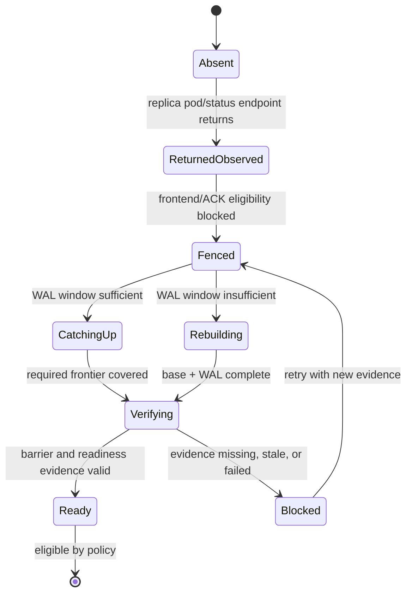

# Returned Replica Rebuild Readiness

This page explains why returned-replica rebuild/reintegration is the natural
next major storage lifecycle feature, and why it should not be treated as
"already done" just because lower-level recovery pieces exist.

## Reader Orientation

A returned replica is a replica that was absent, stale, or behind, then comes
back after the volume has continued elsewhere. The product question is:

```text
when can that replica safely rejoin placement, ACK eligibility, or frontend use?
```

This is harder than detecting that a pod is Running.

## Domain Background

Distributed block systems need a rebuild or catch-up path for stale replicas.
Common industry concepts:

| Term | Meaning |
|---|---|
| catch-up | replica is behind but WAL window can bring it current |
| rebuild | replica is too far behind; base data plus WAL is needed |
| durable frontier | progress boundary the replica must cover |
| pin floor | WAL retention lower bound needed by active recovery |
| barrier | terminal evidence that a recovery stream closed safely |
| reintegration | allowing a recovered replica back into normal serving/ACK policy |
| failback | moving primary role back after recovery; a separate policy decision |

The older design notes describe this as:

```text
recover(a) != merely recover(a,b)
```

Meaning: enumerating data up to a target is not enough. The product must know
whether the replica is safe for the role being claimed.

## Product Problem

Seaweed Block already has important lower-level pieces:

- WAL/frontier concepts,
- recovery/catch-up/rebuild mechanics,
- peer readiness facts,
- promotion-ready evidence,
- stale-primary fencing gates.

But productized returned-replica lifecycle requires a Kubernetes-visible loop:

```text
returned replica observed
-> fenced from frontend
-> classified catch-up or rebuild
-> progress visible
-> barrier/terminal evidence observed
-> readiness changes
-> placement/ACK eligibility updated
```

Without that loop, claiming returned-replica rebuild would be too broad.

## Methodology

Returned-replica rebuild must answer:

```text
what facts prove the replica is stale?
what frontier must it cover?
who decides catch-up vs rebuild?
who executes transfer?
what barrier proves completion?
who changes readiness/ACK eligibility?
where does the user see progress and failure?
```

## State Machine



## Implementation Areas

| Responsibility | Code / doc area |
|---|---|
| promotion readiness facts | `core/host/master/promotion_probe.go`, product loop tests |
| frontend fail-closed projection | `core/host/volume/projection_bridge.go`, `core/frontend/durable/` |
| recovery mechanics | recovery/transport code and older recovery tutorial |
| ManagedVolume status | `core/ops` future returned-replica projection |
| action ownership | operation-layer action model and future executor |

## What Exists Today

| Existing piece | Why it is not enough alone |
|---|---|
| recovery/catch-up mechanics | not yet a full Kubernetes-visible lifecycle claim |
| promotion-ready gates | prove candidate readiness for promotion, not returned-replica reintegration |
| stale primary fencing | prevents old writer, but does not rebuild old replica |
| ManagedVolume model | can expose facts, but needs returned-replica states/actions |
| operation-layer action model | can host future rebuild action contracts, but no executor yet |

## QA Gate Shape Needed

A real returned-replica gate should prove:

```text
replica returns stale
frontend remains fenced
catch-up/rebuild path starts with named reason
progress is visible in CRD/report/dashboard
dirty/stale evidence does not become Ready
barrier/completion evidence arrives
replica becomes ready only after frontier is covered
multi-volume isolation holds
cleanup verifier remains clean
```

## Non-Claims

- No automated returned-replica rebuild is currently claimed.
- No failback policy is claimed.
- No backup/restore is implied.
- No broad HA production claim follows from lower-level recovery code alone.

## Why This Is Next After Operation Layer

Operation-layer v0.5 created the shape needed for this work:

```text
facts -> judgment -> action -> boundary -> evidence
```

Returned-replica rebuild should be the next major storage feature only if it
uses that shape. Otherwise it will recreate the old problem: engine semantics
that look coherent internally but are not a complete product capability.

