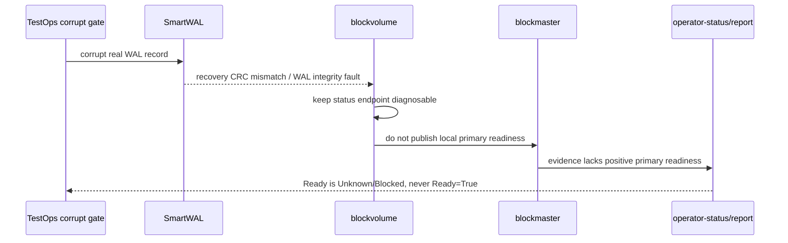

# SmartWAL Dirty-Failure Path

The SmartWAL corruption gate is the best example of why live dirty-failure
tests matter. It found a real false-ready bug that unit tests and clean failure
tests missed.

## Problem

A corrupted WAL record is not the same as a missing pod or a clean restart. It
is a block-storage integrity event. The system must answer harder questions:

- Did recovery read a committed record or a torn tail?
- Is the corruption before or after the durable frontier?
- Can later records be trusted if an earlier committed record failed CRC?
- Does local readiness stay blocked while diagnostics remain available?
- Does the control plane refuse to project `Ready=True` without a positive
  readiness fact?

If the product detects corruption but still reports `Ready=True`, users get a
false safety signal.

The required behavior is:

```text
detect integrity fault
-> fail closed
-> block local readiness
-> projection refuses Ready=True without positive readiness
```

## Failure Chain



## What The Gate Caught

The gate forced fixes through multiple layers:

1. Storage layer: do not skip mid-history CRC mismatch as a harmless torn tail.
2. blockvolume process: do not continue publishing healthy after durable
   recovery fault.
3. blockmaster projection: heartbeat/reachability is not enough for Ready.
   Primary readiness must be positively confirmed.

This sequence matters because each local fix was necessary but insufficient
until the surface stopped claiming false readiness.

## Why Clean Failure Tests Missed This

Clean failures are easy to reason about:

```text
pod killed
status endpoint gone
primary unavailable
```

Dirty failures are different:

```text
process restarted
status endpoint reachable
storage recovery found corruption
local readiness blocked
control plane still has old assignment facts
```

That shape exposes a common anti-pattern:

```text
reachable process + assigned primary -> Ready
```

For block storage, that is wrong. Reachability is an observation, not readiness.
Readiness must include semantic storage and authority facts.

## Historical Method Link

The methodology docs use these terms:

| Term | In this gate |
|---|---|
| frontier | recovery boundary that must not regress |
| barrier/fence | ordering/durability checkpoint |
| lineage | old ready facts must not override new fault state |
| projection | blockmaster/operator view of readiness |
| readiness | permission to serve writes |

The bug existed because projection and readiness were not fully separated at
every layer. The fix was not just a storage patch; it was a control-structure
repair.

## Main Code Areas

| Layer | Code area |
|---|---|
| SmartWAL recovery | `core/storage/smartwal/` |
| durable frontend readiness | `core/frontend/durable/` |
| blockvolume process readiness | `cmd/blockvolume/main.go` |
| blockmaster projection | `core/host/master/observation_snapshot.go`, `core/host/volume/projection_bridge.go` |
| status projection | `core/ops` |

## QA Evidence

| Artifact | Purpose |
|---|---|
| `helm-smartwal-corrupt-restart-chain.yaml` | live dirty-failure scenario |
| Phase 34 D4 finding | proved false Ready after real WAL corruption |
| Phase 34 D4 verify reports | tracked storage fix, process fix, projection fix |
| Phase 34 D4 PASS | confirmed no false Ready after corruption |

## Design Rule

Do not let "process is reachable" imply "volume is ready".

```text
reachable endpoint + assigned primary != positive readiness evidence
```

This same rule should be reused for returned-replica rebuild, partial recovery,
and future dirty shutdown scenarios.

## Non-Claims

- The gate does not prove all WAL corruption modes are recoverable.
- It does not prove no data loss under every power-loss pattern.
- It proves the product does not falsely report Ready when known dirty evidence
  is present.
