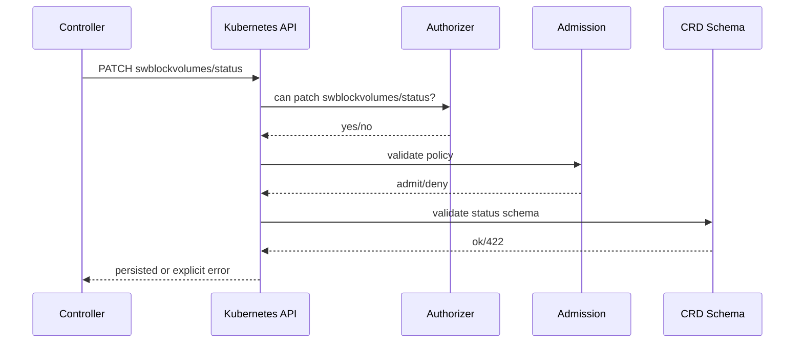
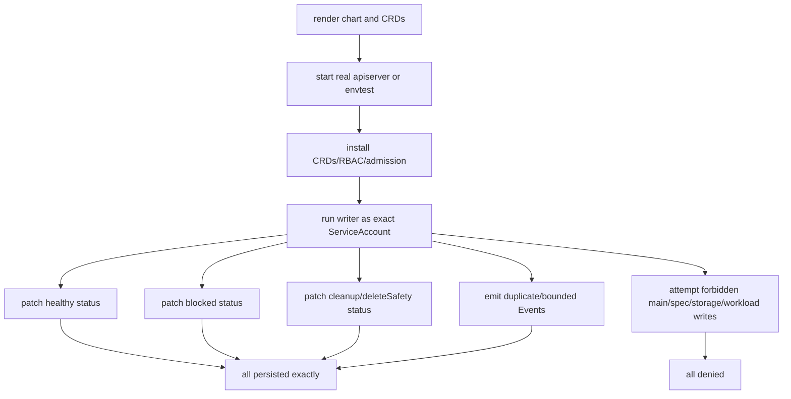

# CRD Status Writer And API Conformance

This page explains why Seaweed Block needs real Kubernetes API conformance
tests for status writers and lifecycle mutations. It is a design note for
developers changing CRDs, status DTOs, RBAC, Events, or admission policy.

## Reader Orientation

You need this page before changing:

- `SwBlockCluster` or `SwBlockVolume` CRD schemas,
- status writer DTOs,
- Kubernetes Events,
- lifecycle-owner finalizer patches,
- RBAC rules,
- ValidatingAdmissionPolicy,
- any mock Kubernetes writer test.

The repeated failure pattern was:

```text
go test/mock passes
helm template passes
live Kubernetes API rejects the request
```

The product lesson is that CRD schema, subresources, RBAC, and admission are
part of the implementation, not deployment details.

## Domain Background

Kubernetes applies multiple checks to a write:

```text
request URL/subresource
-> authentication
-> RBAC authorization
-> admission policy/webhook
-> CRD OpenAPI structural schema
-> status/spec subresource semantics
-> persistence
```

A unit-test mock usually checks only method, path, or rough payload shape. It
does not enforce:

- camelCase vs snake_case JSON field names,
- enum values,
- required fields,
- real CRD subresource availability,
- RBAC authorizer behavior,
- ValidatingAdmissionPolicy CEL behavior,
- how status fields are stripped from main-object patches.

## Product Contract

The status writer contract is:

```text
operator-status may patch only status subresources and create Events.
lifecycle-owner may patch only the approved protection finalizer shape.
Every status/action payload must validate against the real CRD schema.
Every boundary claim must be proven against a real API server or envtest.
```

Schema-aware mocks are useful for fast feedback, but they are not release
proof.

## Ownership Model

| Owner | Allowed write | Validation required |
|---|---|---|
| CSI | main `SwBlockVolume` identity/spec | live API create/patch, no status/finalizer |
| operator-status | `SwBlockCluster/status`, `SwBlockVolume/status`, Events | live/envtest status patch and RBAC |
| lifecycle-owner | main-object finalizer-only patch | live VAP/admission + RBAC |
| release gate | shipped image/chart path | live install with published image |

## API Request Flow



Finalizer mutation is different:

```text
PATCH swblockvolumes/<name>
{"metadata":{"finalizers":[...]}}
```

Generic CRDs do not provide a useful `/finalizers` endpoint for this path. RBAC
cannot express "main patch but only this one finalizer string", so admission
must confine the patch shape.

## Failure History

| Failure | Live result | Lesson |
|---|---|---|
| `allowedActions[].mutation_allowed` reused from operator-snapshot DTO | `422` missing required `mutationAllowed` | CRD DTO must be separate from snapshot DTO |
| node-specific condition types added outside CRD enum | `422` unsupported condition type | product vocabulary must match CRD schema |
| finalizer patch used `/finalizers` URL | `404` | CRD finalizers use main-object patch |
| main-object finalizer patch with status-only RBAC | `403` | finalizer owner needs separate role/admission |
| `allowedActions[].mode=scripted` missing from volume schema enum | `422` | cluster and volume action schemas must stay aligned |
| VAP CEL accessed absent optional fields | admission denied valid finalizer add | admission must be tested on real API server |
| chart passed new flag to old image | CrashLoopBackOff | release artifact conformance includes image/chart compatibility |

## Required Gate Shape



## Code Map

| Responsibility | Code / docs |
|---|---|
| status reconciler | `core/ops/operator_status_controller.go` |
| Kubernetes client/writer | `core/ops/kubernetes_status_writer.go` |
| CRD manifest generation/tests | `core/ops/kubernetes_crd_manifests_test.go` |
| conformance unit tests | `core/ops/kubernetes_status_conformance_test.go` |
| lifecycle owner | `core/ops/lifecycle_owner_controller.go` |
| Helm CRD/RBAC/VAP | `charts/seaweed-block/crds/`, `charts/seaweed-block/templates/` |
| Phase 40 conformance gate | `internal/docs/qa-assignments/phase40-d4-status-api-conformance-qa.md` |

## Evidence Contract

A conformance gate should record:

```text
crd_applied=true
rbac_applied=true
service_account=<exact SA>
cluster_status_patch=ok
volume_status_patch=ok
blocked_status_patch=ok
cleanup_status_patch=ok
event_create=ok
event_duplicate_idempotent=true
main_patch_allowed=false for operator-status
status_subresource_patch_allowed=true for operator-status
workload_storage_mutations_allowed=false
schema_validation_errors=0
```

For lifecycle-owner:

```text
lifecycle_owner_main_patch_allowed=true
finalizer_add_allowed=true
finalizer_remove_allowed=true
spec_patch_allowed=false
label_patch_allowed=false
owner_reference_patch_allowed=false
foreign_finalizer_patch_allowed=false
mixed_patch_allowed=false
```

## Implementation Checklist

1. Use separate DTOs for CRD status and operator-snapshot JSON if field casing
   differs.
2. Add enum values to CRD schemas before emitting them.
3. Test the request URL against a real API; do not invent CRD subresources.
4. Run writes as the real ServiceAccount, not admin.
5. Test healthy, blocked, unknown/stale, cleanup-required, and delete-safety
   status payloads.
6. Test duplicate Events and persistent blockers across multiple reconciles.
7. Test forbidden writes, not just allowed writes.
8. For VAP, wait for policy propagation before negative checks.
9. Treat mock/schema-aware tests as preflight, not release proof.

## Non-Claims

- A passing mock writer test does not prove Kubernetes compatibility.
- Helm rendering does not prove a pod can run or a status patch will persist.
- RBAC alone cannot safely bound CRD finalizer-only mutation.
- A schema-aware fake server is not equivalent to real admission behavior.
