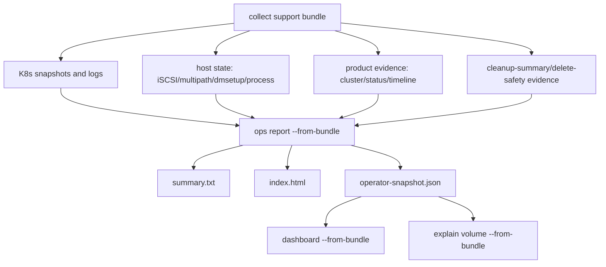
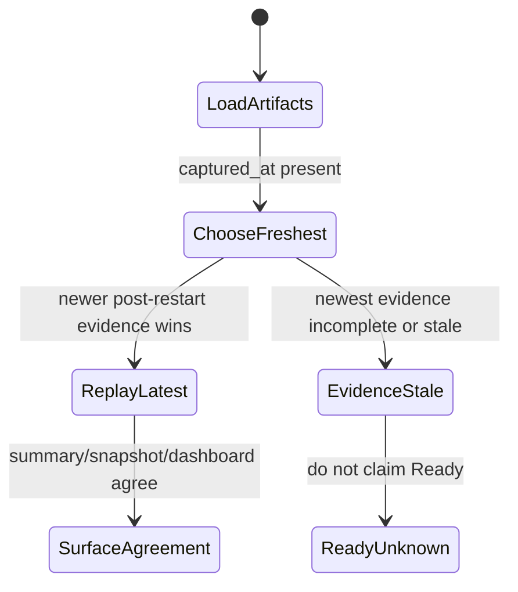

# Support Bundle, Report, Dashboard, And Cold-Reader Evidence

This page explains the support-bundle and replay path. It is the design
contract for making Seaweed Block diagnosable without SSHing back into the
cluster.

## Reader Orientation

You need this page before changing:

- `scripts/collect-helm-support-bundle.sh`,
- `sw-block ops report --from-bundle`,
- `sw-block ops dashboard --from-bundle`,
- `sw-block ops explain ... --from-bundle`,
- `operator-snapshot.json`,
- cleanup-summary and delete-safety replay,
- TestOps failure artifacts.

The product question is:

```text
Can a support engineer or developer read one bundle on another machine and
reach the same status/reason/action conclusion as the live cluster surfaces?
```

## Domain Background

Distributed storage failures often disappear when the cluster is cleaned up or
restarted. A useful bundle must therefore preserve:

- Kubernetes object state,
- product status and logs,
- host initiator state,
- cleanup residue evidence,
- timeline and reason codes,
- enough metadata to know what was not collected.

Logs alone are not enough. They are not structured, not necessarily complete,
and often lack the negative evidence needed for safe decisions.

## Product Contract

The bundle/replay contract is:

```text
capture read-only evidence
-> replay the same observation model offline
-> render summary/report/dashboard/explain/operator-snapshot consistently
-> never claim mutation or repair
```

Required surfaces:

```text
summary.txt
index.html
cluster-evidence.json
timeline.jsonl
operator-snapshot.json
explain.txt or explain command output
```

The cold reader should answer:

```text
what volume/node is affected?
is it Ready, Blocked, Unknown, CleanupRequired, or Releasable?
what stable reason code explains it?
what evidence file supports the reason?
what is the safe next step?
what is explicitly not claimed?
```

## Ownership Model

| Layer | Responsibility |
|---|---|
| collect script | read-only artifact capture |
| ops replay | parse bundle artifacts into `ClusterEvidence` |
| report renderer | human summary and HTML |
| dashboard | read-only local web view over same evidence |
| operator-snapshot | stable JSON for automation and UI |
| explain | cold-reader narrative for one volume/reason |
| verifier scripts | produce cleanup evidence, not hidden mutation by replay |

No support-bundle replay path may promote, repair, rebuild, failback, delete,
or cleanup live state.

## Replay Flow



## Evidence Precedence

Bundles can contain multiple captures. Replay must prefer the freshest relevant
evidence instead of a lexicographically early file.



This rule came from restart-persistence work: older pre-promotion evidence
could otherwise show the wrong primary after restart.

## Code Map

| Responsibility | Code / script |
|---|---|
| collect bundle | `scripts/collect-helm-support-bundle.sh` |
| basic app report generation | `scripts/run-basic-app-example.sh` |
| multi-volume report generation | `scripts/run-multi-volume-example.sh` |
| bundle load/replay | `core/ops/observation_bundle.go` |
| report rendering | `core/ops/observation_report.go` |
| dashboard handler | `core/ops/observation_dashboard.go` |
| operator snapshot | `core/ops/operator_snapshot.go` |
| CLI wiring | `cmd/sw-block/main.go` |
| cleanup parsing | `core/ops/cleanup_evidence.go` |
| delete-safety projection | `core/ops/delete_safety_contract.go`, `observation_bundle.go` |

## Minimum Bundle Contents

A strong failure bundle should include:

```text
metadata:
  product revision
  chart values or rendered manifests
  scenario/run id if from TestOps

cluster:
  pods/deploys/events
  PVC/PV/StorageClass/CSIDriver/CSINode
  SwBlockCluster/SwBlockVolume CRs when enabled

product:
  blockmaster logs current + previous when available
  blockvolume logs current + previous when available
  CSI controller/node logs
  cluster-evidence.json
  timeline.jsonl
  operator-snapshot.json

host:
  iscsiadm sessions
  iscsiadm node records
  multipath -ll
  dmsetup ls/info
  product processes
  hostPath evidence when relevant

cleanup:
  cleanup-summary.txt
  residue counts
  verify command output
```

## Stable Surface Fields

The replayed surfaces must agree on:

```text
status
reason_code
Ready condition
Blocked / EvidenceStale / CleanupRequired condition
read_only=true
mutation_allowed=false
safe_next_steps[].mode
support_bundle_refs[]
cleanup.status / residue counts
deleteSafety.decision/state/reason when deleting evidence exists
```

If any surface says `Ready=True` while another says blocked/unknown, the bundle
is not product-grade evidence.

## Failure Taxonomy

| Failure | Meaning |
|---|---|
| `bundle_missing_required_artifact` | replay cannot find required structured input |
| `evidence_stale` | freshest evidence is too old/incomplete for Ready |
| `surface_disagreement` | summary/snapshot/dashboard/explain disagree |
| `cleanup_required` | cleanup verifier found residue |
| `cleanup_evidence_missing` | delete request has no cleanup evidence |
| `cleanup_evidence_stale` | delete request evidence is too old |
| `from_bundle_lookup_missing` | explain/report cannot locate the volume in replay inventory |
| `snapshot_precedence_stale` | older capture overrides newer truth |

## Implementation Checklist

1. Capture structured JSON/JSONL before relying on text logs.
2. Include product and runner revision when available.
3. Capture previous container logs for crash/restart failures.
4. Preserve host evidence before cleanup removes it.
5. Parse artifacts into one observation model; do not let report/dashboard
   recompute separate truth.
6. Prefer freshest evidence by `captured_at` for replay.
7. Represent missing evidence explicitly as Unknown/EvidenceStale.
8. Keep safe next steps read-only or scripted with `mutation_allowed=false`.
9. Verify summary, HTML, `operator-snapshot.json`, dashboard, and explain
   agree on status/reason.
10. Run cleanup verifier after teardown and include zero-residue proof.

## QA History

| Phase | Contribution |
|---|---|
| Phase 28 | support bundle diagnostics and dashboard route became close-gate evidence |
| Phase 29 | cleanup evidence carried into report/dashboard/operator-snapshot |
| Phase 32 | surface agreement and stale-evidence replay precedence fixed |
| Phase 36 | support bundle refs and safe next steps projected into CRD/status surfaces |
| Phase 44 | cleanup-summary/deleteSafety replay for deleting CRs integrated into report/dashboard/explain |

## Non-Claims

- A support bundle is not a backup, snapshot, or restore point.
- Replay is not a repair executor.
- `safe_next_steps` are instructions or dry-run/scripted hints, not proof that
  the product executed mutation.
- A cold bundle cannot prove facts that were never captured.
