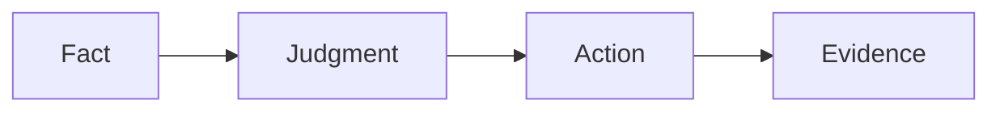

# Deep-Dive Template

Use this template for developer-facing pages. The target reader can read code
but may not know storage, CSI, iSCSI/NVMe, WAL, or Kubernetes operator
semantics.

## Reader Orientation

Explain what domain this page covers and why it matters.

```text
This page explains ...
You need this before changing ...
```

## Domain Background

Introduce the industry terms and standards involved. Keep it practical:

- What is the external system or standard?
- What does it expect from us?
- What does it not care about?
- What failure does a user see when we get it wrong?

## Product Problem

State the Seaweed Block-specific delivery goal and the traps:

```text
We need to deliver ...
The dangerous easy answer is ...
The correct answer must preserve ...
```

## Methodology

Answer the four questions:

```text
what facts do we observe?
what constraints must those facts satisfy?
who is allowed to decide?
where does the decision become real?
```

## State Machine / Protocol

Use Mermaid:



## Implementation Map

| Responsibility | Code / config |
|---|---|
| input facts | path |
| decision | path |
| execution | path |
| evidence | path |

## Phase History

| Phase | Contribution |
|---|---|
| Phase X | what changed |

Include failures that shaped the design.

## QA Evidence

| Gate | What it proves | What would fail |
|---|---|---|
| gate | proof | failure |

## Non-Claims

Name what this does not deliver yet.

