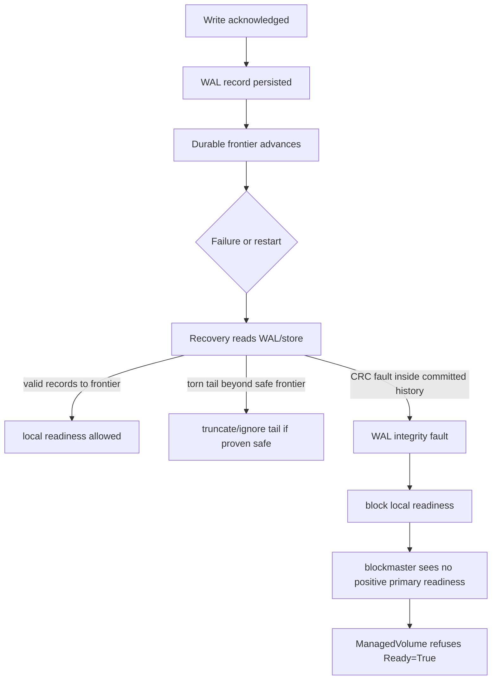
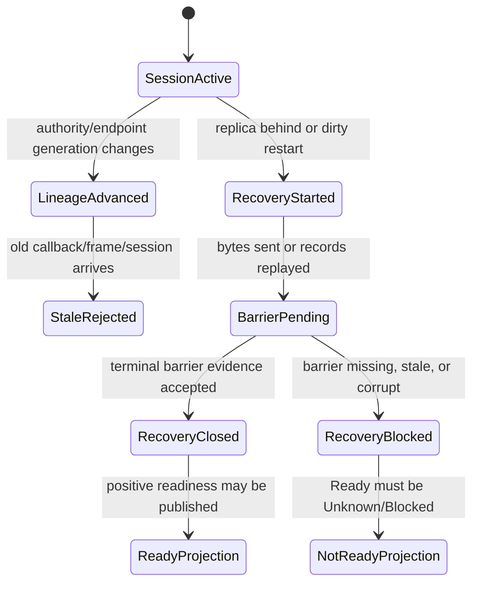

# WAL, Frontier, Barrier, And Recovery

This page explains the persistence and recovery vocabulary behind Seaweed
Block. It is written for developers who need to change SmartWAL, durable
frontends, recovery, rebuild, or readiness projection.

## Reader Orientation

Do not start with "where is the write function?" Start with the block-storage
question:

```text
After failure, which acknowledged writes are definitely part of the current
truth, and which old sessions or partial recovery streams must be ignored?
```

The project vocabulary is:

| Term | Meaning |
|---|---|
| WAL | write-ahead log or durable record stream used to recover acknowledged writes |
| frontier | highest durable progress boundary that recovery can trust |
| barrier | terminal evidence that a recovery or shipping route has closed |
| lineage | generation/session identity that prevents old traffic from becoming current truth |
| session | bounded protocol or recovery conversation |
| fail closed | refuse Ready/write projection when evidence is missing, stale, or corrupt |

These words matter because a false `Ready=True` after dirty storage evidence is
more dangerous than a visible failure.

## Domain Background

Block storage clients assume a coherent device. Filesystems do not know about
Seaweed Block replicas, control-plane epochs, or TestOps gates. If a write is
acknowledged, the storage system must either preserve it or explicitly fail the
path rather than present a silently regressed device.

Write-ahead logging solves only part of the problem. The hard parts are:

- distinguishing a torn tail from mid-history corruption,
- ensuring recovery does not skip committed records and keep later records,
- proving a replica caught up to the required frontier,
- ensuring old sessions cannot complete against new authority,
- ensuring control-plane readiness reflects storage recovery, not process
  liveness.

## Product Contract

The narrow product rule is:

```text
Known dirty or incomplete durable evidence must not surface as Ready=True.
```

Positive readiness requires:

```text
storage opened successfully
recovery completed or is not required
local readiness published positively
authority projection sees positive primary readiness
ManagedVolume projection sees current evidence
```

Negative or uncertain evidence becomes:

```text
Ready=Unknown / EvidenceStale
or Ready=False / Blocked
```

depending on whether the product can identify a concrete blocker.

## Ownership Model

| Layer | Owns | Must not own |
|---|---|---|
| storage / SmartWAL | local record integrity and recovery result | cluster readiness |
| blockvolume process | local readiness and diagnosable status endpoint | global authority decision |
| blockmaster | authority projection and primary readiness observation | WAL interpretation |
| operator-status/report | user-facing condition projection | storage mutation |
| TestOps | dirty-failure injection and evidence validation | product truth by helper echo only |

## Recovery Shape



## Session / Lineage / Barrier Model

The older methodology describes the block-shaped chain:

```text
initiator -> target -> session -> lineage -> barrier -> recovery
```

In implementation terms:



Key rule:

```text
bytes sent != recovery closed
process reachable != storage ready
```

## Code Map

| Responsibility | Code / source |
|---|---|
| SmartWAL store layout and recovery | `core/storage/smartwal/` |
| durable frontend readiness | `core/frontend/durable/` |
| blockvolume startup/recovery/readiness | `cmd/blockvolume/main.go` |
| recovery sender/receiver/barrier | `core/recovery/` |
| transport lineage/session execution | `core/transport/` |
| authority/product projection | `core/host/master/`, `core/host/volume/` |
| ManagedVolume projection | `core/ops/managed_volume_model.go` |
| dirty-failure scenario | `helm-smartwal-corrupt-restart-chain.yaml` |

Historical source material:

- `design/methdology/01-problem-shape-and-method.md`
- `design/methdology/02-block-clump-initiator-target-session-lineage-barrier-recovery.md`
- `design/tutorial/09-recovery-walshipper-dual-lane.md`

## Evidence Contract

A recovery or dirty-failure gate needs stable facts such as:

```text
wal_recovery_status=<ok|faulted|blocked>
wal_integrity_fault=<true|false>
frontier_before=<lsn>
frontier_after=<lsn>
recovery_barrier_observed=<true|false>
local_readiness_blocked=<true|false>
publish_healthy_emitted=<true|false>
operator_snapshot_ready_true_count=0
reason=<wal_integrity_fault|evidence_stale|unknown>
```

For dirty corruption, evidence must also prove the injection was real:

```text
target_offset_inside_wal=true
target_offset_inside_extent=false
mutated_offset=<byte>
```

Otherwise the test can corrupt extent bytes or the wrong file and produce a
false sense of WAL coverage.

## Failure Taxonomy

| Failure | Meaning | Correct projection |
|---|---|---|
| `wal_integrity_fault` | committed WAL record failed integrity check | not Ready; ideally Blocked with reason |
| `recovery_barrier_missing` | recovery stream did not close with terminal evidence | not Ready |
| `frontier_unknown` | durable progress boundary cannot be established | Unknown |
| `stale_lineage` | old session/frame/callback belongs to previous generation | reject/fail closed |
| `primary_readiness_missing` | assigned primary exists but did not positively publish readiness | Unknown |
| `status_endpoint_unreachable` | cannot collect fresh evidence | Unknown/EvidenceStale |

## Implementation Checklist

When changing recovery or persistence:

1. Identify the fact source: storage record, recovery barrier, authority epoch,
   or status endpoint.
2. Define the safe frontier and what evidence advances it.
3. Decide whether a fault is a safe torn tail or an unsafe mid-history fault.
4. Make the storage layer return a typed failure for unsafe faults.
5. Ensure `blockvolume` does not publish healthy after typed failure.
6. Ensure blockmaster projection requires positive primary readiness.
7. Ensure operator/status/report cannot convert missing positive evidence into
   `Ready=True`.
8. Add a dirty-failure gate that proves the injection hits the intended layout.
9. Verify cleanup leaves no storage/process/Kubernetes residue.

## QA History

| Gate / phase | What it proved |
|---|---|
| Phase 34 D4 initial failure | real SmartWAL corruption was detected but surfaced false Ready |
| storage fix | mid-history CRC mismatch failed closed instead of being skipped |
| blockvolume fix | durable recovery fault blocked local readiness |
| projection fix | blockmaster stopped treating heartbeat/assignment as Ready |
| Phase 34 D4 strict pass | no false Ready after corruption; cleanup clean |

## Non-Claims

- This page does not claim all WAL corruption modes are recoverable.
- It does not claim unconditional no data loss under arbitrary power failure.
- It does not define returned-replica rebuild by itself.
- It does not allow readiness to be inferred from process liveness.
