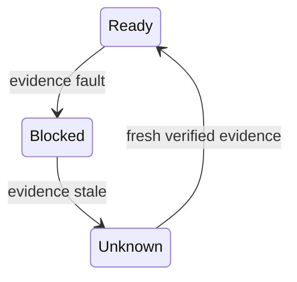

# Developer Guide

The engineering wiki exists to reduce rediscovery. It should answer:

```text
Why was this built?
What invariant does it protect?
Where is the code?
How is it tested?
What is still out of scope?
```

## Documentation Layers

| Layer | Purpose | Source |
|---|---|---|
| README / quickstart | first user path and narrow claims | `README.md`, `docs/quickstart-kubernetes.md` |
| Release notes | exact user-visible claims and image boundary | `docs/releases/` |
| Wiki | developer navigation and explanation | `docs/wiki/` |
| Finished plans | phase completion and historical decisions | `internal/docs/finished-plans/` |
| Ref docs | contracts, audits, design notes | `internal/docs/ref/` |
| Protocol docs | invariants and control-model reviews | `internal/docs/protocol/` |
| QA sign-offs | evidence that a gate passed or failed | `internal/docs/qa-assignments/` |
| TestOps | executable scenario definitions | `testops/` |

## Writing Rule

Do not copy a finished plan into the wiki. Instead, write the explanation a new
developer needs and link to the source evidence.

Assume the reader:

- can read Go, YAML, and shell,
- understands basic Kubernetes objects,
- does not yet understand block storage, CSI, iSCSI/NVMe, authority, fencing,
  WAL recovery, or why finalizers are dangerous,
- has not followed the phase history.

Good wiki content:

- problem context,
- short domain primer,
- industry terms and standards involved,
- what Seaweed Block must deliver,
- why the problem is harder than it looks,
- ownership boundary,
- state transition,
- package/function entry point,
- gate name that proves the behavior,
- explicit non-claim.

Bad wiki content:

- phase diary copied line-by-line,
- PM wording without code references,
- claims that are not backed by QA,
- TODO lists without an owner or phase.

## Deep-Dive Page Standard

Each deep-dive page should use this shape:

```text
1. Reader orientation
   What domain is this? Why should a developer care?

2. Domain background
   Explain industry terms and standards at a practical level.

3. Product problem
   What does Seaweed Block need to deliver? What can go wrong?

4. Methodology
   What facts are observed? What constraints matter? Who decides? Where does
   execution happen? What evidence closes the loop?

5. State machine / protocol diagram
   Mermaid first, prose second.

6. Implementation map
   Main packages, key structs/functions, commands, Helm/RBAC surfaces.

7. Phase history
   Which phases solved which part? Name the meaningful failures too.

8. QA evidence
   Which gates prove the behavior? What would fail the gate?

9. Non-claims and future work
   What is explicitly not delivered yet?
```

This standard matters because historical design notes can be stale. Use them as
source material for explanation and vocabulary, not as current release claims.

## Local Preview

Install MkDocs Material and serve the site:

```bash
pip install mkdocs-material
mkdocs serve
```

Open:

```text
http://127.0.0.1:8000
```

Docker alternative:

```bash
docker run --rm -it -p 8000:8000 -v "$PWD:/docs" squidfunk/mkdocs-material
```

The site is static. It can be served internally with any static file server
after:

```bash
mkdocs build
```

## Diagrams

Use Mermaid for state machines and sequence diagrams:

````markdown

````

Avoid screenshots for state machines. Mermaid diagrams stay reviewable in Git
and can be updated with the code.

## Code Links

For links to Markdown docs inside `docs/`, use normal relative Markdown links.
MkDocs renders those as site links.

For links to source code under `cmd/`, `core/`, `charts/`, `scripts/`, or
`testops/`, prefer GitHub source links when the target should be clickable in
the built site:

```markdown
[operator_status_controller.go](https://github.com/seaweedfs/seaweed-block/blob/main/core/ops/operator_status_controller.go)
```

MkDocs' default site only serves files under `docs_dir`. It does not render
repo-root source files as pages unless we add a source-link plugin or copy
generated code references into `docs/`. Keep wiki pages as explanations and
link to source-of-truth code rather than duplicating code.
