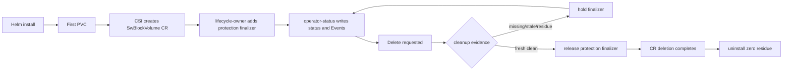

# Phase Map

The phases form a product-learning sequence. They should not be read as a flat
changelog.

For a per-phase explanation of the problem, feature logic, and remaining gap,
see [Phase Recap](phase-recap.md).

## Phase Groups

| Phases | Theme | Outcome |
|---|---|---|
| 1-8 | protocol readiness and beta hardening seed | early frontend/control-plane gates |
| 9-12 | light-use operations and product-owned blockvolume lifecycle | first user-facing operations loop |
| 13-18 | restart, placement, mounted failover, node loss | data-plane recovery semantics |
| 19-24 | observation, ManagedVolume model, dashboard | AI/cold-reader operations surfaces |
| 25-32 | Helm, multi-volume, restart persistence, status surfaces | productized Kubernetes alpha loop |
| 33-34 | failure hardening and test realism | live dirty-failure gates, no false Ready |
| 35-40 | Kubernetes-native read-only operator foundation | CRD status, Events, node evidence, action model, release hardening |
| 41-44 | bounded lifecycle owner | finalizer add/release, delete-safety hold/release, integrated close gate |
| 47-67 | returned-replica ACK/rebuild planning and runtime | eligibility, rebuild target, catch-up runtime, terminal evidence |
| 68-74 | frontend publication and failback contract separation | publication stays blocked until authority-owned failback exists |
| 75-97 | returned-replica failback control path | target CR, executor, runtime, blockmaster RPC, deployed-suite smoke, frontend-publication call-site |

## The Important Pivot

The major pivot was from "model looks coherent" to "live product capability is
closed":

```text
live fact
-> judgment
-> status/action
-> real Kubernetes API boundary
-> QA gate
-> failure evidence
```

This pivot explains why many later phases are operation-layer hardening rather
than new protocol features. Without this closure, rebuild, NVMe, backup, and
failback would add more states than the product can safely explain.

## Current Closure

Phase 44 closes this path:



```text
install
-> first PVC
-> CSI-created SwBlockVolume CR
-> lifecycle-owner protection finalizer
-> operator-status status/Events
-> delete request
-> hold on unsafe evidence
-> release on clean evidence
-> zero residue
```

The remaining release step is artifact validation: publish matching immutable
images and rerun pinned-image smoke.

Returned-replica failback now has a separately gated control path:


The Phase 97 boundary is explicit:

```text
authority control path can run when opt-in
frontend publication target can be planned from terminal failback evidence
frontend publication runtime can be called only under explicit policy
workload-visible path switch is still not claimed
```

## Next Feature Rule

A new storage feature should not enter product scope unless it can answer:

```text
Who owns the facts?
Who judges safety?
Who owns the action?
What admission/RBAC boundary confines it?
Where does the user see hold/release/progress/failure?
Which gate proves no false Ready=True?
```

Returned-replica rebuild/failback is the natural next major product capability
because it can reuse the operation-layer model built in Phases 35-44.
