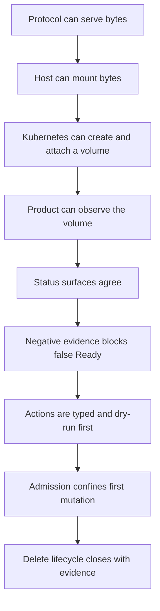

# Phase Recap

This page explains what each phase solved. It is not a full changelog. The
goal is to show the product logic: which user or engineering problem existed,
what capability was added, and why the next phase was necessary.

Source note: Phases with finished plans link to `internal/docs/finished-plans/`.
Phases without a finished-plan file are summarized from release notes,
TestOps scenarios, QA assignments, and adjacent protocol documents.

## Reading Pattern

Each phase should be read as:

```text
problem -> feature/capability -> product logic -> remaining gap
```

The late operation phases are not random polish. They turned a model that could
describe storage into a product loop that Kubernetes users can observe,
delete, block, and release safely.

## Recap Table

| Phase | Problem solved | Capability added | Product logic / why it mattered |
|---|---|---|---|
| 1 | The frontend protocol surface was not ready for real initiators. | iSCSI/NVMe frontend readiness gates. | Before Kubernetes claims, the target protocol had to speak enough wire behavior to be testable by real clients. |
| 2 | Early beta gates were too broad and slow to guide daily work. | Seed beta-hardening gate. | Created the habit of defining a release gate instead of relying on ad hoc manual smoke tests. |
| 3 | The first beta seed still had unstable or expensive checks. | Stabilized and reduced gate cost. | Made the gate repeatable enough to use as engineering feedback, not just release ceremony. |
| 4 | Fast operations contracts were not separated from long protocol validation. | Fast gates and operations contract prep. | Split "is the code basically safe to merge" from "is the whole product releaseable." |
| 5 | Users had no compact read-only status/report path. | Read-only operations status report. | First step toward explaining the product without SSH log spelunking or internal grep knowledge. |
| 6 | The iSCSI target needed real Linux initiator compatibility. | OS initiator compatibility checks. | Proved the block target could interact with the host stack, not only with synthetic protocol tests. |
| 7 | iSCSI sessions and backend pressure could fail in ambiguous ways. | Session/backend pressure hardening. | Tightened the boundary between frontend sessions and storage backend behavior. |
| 8 | Main merge needed a clear readiness bar. | Merge-readiness plan and gate cleanup. | Made "ready for main" a concrete state rather than a subjective review. |
| 9 | The project needed a first light-use operations story. | Light-use operations MVP. | Established a minimal user path around installing, observing, and cleaning the system. |
| 10 | Install and lifecycle operations were still fragmented. | Light-use install/lifecycle MVP. | Connected install, use, and cleanup into one small lifecycle, exposing where product ownership was missing. |
| 11 | Operators could not inventory the cluster and volume lifecycle clearly. | Cluster ops inventory and lifecycle visibility. | Added the ability to list what exists and why, which is prerequisite to any safe action. |
| 12 | `blockvolume` processes were product side effects, not owned objects. | Product-owned blockvolume lifecycle MVP. | Started moving from helper-launched processes to product-owned lifecycle semantics. |
| 13 | Restart could lose usable volume state. | Durable volume restart and reattach MVP. | Introduced restart persistence as a product concern, not just a process restart. |
| 14 | Multi-node placement and attach were not proven. | Multi-node attach and placement MVP. | Proved the product had to reason about node identity, placement, and frontend reachability. |
| 15 | Basic failover existed below the user surface but not as mounted recovery. | Basic mounted failover and reattach. | Connected authority change to workload-visible recovery behavior. |
| 16 | Mounted recovery needed an ACK/readiness profile. | Stage-1 mounted recovery ACK profile. | Made recovery safer by distinguishing "process alive" from "safe to acknowledge/serve." |
| 17 | Transparent mounted failover needed host multipath evidence. | Stage-2 iSCSI ALUA/dm-multipath failover. | Proved that a mounted workload can survive path change only when host path state is part of evidence. |
| 18 | Whole-node loss could break assumptions about authority and placement. | Node-loss survival MVP. | Forced the product to treat missing nodes as first-class state instead of accidental process failures. |
| 19 | Control-plane facts were not AI/cold-reader readable. | Control-plane observation and AI-readable ops. | Began the shift from logs to structured evidence and explanations. |
| 20 | Day-1 activation was not packaged as a user loop. | Activation / Day-1 ops MVP. | Produced a first install -> first volume -> verify -> cleanup story. |
| 21 | Helm activation needed runner-native proof. | Helm first-volume scenarios. | Moved Day-1 activation toward Kubernetes-native packaging and repeatable TestOps. |
| 22 | Observability lacked a central product object. | `ManagedVolume` operations model. | Defined the volume as users experience it: PVC, replicas, frontend, readiness, blockers, and safe actions. |
| 23 | The ManagedVolume model was not visible enough. | Report/explain/dashboard/operator-readiness surfaces. | Turned the internal read model into user-facing status and Conditions. |
| 24 | The dashboard was local and not hosted as a simple read-only surface. | Hosted read-only dashboard. | Made support/debug information available through a browser without mutation. |
| 25 | Helm and observable first-volume release had to converge. | v0.3 Helm observable first-volume release. | Tied packaging, first PVC, report, dashboard, and cleanup into a release-shaped path. |
| 26 | Helm lifecycle and support diagnostics needed runner coverage. | Helm release hygiene, upgrade/rollback, multi-volume day-1, support bundle gates. | Converted release packaging assumptions into executable scenarios. |
| 27 | RF=3 and failover had to hold under multi-volume pressure. | Multi-volume RF=3 readiness, reattach, mounted failover, interleaved failover. | Proved identity isolation: one volume's recovery must not corrupt another's authority or publish target. |
| 28 | Productized operations close needed consistent surfaces. | Phase 28 productized ops close and support-bundle/dashboard route hardening. | Made README, quickstart, release notes, report, dashboard, and operator snapshot agree on narrow claims. |
| 29 | Cleanup reliability still depended on helper timing and residue assumptions. | Deterministic cleanup evidence and vocabulary. | Made cleanup itself an evidence object with residue counts, failure counts, and downstream report/dashboard carry-through. |
| 30 | CRD/status protocols needed a stable field contract. | ManagedVolume field/status contract alignment. | Prevented each surface from inventing its own vocabulary for the same product state. |
| 31 | Kubernetes restart could resurrect stale authority. | Restart persistence for single-node and RF=3 promoted authority. | Proved primary, publish target, epoch, and data survive k3s restart without old-primary resurrection. |
| 32 | Status surfaces could disagree or over-claim readiness. | CRD/Condition/Event model and surface agreement gates. | Established negative-first behavior across healthy, blocked, restart, multi-volume, and stale evidence surfaces. |
| 33 | TestOps still had self-proving or weak failure checks. | Failure hardening review and scenario realism plan. | Started classifying tests by evidence strength rather than action count. |
| 34 | Dirty storage failures could be hidden behind false Ready. | SmartWAL corruption live gate and no-false-Ready fix chain. | Forced the storage, process readiness, and projection layers to fail closed when WAL integrity evidence is bad. |
| 35 | Kubernetes users needed native CRD status and Events. | Read-only operator-status foundation. | Added `SwBlockCluster`/`SwBlockVolume` status writes, Events, and RBAC-confined status-only behavior. |
| 36 | Status was visible but not actionable enough. | Node readiness, support evidence refs, cleanup visibility, cross-surface actionability. | Turned "something is blocked" into "why, where is evidence, and what safe next step exists." |
| 37 | Live node evidence was incomplete and replay-only in negative cases. | Live K8s node/CSI/image/host-prereq/loopback blockers. | Closed false node-ready masking: cordon, NotReady, missing CSI driver/image, and loopback cross-node blockers surface live. |
| 38 | Actions were still suggestions without an executable contract. | Action model evaluator: allowed dry-run, rejected unsafe, required facts/evidence. | Defined the bridge from read-only observation toward future mutation without enabling broad mutation. |
| 39 | Delete safety needed status before any finalizer mutation. | Delete-safety status boundary and multi-volume isolation. | Proved blocked/releasable/unknown delete decisions could be shown per volume with zero finalizer mutation. |
| 40 | Operator-status needed release-grade hardening. | Production hardening, release candidate gates, image/chart skew detection. | Caught that a chart can be correct against source but broken against published images; release artifacts became part of the gate. |
| 41 | Lifecycle ownership needed role separation before mutation. | Observer/lifecycle-owner/executor foundation. | Separated who observes, who decides, and who may eventually mutate, avoiding a broad operator role. |
| 42 | Finalizer mutation boundary had to be proven against a real API server. | ValidatingAdmissionPolicy/RBAC admission gate and delete-safety decision model. | Proved lifecycle-owner can only patch the protection finalizer, while operator-status remains status/events-only. |
| 43 | The first real product mutation needed bounded add and release. | Protection finalizer add/release gates. | Added the first admitted metadata mutation: hold on missing/blocked/stale delete safety, release only clean/releasable, preserve foreign finalizers. |
| 44 | The integrated delete lifecycle still had manual gaps. | CSI-created protected CR, status publication, delete-request hold/release, multi-volume close gate. | Closed the user-visible loop: PVC -> CR -> finalizer -> status -> delete hold/release -> zero residue. |

## Recap Addendum: Phases 45-95

Phases after 44 reuse the operation-layer closure instead of bypassing it. The
important line is returned-replica recovery:

| Phase range | Problem solved | Capability added | Product logic / why it mattered |
|---|---|---|---|
| 45-54 | A returned replica could not be admitted back through a bounded executor path. | ACK eligibility CRs, executor preflight/status schema, terminal-evidence gate, first bounded ACK eligibility mutation. | Reintegrating a returned replica starts as evidence and eligibility, not as automatic primary movement. |
| 56-67 | Returned-replica rebuild/catch-up needed a target and runtime loop before failback. | Rebuild target CR, target owner, planned/running/caught-up status, terminal catch-up evidence. | A replica may only become useful after durable frontier evidence proves it caught up. |
| 68-73 | Frontend publication was too dangerous to couple directly to returned-replica eligibility. | Frontend publication target/executor boundaries that deliberately block returned-replica publication. | Publishing a frontend path is separated from ACK/rebuild evidence so the product cannot accidentally expose an unsafe target. |
| 74-88 | Failback needed an authority-owned path rather than frontend-publication inference. | `authority.failback_returned_replica`, `SwBlockReplicaFailback`, failback executor, typed runtime, blockmaster RPC, Helm packaging. | Authority reassignment belongs to blockmaster/Publisher and remains default-off until explicit evidence and policy exist. |
| 89-95 | The packaged failback path still needed current authority facts and live deployed proof. | Authority facts in `SwBlockVolume.status`, expected-current guards, activation policy, handoff isolation, real gRPC smoke, live k3s deployed-suite gate. | The deployable failback control path can now run end-to-end without claiming frontend publication or workload-visible data-path switch. |
| 96 | Terminal failback evidence existed, but frontend publication had no post-failback source object. | `SwBlockReplicaFailback.status=failed_back/failback_completed` can create a disabled `SwBlockFrontendPublication` target with failback-source fields. | The next publication step is explicit, but executor publication and workload-visible path switching remain separate later gates. |

## Product Logic Across The Phases



The important transition is between D and I. The project spent many phases
there because a storage product cannot safely add rebuild, failback, backup,
NVMe expansion, or GPU paths if it cannot first explain:

- which facts are live,
- which facts are stale,
- why a volume is ready, blocked, unknown, or releasable,
- who owns each mutation,
- what admission/RBAC boundary confines it,
- and what evidence proves the mutation completed safely.

## Why The Operation Loop Was Necessary

Earlier engine work built useful protocol and recovery pieces, but some of it
was still a logical loop rather than a capability loop. A logical loop can say
"if facts are X, decide Y." A capability loop must prove:

```text
live system produces fact X
status writes decision Y
user sees Y consistently
unsafe action is rejected
safe action is bounded
terminal evidence closes the loop
cleanup leaves no residue
```

Phases 35-44 were about closing that capability loop. That is why the roadmap
now says new storage features should reuse the same fact -> judgment -> action
-> evidence structure instead of creating new isolated engines.

## Source Index

Representative source files:

- `internal/docs/finished-plans/phase1_finishedplan_frontend_protocol_readiness.md`
- `internal/docs/finished-plans/phase22_finishedplan_managed_volume_operations_model.md`
- `internal/docs/finished-plans/phase34_finishedplan_test_realism_dirty_failure_hardening.md`
- `internal/docs/finished-plans/phase35_finishedplan_kubernetes_native_read_only_operator_foundation.md`
- `internal/docs/finished-plans/phase41_finishedplan_lifecycle_owner_foundation.md`
- `internal/docs/finished-plans/phase44_finishedplan_delete_lifecycle_close_gate.md`
- `docs/releases/`
- `internal/docs/qa-assignments/`
- `testops/scenarios/`
