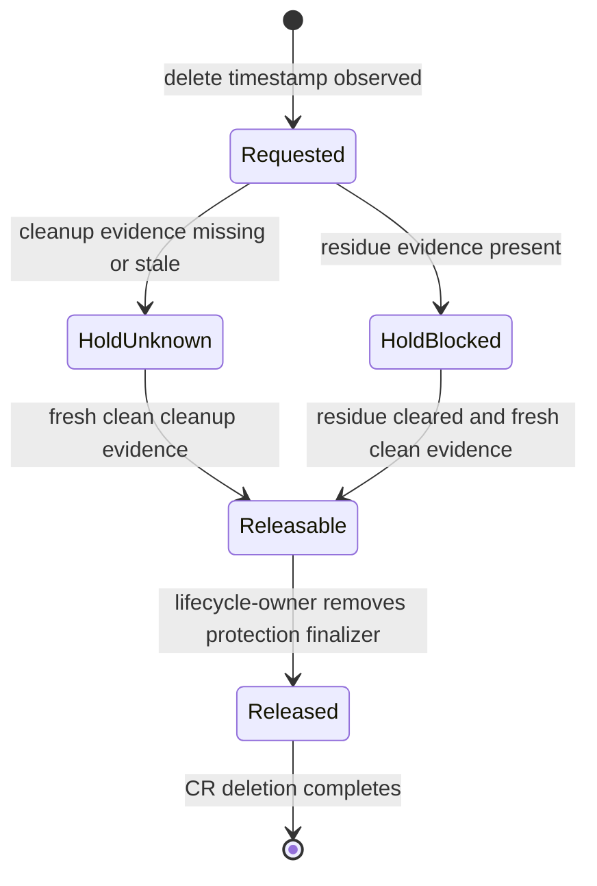
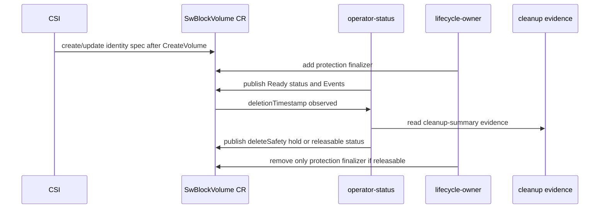

# State Machines

Seaweed Block development should be driven by state machines and invariants,
not by isolated helper scripts. This page names the states developers must
preserve.

For the broader list of mini-protocols and diagrams still to add, see
[Protocol Catalog](protocol-catalog.md). For existing runtime diagrams, see
[Runtime State Machines](../runtime-state-machines.md).

## Managed Volume Readiness

```text
Ready
Blocked
Recovering
Recovered
EvidenceStale
CleanupRequired
Unknown
```

Negative-first rule:

```text
missing, stale, unreachable, corrupt, or contradictory evidence must not become
Ready=True
```

Typical mappings:

| Evidence | Status |
|---|---|
| first volume verified | `Ready=True`, reason `first_volume_verified` |
| CSI image pull failure | `Ready=False`, `Blocked=True`, reason `csi_node_image_pull_failed` |
| status endpoint unreachable | `Ready=Unknown`, `EvidenceStale=True` |
| WAL integrity fault | not Ready; prefer reason `wal_integrity_fault` |
| cleanup residue | `CleanupRequired=True`, delete-safety rejected |

## Node Readiness

Node status combines Kubernetes facts and product prerequisites:

| Fact | Expected projection |
|---|---|
| Kubernetes Ready false/unknown | `unknown/node_not_ready` |
| Scheduling disabled | `blocked/node_scheduling_disabled` |
| CSI driver not registered | `blocked/csi_driver_not_registered` |
| CSI node pod not ready | `blocked/csi_node_pod_not_ready` |
| CSI image missing | `blocked/image_missing_on_node` |
| iSCSI prereq missing | `blocked/iscsi_prereq_missing` |
| multipath prereq missing | `blocked/multipath_prereq_missing` |

Root cause should win over symptoms. For example, node NotReady should not be
masked by CSI pod not ready.

## Delete Safety

Delete-safety is evidence-driven:



```text
missing cleanup evidence -> unknown/requested -> hold finalizer
stale cleanup evidence -> unknown/requested -> hold finalizer
residue evidence -> rejected/blocked -> hold finalizer
clean fresh evidence -> allowed/releasable -> release protection finalizer
```

The lifecycle-owner never runs cleanup. It only consumes status already written
by operator-status.

## Finalizer Lifecycle



```text
SwBlockVolume created
-> lifecycle-owner adds protection finalizer
-> delete requested
-> hold while deleteSafety is missing/stale/rejected
-> release only when deleteSafety is allowed/releasable
-> remove only block.seaweedfs.com/swblockvolume-protection
-> preserve foreign finalizers
```

Admission policy confines lifecycle-owner main-object patches to this finalizer
shape.

## Dirty-Failure Rule

The SmartWAL corruption gate established the pattern:

```text
detect corruption
-> fail closed in storage
-> block local readiness in blockvolume
-> require positive readiness before projection
-> never publish false Ready=True
```

This is the model for future dirty failures such as partial writes, stale
replicas, and returned-replica rebuild.
