# Snapshot And Restore Contract

## Purpose

This document defines the data and ownership contract for Phase 175. It is a
design constraint for storage, CSI, blockvolume runtime, blockmaster, and
operations code; it is not a statement that the feature is already released.

## User Semantics

The first product shape is a crash-consistent single-volume snapshot:

```text
all durable writes ordered before cut C are present
all writes ordered after cut C are absent
the image is equivalent to the source after an abrupt host crash at C
```

The storage service does not know whether an application has flushed its own
buffers or reached a transaction boundary. A user requiring application
consistency must quiesce or freeze the application before requesting the
snapshot. Phase 175 does not automate that protocol.

Restore always creates a new volume. The source volume and immutable snapshot
remain unchanged. In-place revert is deliberately absent.

## Why Rebuild Enumeration Is Insufficient

`LogicalStorage.AllBlocks()` reads blocks one at a time for replica rebuild.
If writes continue during that scan, block A can reflect time T1 while block B
reflects T2. That behavior is valid for rebuild because the WAL/live lane
converges the receiver after the base enumeration. A standalone snapshot has
no such convergence lane and would be torn.

Snapshot capture therefore uses a separate capability:

```go
type SnapshotSource interface {
    CaptureSnapshot(context.Context, SnapshotBlockSink) (SnapshotCut, error)
}
```

The implementation must exclude all storage mutations for the duration of the
durability fence and block stream. It must not implement this contract as
`Sync(); AllBlocks()` with the lock released between calls.

## Initial Cut Algorithm

The correctness-first implementation is stop-the-world:

```text
acquire exclusive storage mutation barrier
  reject closed or unrecovered storage
  flush all writes admitted before the barrier
  record durable frontier C
  scan logical blocks in ascending LBA order
  stream non-zero blocks to the archive writer
release mutation barrier
allow later writes
```

Reads may continue if the substrate can guarantee they do not mutate the
captured view. Writes, replicated apply, direct extent install, frontier
advance, recovery, and close must not cross the barrier.

Holding the barrier while archive bytes are written can cause a long write
pause. This is an accepted first-release limitation and must be surfaced in
metrics and documentation. A later COW or redirect-on-write implementation
may shorten the pause only if it preserves the same contract.

## Snapshot Identity And Idempotency

The product key is snapshot name within the storage product namespace. Each
record contains:

| Field | Meaning |
|---|---|
| `snapshot_id` | immutable opaque product identity |
| `name` | CSI idempotency key |
| `source_volume_id` | immutable source identity |
| `created_at` | server creation time |
| `frontier` | source durable frontier at cut |
| `size_bytes` | source logical capacity |
| `block_size` / `num_blocks` | restore geometry |
| `archive_digest` | whole archive integrity digest |
| `record_count` | non-zero block count |
| `state` | creating, ready, deleting, failed |
| `reason` | stable terminal or blocking reason |

Rules:

- same name + same source returns the existing snapshot;
- same name + different source returns conflict;
- the externally visible ID is minted once and survives restart;
- a record is `ready` only after its immutable archive is durable;
- a failed or temporary record cannot be returned as ready.

## Archive Contract

The first archive is a versioned full snapshot, not an incremental stream.
It contains a fixed header, ascending non-zero block records, and integrity
metadata. Every block record carries its LBA and CRC. The catalog carries a
whole-archive SHA-256 digest.

Creation order is:

```text
temporary archive
-> write and verify records
-> fsync archive
-> atomic rename to immutable archive name
-> fsync archive directory
-> write temporary catalog record
-> fsync catalog record
-> atomic rename to ready record
-> fsync catalog directory
-> publish ready
```

On restart, temporary files are not snapshots. Unreferenced immutable files
may be removed only when catalog reconciliation proves no record references
them.

## Full Backup Export And Import

The first backup path copies an already-ready immutable snapshot archive. It
does not scan a live volume and therefore does not define a second consistency
mechanism:

```text
ready snapshot catalog record + immutable archive
-> stream under the snapshot deletion lease
-> fsync and atomically publish full backup archive
-> fsync and atomically publish backup manifest
-> move/copy the complete backup directory
-> verify manifest, archive SHA-256, geometry, and per-block CRC
-> atomically import the original snapshot identity into a catalog
-> use the normal restore-to-new-volume path
```

The backup manifest contains the backup ID, source snapshot ID, server creation
time, archive size and SHA-256, relative destination evidence, the complete
snapshot record, and a SHA-256 over the canonical manifest. The archive digest
protects data bytes; the manifest digest detects accidental metadata changes.
Neither is an authenticity signature. Authenticity and encryption remain a
deployment/transport responsibility.

Imported snapshot identities must equal the canonical product ID derived from
the validated snapshot name and source volume. Import never accepts a path or
uses an untrusted ID as an unchecked filesystem component. It stages and
verifies the complete archive before publishing either archive or catalog
metadata, never overwrites an existing identity/name binding, and is
idempotent only when the complete catalog record agrees.

The initial destination is a fixed server-side file root configured by the
administrator. `SnapshotBackupService` is registered only on the dedicated
mTLS snapshot listener when that root and a separate backup bearer-token file
are configured. The backup token must differ from the CSI SnapshotService
token and is not projected into the CSI pod. Arbitrary server paths, object
storage, incremental/changelog backup, retention policy, encryption, and a
cross-cluster disaster-recovery claim are outside this first slice.

## Restore State Machine

```mermaid
stateDiagram-v2
  [*] --> Requested
  Requested --> Validating
  Validating --> Rejected: missing/not-ready/geometry/integrity
  Validating --> Restoring: valid immutable archive
  Restoring --> Failed: write/sync failure
  Restoring --> Durable: all records written and synced
  Durable --> IntegrityFault: target readback differs from archive
  Durable --> Verified: every archive LBA reads back exactly
  Verified --> Published: lifecycle identity becomes visible
  Failed --> Discarded: unpublished target removed
  IntegrityFault --> Discarded: destroy target; never retry same store
  Published --> [*]
```



Restore preconditions:

- snapshot is ready and digest-valid;
- target is a new, unpublished volume with matching geometry;
- no existing target data or lifecycle identity can be overwritten;
- the operation owns a reference that prevents snapshot deletion.

Restored writes use the target substrate's normal write path and receive a new
target LSN sequence. After the target durability fence, the restore owner reads
every archived LBA through the target's logical read path and compares it with
the verified archive before publication. Write counts are diagnostics, not
proof that restored bytes are usable. The source frontier is provenance, not
the restored volume's authority or write frontier.

## Distributed Ownership

| Component | Owns | Must not own |
|---|---|---|
| CSI controller | CSI validation, idempotency mapping, gRPC status, content-source mapping | block scanning, authority, direct archive writes |
| blockmaster snapshot service | durable product catalog, request orchestration, source/current-primary lookup | fabricating source readiness or reading block files directly |
| blockmaster backup service | fixed-root full export/import of ready immutable snapshots | live-volume scanning, arbitrary paths, object upload, CSI credential reuse |
| current-primary blockvolume runtime | authority-guarded local cut and integrity-framed block stream | catalog publication or Kubernetes VolumeSnapshot reconciliation |
| storage substrate | atomic cut, block stream, durability frontier | CSI names, Kubernetes objects, retention policy |
| external-snapshotter | Kubernetes-to-CSI request bridge | storage consistency implementation |
| operator-status | status, Conditions, Events, report evidence | snapshot/restore/delete execution |

An authority epoch or current-primary change during capture invalidates the
runtime result unless the request proves the cut completed under the expected
lineage. The master may retry against the new current primary; it may not join
partial archives from different replicas.

## Capture Runtime Protocol

The capture path is not the unauthenticated status endpoint and is not inferred
from a data, replication-control, iSCSI, or NVMe address. An enabled
blockvolume starts a dedicated HTTPS listener and publishes its advertised
endpoint as a heartbeat observation. Blockmaster resolves that endpoint only
when the same fresh slot positively matches the publisher's current authority
line (`volume_id`, `replica_id`, data/control addresses, epoch, and endpoint
version) and is reachable, eligible, ready-for-primary, and not withdrawn.

```text
SnapshotService.CreateSnapshot
  -> resolve exact current authority and fresh runtime observation
  -> HTTPS POST /v1/snapshot/capture with expected lineage
  -> blockvolume verifies local healthy projection before the cut
  -> storage holds the mutation barrier and streams ascending block frames
  -> blockvolume verifies the same projection after the cut
  -> terminal frame reconciles geometry/frontier/block-count/data-bytes
  -> blockmaster fsyncs and atomically publishes archive then catalog record
```

Transport requirements:

- TLS 1.2 or newer with mutual certificate authentication; plain HTTP and a
  client without the blockmaster client certificate are rejected;
- bearer token loaded from a mounted file, never a command-line value;
- redirects are not followed, so credentials cannot be forwarded;
- every block frame carries LBA, length, and CRC32;
- a stream has exactly one terminal success frame, or an error/EOF and no
  catalog publication;
- authority changes before, during, or after capture fail closed; partial
  bytes remain temporary and are removed by the catalog owner.

The first implementation uses one cluster runtime Secret containing
`ca.crt`, `tls.crt`, `tls.key`, `client.crt`, `client.key`, `token`,
`api-token`, `api-server.crt`, `api-server.key`, `api-client-ca.crt`,
`api-server-ca.crt`, `api-client.crt`, and `api-client.key`.
Kubernetes Secret projection separates roles: blockmaster receives the runtime
CA, mTLS runtime-client identity, runtime token, SnapshotService server
identity/client CA, and API token; blockvolume receives only the runtime CA,
server identity, and runtime token; CSI receives only `api-server-ca.crt`, the
`api-client.crt`/`api-client.key` identity, and `api-token`. SnapshotService is
not registered on the shared plaintext control listener. Its dedicated gRPC
listener requires a client certificate signed by `api-client-ca.crt` and the
separate API bearer token. `api-server.crt` is signed by `api-server-ca.crt`
and covers the blockmaster Service DNS name. Per-node runtime server identities
remain future hardening; blockmaster additionally binds the observed endpoint
host and reporting server to the current authority slot.

The initial catalog is node-local durable state. Enabling snapshots therefore
requires exactly one blockmaster replica, durable `stateHostPath`, and an
explicit `kubernetes.io/hostname` selector. A generic selector such as
`kubernetes.io/os=linux` is not sufficient because it permits rescheduling to a
different host with an empty catalog. The chart mounts only the
`stateHostPath/master` subtree into blockmaster and derives blockvolume storage
from `stateHostPath/replicas/<volume>/<replica>`. Each blockvolume mounts only
its own leaf, so it cannot traverse into authority, lifecycle, or snapshot
catalog state even when scheduled on the blockmaster node.

## CSI Mapping

### CreateSnapshot

- require non-empty name and source volume ID;
- reject unknown source or source that lacks current-primary readiness;
- return the existing snapshot for an idempotent retry;
- return `ready_to_use=false` only for a genuinely persisted asynchronous
  operation, never for an untracked goroutine;
- return the immutable snapshot ID, source ID, creation time, size, and
  readiness.

### DeleteSnapshot

- missing ID is success;
- active restore reference holds deletion with an explicit retryable result;
- successful deletion removes catalog visibility and archive data
  idempotently.

### ListSnapshots

- filter by snapshot ID or source volume ID as CSI specifies;
- paginate with stable ordering and opaque continuation tokens;
- never list temporary or failed-unpublished records as ready.

### CreateVolume From Snapshot

- require the CSI requested capacity range to contain the snapshot size;
- create the initial target at the exact snapshot size because the restore
  target currently requires identical block geometry;
- a larger target remains unsupported until explicit post-restore expansion is
  implemented and gated;
- create a new volume identity;
- complete restore durability before returning the volume;
- retry returns the same compatible target; incompatible retry is conflict;
- no source or snapshot mutation occurs.

## Failure Vocabulary

| Reason | Meaning |
|---|---|
| `snapshot_source_not_ready` | no current positive source readiness |
| `snapshot_authority_changed` | source lineage changed during operation |
| `snapshot_cut_failed` | durability fence or capture failed |
| `snapshot_archive_corrupt` | record CRC or archive digest mismatch |
| `snapshot_name_conflict` | idempotency name reused for another source |
| `snapshot_not_ready` | restore/delete requested before ready |
| `snapshot_in_use` | active restore reference prevents deletion |
| `restore_target_not_empty` | target is not a new unpublished volume |
| `restore_geometry_mismatch` | target cannot hold the snapshot |
| `restore_failed` | target write or durability fence failed |

Unknown, stale, corrupt, or failed evidence must never project
`ready_to_use=true` or a restored volume `Ready=True`.

## Required Evidence

At minimum each operation records:

- request and product IDs;
- source volume and expected/current authority lineage;
- cut frontier and geometry;
- block count, bytes, CRC failures, and archive digest;
- started/completed timestamps and duration;
- terminal state and stable reason;
- target identity and target durable frontier for restore;
- cleanup result and residue counts.

## Implementation Checklist

1. Implement and race-test the storage mutation barrier.
2. Stream rather than materialize a full-volume map.
3. Persist archive before publishing catalog readiness.
4. Recover idempotency after crash at every rename/fsync boundary.
5. Verify CRC and digest before restore publication.
6. Keep source, snapshot, and restored target independently writable/deletable.
7. Guard runtime capture with current-primary authority facts.
8. Advertise CSI capability only with complete runtime wiring.
9. Exercise real Kubernetes VolumeSnapshot objects and sidecars.
10. Verify deletion, uninstall, and failed-run residue independently.
