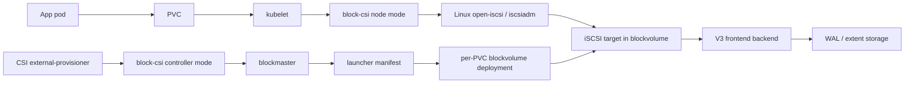

# iSCSI / CSI / ALUA Review Guide

Status: internal owner-level review guide.

Use this when reviewing frontend hardening work that touches Kubernetes CSI,
iSCSI, ALUA, MPIO, or blockvolume frontend state. The goal is to make the code
reviewable from first principles: what the OS expects, what Kubernetes expects,
what V3 owns, and where the dangerous boundaries are.

## Owner Reading Path

Read in this order when coming back to the project after time away:

1. Kubernetes path:
   - understand PVC -> CSI controller -> generated blockvolume -> CSI node ->
     Linux mount.
   - read "Kubernetes Flow" and "Binary And Container Map" below.
2. iSCSI path:
   - understand login, discovery, SCSI command dispatch, R2T/Data-Out,
     Data-In, and cleanup.
   - read "iSCSI Code Map".
3. ALUA/MPIO path:
   - understand why Linux needs common NAA, distinct TPG/RTP, and RTPG state.
   - read "ALUA Policy" and "Identity Rules".
4. Safety boundary:
   - understand why protocol reports state but must not decide authority.
   - read "State Ownership Boundaries" and "Review Traps".
5. Evidence:
   - map each product claim to one QA artifact.
   - read "Test Evidence Map" before approving a PR description.

Owner-level review questions:

- If an app writes through a PVC, which binary actually receives the bytes?
- Which layer owns the decision that a replica is primary?
- Which layer exposes that decision to Linux as active/optimized ALUA state?
- What prevents a stale primary from acknowledging a WRITE?
- What lets a standby path answer RTPG without serving data reads?
- What local files let CSI node recover after plugin restart?
- What evidence proves the claim: unit test, OS initiator, K8s CSI, or
  mounted multipath failover?

## One-Screen Model



- Kubernetes asks for a disk by creating a PVC.
- CSI controller code creates the V3 volume intent and exposes attach facts.
- CSI node code turns those facts into a Linux iSCSI login and a mounted
  filesystem path.
- `blockvolume` runs the actual iSCSI target and gates SCSI I/O through V3
  frontend state.
- ALUA/MPIO is how Linux can see multiple iSCSI paths as one logical disk and
  choose the currently safe path.

## Terms

- PVC: Kubernetes PersistentVolumeClaim. This is the app-facing request for
  storage.
- PV: Kubernetes PersistentVolume. This is the cluster object backing a PVC.
- CSI controller: the control-plane side of the CSI plugin. It handles
  CreateVolume, DeleteVolume, ControllerPublish, and related attach metadata.
- CSI node: the node-local side of the CSI plugin. It handles NodeStage,
  NodePublish, NodeUnstage, and local `iscsiadm` / mount work.
- iSCSI initiator: the client side. In Linux this is open-iscsi plus kernel
  SCSI block device handling.
- iSCSI target: the server side. In V3 this runs inside `blockvolume`.
- SCSI CDB: the command payload carried over iSCSI, for example READ(10),
  WRITE(10), INQUIRY, SYNCHRONIZE CACHE, or REPORT TARGET PORT GROUPS.
- Data-Out: iSCSI PDUs carrying write payload bytes from initiator to target.
- R2T: Ready To Transfer. The target asks the initiator to send the next chunk
  of Data-Out bytes.
- Data-In: iSCSI PDUs carrying read payload bytes from target to initiator.
- VPD 0x83: SCSI device identity page. Linux multipath uses this to decide
  whether multiple paths are the same logical disk.
- NAA: the stable logical device identifier inside VPD 0x83.
- TPG: target port group. ALUA groups paths by access state.
- RTP: relative target port. A path identity within a target port group.
- RTPG: REPORT TARGET PORT GROUPS, the SCSI command that reports ALUA path
  states.
- ALUA: Asymmetric Logical Unit Access. SCSI's standard way to say path A is
  active, path B is standby, path C is unavailable, etc.
- MPIO: multipath I/O. Linux `multipathd` can group several paths to one disk.
- CHAP: iSCSI login authentication.

## Kubernetes Flow

### Dynamic PVC Create

1. User applies a PVC and pod.
2. The official CSI external-provisioner calls our CSI controller
   `CreateVolume`.
3. Our controller records the requested volume in the master/lifecycle path.
4. The launcher renders a per-volume `blockvolume` Deployment.
5. K8s starts the generated `blockvolume`.
6. The `blockvolume` registers frontend facts: iSCSI address, IQN, and whether
   the current frontend is actually ready.
7. The official CSI external-attacher calls `ControllerPublish`.
8. Our CSI controller returns publish context with iSCSI target facts.
9. kubelet calls our CSI node `NodeStage`.
10. CSI node runs discovery/login through `iscsiadm`, waits for a block device,
    formats if needed, and mounts it.
11. kubelet bind-mounts the staged path into the app pod.

### Dynamic PVC Delete

1. User deletes the PVC.
2. kubelet calls NodeUnpublish/NodeUnstage.
3. CSI node unmounts, logs out from iSCSI, and removes local stage state.
4. CSI controller handles DeleteVolume.
5. With owner-reference mode, the generated `blockvolume` Deployment belongs
   to the PVC and Kubernetes garbage collection removes it.

Review point: CSI must not invent storage truth. It should consume published
frontend facts and return precise errors when facts are missing or stale.

## Binary And Container Map

- `cmd/blockmaster`
  - Owns lifecycle/control-plane orchestration for the alpha flow.
  - Knows placement intent and generated workload manifests.
  - Does not serve the data path.

- `cmd/blockvolume`
  - One daemon currently represents one volume/replica path.
  - Owns durable backend setup, V3 frontend backend, iSCSI target, ALUA state
    provider, and probe backend provider.
  - Must never acknowledge stale data I/O after authority moved.

- `cmd/blockcsi`
  - One binary used in two CSI roles.
  - Controller mode handles CreateVolume/DeleteVolume/ControllerPublish.
  - Node mode handles NodeStage/NodeUnstage and local Linux iSCSI/mount work.

- Official CSI sidecars
  - `csi-provisioner` calls controller Create/Delete.
  - `csi-attacher` calls controller publish/unpublish.
  - kubelet calls node stage/publish/unpublish/unstage.

## iSCSI Code Map

- `core/frontend/iscsi/target.go`
  - TCP listener, target lifecycle, discovery behavior, session creation.
  - Holds the optional `ProbeBackendProvider` used for ALUA metadata-only
    paths.

- `core/frontend/iscsi/session.go`
  - Login, discovery session, full-feature session loop.
  - R2T/Data-Out collection and bounded pending command behavior.
  - Session timeout and cleanup behavior.

- `core/frontend/iscsi/dataout.go`
  - V3-local Data-Out collector.
  - Owns DataSN, BufferOffset, overflow, premature final, and expected length.

- `core/frontend/iscsi/datain.go`
  - Splits large READ responses into bounded Data-In PDUs.
  - Owns residual count and final status semantics.

- `core/frontend/iscsi/scsi.go`
  - Dispatches SCSI commands.
  - Owns READ/WRITE/SYNCHRONIZE_CACHE, standard INQUIRY, VPD pages, READ
    CAPACITY, MODE SENSE, and ALUA command policy.

- `core/frontend/iscsi/alua.go`
  - Defines ALUA states and REPORT TARGET PORT GROUPS serialization.
  - Must stay protocol-only.

- `core/frontend/iscsi/login.go`
  - iSCSI login negotiation and CHAP authentication.

- `core/frontend/iscsi/errors.go`
  - SCSI sense/status mapping. Reviewers should check that fail-closed paths
    return stable SCSI errors, not transport crashes.

## Blockvolume ALUA Wiring

- `cmd/blockvolume/iscsi_alua_provider.go`
  - Translates V3 frontend projection into ALUA state.
  - Maps the current primary frontend to active/optimized.
  - Maps a valid non-primary path to standby.
  - Maps recovering to transitioning.
  - Maps degraded or identity-mismatched paths to unavailable.
  - Provides stable NAA, target port group, and relative target port identity.

- `cmd/blockvolume/iscsi_probe_provider.go`
  - Provides a borrowed metadata backend for non-active ALUA paths.
  - This exists so Linux can run INQUIRY, VPD 0x83, RTPG, capacity, and mode
    sense on a standby path.
  - It must not become a normal READ/WRITE backend.

Review point: the ALUA provider reports frontend truth. It must not import
authority, placement, lifecycle launcher code, or promotion logic.

## ALUA Policy

Current policy:

- Active optimized:
  - data READ allowed,
  - WRITE allowed,
  - SYNCHRONIZE_CACHE allowed.
- Active non-optimized:
  - same data permissions as active optimized,
  - less preferred if/when exposed.
- Standby:
  - metadata/path probing allowed,
  - data READ rejected,
  - WRITE rejected,
  - SYNCHRONIZE_CACHE rejected.
- Transitioning:
  - metadata/path probing allowed,
  - data READ/WRITE/SYNC rejected.
- Unavailable:
  - metadata/path probing allowed when a probe backend exists,
  - data READ/WRITE/SYNC rejected.

Why data READ is rejected on standby:

- A standby path can be useful for Linux path discovery, identity, and RTPG.
- A standby path must not leak stale data or make the kernel believe it is safe
  for normal data I/O.
- This is stricter than some early design notes. The current code and QA
  evidence use fail-closed data I/O on non-active paths.

## Identity Rules

Linux multipath grouping depends on stable identity.

- Same volume must expose the same NAA across paths.
- Different paths must still expose distinct TPG/RTP descriptors.
- RTPG target port group ID must match the TPG identity exposed in VPD 0x83.
- NAA/TPG/RTP must stay stable across restart for the same logical path.

If this breaks, Linux may either fail to group paths or group unrelated disks.
Both are product-critical failures.

## CSI Node Lifecycle Rules

CSI node code must be boring and conservative.

- NodeStage is idempotent for the same volume.
- NodeStage fails closed if the staging path is already mounted for another
  volume.
- Login failure must not leave staged state.
- Mount/mkfs failure after login must logout and clean up.
- NodeUnstage is idempotent.
- A plugin restart may reuse an existing login only when local identity state
  proves the staging path belongs to the same volume.
- CHAP secrets are consumed at NodeStage time and must not be copied into
  controller publish context.

Review files:

- `core/csi/node.go`
- `core/csi/node_test.go`
- `core/csi/controller.go`
- `core/csi/master_backend.go`
- `cmd/blockcsi/main.go`

## State Ownership Boundaries

The important design rule:

```text
iSCSI reports state.
CSI consumes published state.
Authority decides authority.
Recovery proves data continuity.
```

Do not collapse those into one layer.

- Protocol code must not promote a replica.
- Protocol code must not decide replica readiness.
- CSI must not infer readiness from heartbeat alone.
- A frontend fact is not proof of data continuity.
- Authority movement is not automatically data-continuity proof.
- A standby/probe backend is not permission to serve data I/O.

## Review Traps

- TPGS advertised but RTPG or VPD identity not implemented.
- VPD 0x00 advertises pages that `scsi.go` cannot serve.
- Standby path returns GOOD for READ/WRITE/SYNC.
- Probe backend accidentally used for data commands.
- CHAP credentials appear in publish context or logs.
- Owner-ref generated workloads are still hardcoded to `kube-system`.
- `iscsiadm` login succeeds but NodeStage records state before the mount is
  actually complete.
- Cleanup checks only pods and misses iSCSI sessions or multipath maps.
- Test evidence uses only in-process clients for behavior that Linux kernel
  initiator handles differently.

## Test Evidence Map

The following are review anchors, not performance claims.

- iSCSI P1/P2 OS initiator large I/O:
  - Linux `iscsiadm`, 256 MiB target, `mkfs.ext4`, mount, checksum, logout.
  - protects R2T/Data-Out, pending queue, timeout, large READ Data-In.
- P4 CHAP:
  - K8s dynamic PVC with CHAP Secret passed through CSI node stage.
  - default non-CHAP regression also green.
- P5 CSI node lifecycle:
  - artifact:
    `/mnt/smb/work/share/g15d-k8s/20260505T231321Z-iscsi-p5-csi-node-restart`.
  - CSI node DaemonSet restart while writer pod holds a mounted PVC.
  - replacement reader pod reads the same payload.
- P6-D two-path ALUA/MPIO:
  - artifact:
    `/mnt/smb/work/share/g15d-k8s/20260506T093732Z-iscsi-p6-alua-mpath-fix`.
  - two iSCSI paths, common NAA, distinct TPG/RTP, active/standby AAS,
    standby WRITE rejected, `multipath -ll` groups both paths.
- P6-E mounted failover:
  - artifact:
    `/mnt/smb/work/share/g15d-k8s/20260506T094503Z-iscsi-p6-mounted-failover`.
  - mounted `/dev/mapper/mpatha`, kill active path, r2 promoted, pre-failover
    checksum still readable, post-failover write verified, stale r1 rejects
    writes.
- P7 backend matrix:
  - artifact:
    `/mnt/smb/work/share/g15d-k8s/20260506T215457Z-iscsi-p7-backend-fio`.
  - walstore and smartwal both complete the same Linux loopback iSCSI fio
    profile.

## Non-Claims

Current alpha evidence does not claim:

- production HA,
- long soak,
- multi-node Kubernetes failure handling,
- Windows iSCSI Initiator support,
- NVMe-oF / ANA parity,
- RoCE or 25 GbE performance,
- smartwal performance advantage,
- concurrent multi-writer filesystem semantics,
- operator-managed lifecycle beyond the current alpha launcher path.

## Suggested Review Order

1. Read this file and `current-plan.md`.
2. Review `core/frontend/iscsi/scsi.go`, `alua.go`, `session.go`,
   `dataout.go`, and `datain.go`.
3. Review `cmd/blockvolume/iscsi_alua_provider.go` and
   `iscsi_probe_provider.go`.
4. Review CSI node lifecycle in `core/csi/node.go` and tests.
5. Review scripts only after the protocol and state boundaries make sense.
6. Check QA artifacts for every user-visible claim in the PR description.
